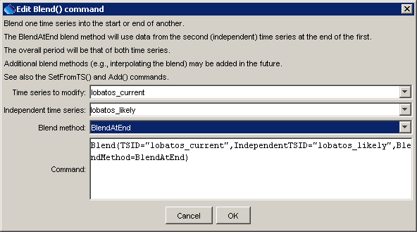

# TSTool / Command / Blend #

* [Overview](#overview)
* [Command Editor](#command-editor)
* [Command Syntax](#command-syntax)
* [Examples](#examples)
* [Troubleshooting](#troubleshooting)
* [See Also](#see-also)

-------------------------

## Overview ##

The `Blend` command blends one time series into another,
extending the first time series period if necessary.
This is typically used for combining time series for a station that has been
renamed or to blend historic and real-time data.
The second (independent time series) will ALWAYS override the first time series.
See also the [`SetFromTS`](../SetFromTS/SetFromTS) and [`Add`](../Add/Add) commands.
The `Blend` command ensures that single data values are used whereas
[`Add`](../Add/Add) will add values if more than one value is available at the same date/time.
The [`SetFromTS`](../SetFromTS/SetFromTS) does not extend the period.

## Command Editor ##

The following dialog is used to edit the command and illustrates the syntax of the command.
<a href="../Blend.png">See also the full-size image.</a>



**<p style="text-align: center;">
`Blend` Command Editor
</p>**

## Command Syntax ##

The command syntax is as follows:

```text
Blend(Parameter="Value",...)
```
**<p style="text-align: center;">
Command Parameters
</p>**

|**Parameter**&nbsp;&nbsp;&nbsp;&nbsp;&nbsp;&nbsp;&nbsp;&nbsp;&nbsp;&nbsp;&nbsp;&nbsp;&nbsp;&nbsp;&nbsp;&nbsp;|**Description**|**Default**&nbsp;&nbsp;&nbsp;&nbsp;&nbsp;&nbsp;&nbsp;&nbsp;&nbsp;&nbsp;&nbsp;&nbsp;&nbsp;&nbsp;&nbsp;&nbsp;&nbsp;&nbsp;&nbsp;&nbsp;&nbsp;&nbsp;&nbsp;&nbsp;&nbsp;&nbsp;&nbsp;|
|--------------|-----------------|-----------------|
|`TSID`<br>**required**|The time series identifier or alias for the time series to be modified.|None – must be specified.|
|`IndependentTSID`<br>**required**|The time series identifier or alias for the time series to be blended to the first time series.|None – must be specified.|
|`BlendMethod`|The method used to blend the data, one of:<ul><li>`BlendAtEnd` - the main time series will have the other time series attached to the end of its period.</li></ul>|None – must be specified.  Currently only `BlendAtEnd` is recognized.|

## Examples ##

See the [automated tests](https://github.com/OpenWaterFoundation/cdss-app-tstool-test/tree/master/test/regression/commands/general/Blend).

A sample command file to blend two time series from the [State of Colorado’s HydroBase database](../../datastore-ref/CO-HydroBase/CO-HydroBase)
is as follows:

```text
# 08236000 - ALAMOSA RIVER ABOVE TERRACE RESERVOIR
08236000.DWR.Streamflow.Month~HydroBase
# 08236500 - ALAMOSA RIVER BELOW TERRACE RESERVOIR
08236500.DWR.Streamflow.Month~HydroBase
Blend(TSID=”08236000.DWR.Streamflow.Month”,IndependentTSID=”08236500.DWR.Streamflow.Month”,BlendMethod=”BlendAtEnd”)
```

## Troubleshooting ##

## See Also ##

* [`Add`](../Add/Add) command
* [`SelectTimeSeries`](../SelectTimeSeries/SelectTimeSeries) command
* [`SetFromTS`](../SetFromTS/SetFromTS) command
