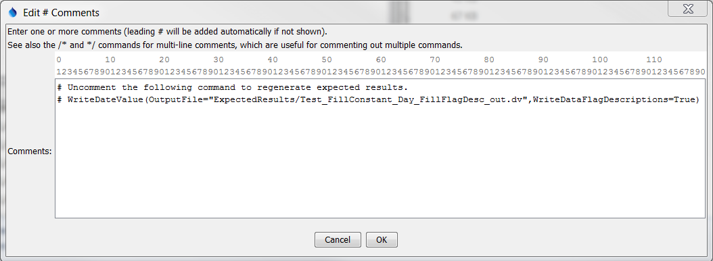

# TSTool / Command / Comment `#` #

* [Overview](#overview)
* [Command Editor](#command-editor)
* [Command Syntax](#command-syntax)
* [Examples](#examples)
* [Troubleshooting](#troubleshooting)
* [See Also](#see-also)

-------------------------

## Overview ##

Single-line comments start with `#`.
Spaces and tabs before the comment character are currently not allowed.
Comments cannot be added after commands - comments must exist on their own command line.
Commands can be converted to and from `#` comments by right-clicking on a command in TSTool
and selecting ***Convert selected commands to # comments*** and
***Convert selected commands from # comments*** from the popup menu.
See also the [`/*`](../CommentBlockStart/CommentBlockStart) and [`*/`](../CommentBlockEnd/CommentBlockEnd)
comment block commands, which are used to comment multiple commands.

The following table lists annotation tags that can be placed in comments to provide additional
information to software that processes the commands, using notation similar to the following:

```
#@expectedStatus Failure
```
**<p style="text-align: center;">
`#` Comment Tags
</p>**

|**Annotation Tag**&nbsp;&nbsp;&nbsp;&nbsp;&nbsp;&nbsp;&nbsp;&nbsp;&nbsp;&nbsp;&nbsp;&nbsp;&nbsp;&nbsp;&nbsp;&nbsp;&nbsp;&nbsp;&nbsp;&nbsp;&nbsp;&nbsp;&nbsp;&nbsp;&nbsp;&nbsp;&nbsp;&nbsp;&nbsp;&nbsp;&nbsp;&nbsp;&nbsp;&nbsp;&nbsp;&nbsp;&nbsp;&nbsp;&nbsp;&nbsp;&nbsp;&nbsp;&nbsp;&nbsp;&nbsp;|**Command That Uses**&nbsp;&nbsp;&nbsp;&nbsp;&nbsp;&nbsp;&nbsp;&nbsp;&nbsp;&nbsp;&nbsp;&nbsp;&nbsp;&nbsp;&nbsp;&nbsp;&nbsp;&nbsp;&nbsp;&nbsp;&nbsp;&nbsp;&nbsp;&nbsp;&nbsp;&nbsp;&nbsp;&nbsp;&nbsp;&nbsp;&nbsp;&nbsp;&nbsp;&nbsp;&nbsp;&nbsp;&nbsp;&nbsp;&nbsp;&nbsp;&nbsp;&nbsp;&nbsp;&nbsp;&nbsp;&nbsp;&nbsp;&nbsp;&nbsp;&nbsp;&nbsp;&nbsp;&nbsp;&nbsp;&nbsp;|**Description**&nbsp;&nbsp;&nbsp;&nbsp;&nbsp;&nbsp;&nbsp;&nbsp;&nbsp;&nbsp;|
|----------------|--------------------------|----------------- |
|`@enabled False`| TSTool command processor.|Used to disable a command file.  For example, use this annotation in a test command file when the test is not ready for use in the software release process.|
|`@expectedStatus Failure`<br>`@expectedStatus Warning`|[`RunCommands`](../RunCommands/RunCommands)|Used to help the test framework know if an error or warning is expected, in which case a passing test can occur even if the command status is not “success”.|
|`@os Windows`<br>`@os UNIX`|[`CreateRegressionTestCommandFile`](../CreateRegressionTestCommandFile/CreateRegressionTestCommandFile)|Used to filter out test command files that are not appropriate for the operating system.  Linux is included in UNIX.|
|`@readOnly`|TSTool main interface and command editors|Indicates that the command file should not be edited.  TSTool will update old command syntax to current syntax when a command file is loaded.  However, this tag will cause the software to warn the user when saving the command file, so that they can cancel.  This tag is often used with templates to protect the template from mistakenly being edited and saved in TSTool (TSTool does not currently allow editing templates within the interface).|
|`@template`|TSTool main interface|Similar to `@readOnly` and indicates a template command file.  Currently, a text file editor needs to be used to edit template files because TSTool checks commands for final syntax.|
|`@testSuite ABC`|[`CreateRegressionTestCommandFile`](../CreateRegressionTestCommandFile/CreateRegressionTestCommandFile)|Used to filter out test command files that are not appropriate for the operating system.|

## Command Editor ##

The following dialog is used to edit the command and illustrates the command syntax.
<a href="../Comment.png">See also the full-size image.</a>



**<p style="text-align: center;">
`#` Command Editor
</p>**

## Command Syntax ##

The command syntax is as follows:

```text
# A comment
# Another comment
```

## Examples ##

See the [automated tests](https://github.com/OpenWaterFoundation/cdss-app-tstool-test/tree/master/test/regression/commands/general/Comment).

## Troubleshooting ##

## See Also ##

* [`/*`](../CommentBlockStart/CommentBlockStart) comment block start command
* [`*/`](../CommentBlockEnd/CommentBlockEnd) comment block end command
