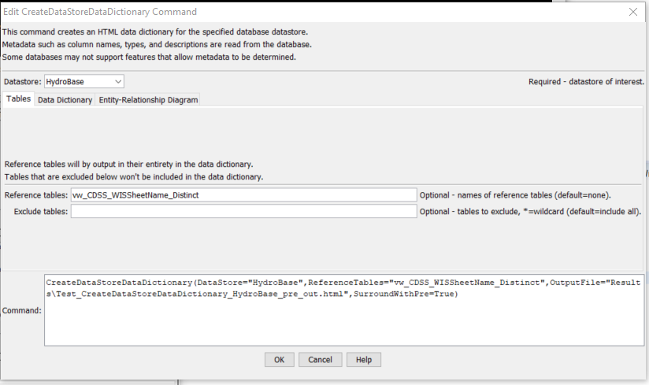
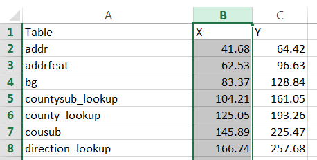

# TSTool / Command / CreateDataStoreDataDictionary #

* [Overview](#overview)
* [Command Editor](#command-editor)
* [Command Syntax](#command-syntax)
* [Examples](#examples)
* [Troubleshooting](#troubleshooting)
* [See Also](#see-also)

-------------------------

## Overview ##

The `CreateDataStoreDataDictionary` command creates an HTML data dictionary and
Entity Relationship (ER) Diagram for a database datastore.
The data dictionary output from the command is an HTML file that provides:
	
* General database information.
* A list of tables and views, which link to table details.
* For each table, the details for the columns in the table, including name, data type,
remarks (description), whether null is allowed, and indication of whether the columns are primary or foreign keys.
* Reference tables have all of their data listed to help understand relationships.

The Java DatabaseMetaData class is used to access database metadata.
Current limitations are as follows:

* The command has been tested with SQL Server, Microsoft Access, MySQL, Oracle, and PostgreSQL databases.
The command may or may not work with other databases.
* SQL Server is supported to a limited degree.
Table and column descriptions currently cannot be retrieved due to limitations in SQL Server database drivers.
* Data dictionary output is only as complete as the metadata defined by the database
administrator – there currently is no way to provide additional information via the command,
although in the future an ability to provide table and column descriptions using an input table may be implemented.
* The ER Diagram capability is under development.
* Information for procedures, functions, and triggers is not implemented.

## Command Editor ##

The following dialog is used to edit the command and illustrates the syntax of the command for table parameters.
<a href="../CreateDataStoreDataDictionary_Tables.png">See also the full-size image.</a>



**<p style="text-align: center;">
`CreateDataStoreDataDictionary` Command Editor for Table Parameters
</p>**

The following dialog is used to edit the command and illustrates the syntax of the command for data dictionary parameters.
<a href="../CreateDataStoreDataDictionary.png">See also the full-size image.</a>


**<p style="text-align: center;">
`CreateDataStoreDataDictionary` Command Editor for Data Dictionary Parameters
</p>**

The following dialog is used to edit the command and illustrates the syntax of the command for entity relationship parameters.
<a href="../CreateDataStoreDataDictionary_ERDiagram.png">See also the full-size image.</a>


**<p style="text-align: center;">
`CreateDataStoreDataDictionary` Command Editor for Entity Relationship Diagram Parameters
</p>**

## Command Syntax ##

The command syntax is as follows:

```text
CreateDataStoreDataDictionary(Parameter="Value",...)
```
**<p style="text-align: center;">
Command Parameters
</p>**

|**Parameter**&nbsp;&nbsp;&nbsp;&nbsp;&nbsp;&nbsp;&nbsp;&nbsp;&nbsp;&nbsp;&nbsp;&nbsp;&nbsp;&nbsp;&nbsp;&nbsp;&nbsp;&nbsp;&nbsp;&nbsp;&nbsp;&nbsp;&nbsp;&nbsp;&nbsp;&nbsp;&nbsp;&nbsp;&nbsp;&nbsp;&nbsp;&nbsp;&nbsp;&nbsp;&nbsp;&nbsp;&nbsp;&nbsp;&nbsp;|**Description**|**Default**&nbsp;&nbsp;&nbsp;&nbsp;&nbsp;&nbsp;&nbsp;&nbsp;&nbsp;&nbsp;&nbsp;&nbsp;&nbsp;&nbsp;&nbsp;&nbsp;&nbsp;&nbsp;&nbsp;&nbsp;&nbsp;&nbsp;&nbsp;&nbsp;&nbsp;&nbsp;&nbsp;|
|--------------|-----------------|-----------------|
|`DataStore`<br>**required**|The name of a database datastore.  Can be specified using `${Property}`.|None – must be specified.|
|`ReferenceTables`|A comma-separated list of database reference tables.  The content of these tables will be output in their entirety.  Can be specified using `${Property}`.|No reference tables|
|`ExcludeTables`|A comma-separated list of tables to exclude from output, for example to exclude database system tables.  Use `*` as a wildcard.|Include all tables.|
|`OutputFile`|The name of the file for the HTML data dictionary.  Can be specified using ${Property}.|None.|
|`SurroundWithPre`|Specify as True if comments for table columns should be surrounded with `<pre></pre>` in output, useful if comments included newlines for formatting.  In this case Newline and `EncodeHtmlChars` are ignored.|`False`|
|`Newline`|String to replace newline in table column comments.  For example use `<br>` to preserve newlines in HTML output.  Specifying True will cause `EncodeHtmlChars` to be ignored.|Space|
|`EncodeHtmlChars`|Specify as True if characters such as `<` should be encoded to display in HTML, `False` to pass through comment content as is with no encoding.|`True`|
|`ERDiagramLayoutTableID`|The table identifier for the table supplying ER Diagram coordinate information.  Can be specified using `${Property}`.|None – must be specified if ER Diagram is created.|
|`ERDiagramLayoutTableXColumn`|The name of the column in the layout table containing the X coordinates for the ER Diagram.  Coordinates should be specified in points (1/72 of inch) as position on page size.  Can be specified using `${Property}`.|None – must be specified.|
|`ERDiagramLayoutTableYColumn`|The name of the column in the layout table containing the Y coordinates for the ER Diagram.  Can be specified using `${Property}`.|None – must be specified.|
|`ERDiagramPageSize`|The page size for the ER Diagram layout.  Currently this defaults to 11x17 (B).|`B`|
|`ERDiagramOrientation`|The orientation of the ER Diagram.|`Landscape`|
|`ViewERDiagram`|Indicate whether the ER Diagram should be shown in a window when the commands are run.|`False`|

## Examples ##

See the [automated tests](https://github.com/OpenWaterFoundation/cdss-app-tstool-test/tree/master/test/regression/commands/general/CreateDataStoreDataDictionary).

The following is an example of an Excel workbook with ER Diagram layout data, which can be read with the
[`ReadTableFromExcel`](../ReadTableFromExcel/ReadTableFromExcel) command.



**<p style="text-align: center;">
`CreateDataStoreDataDictionary` Command Editor for Entity Relationship Diagram Parameters
</p>**

## Troubleshooting ##

## See Also ##

* [`ReadTableFromExcel`](../ReadTableFromExcel/ReadTableFromExcel) command
