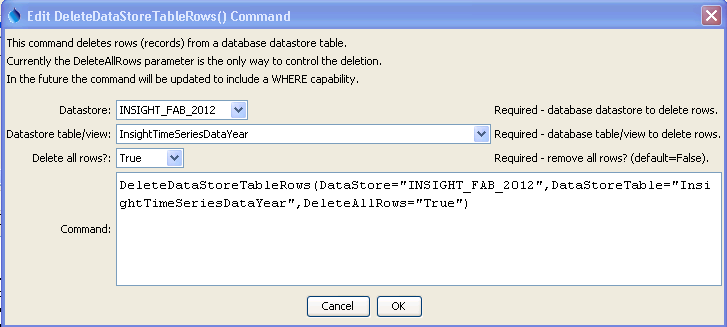

# TSTool / Command / DeleteDataStoreTableRows #

* [Overview](#overview)
* [Command Editor](#command-editor)
* [Command Syntax](#command-syntax)
* [Examples](#examples)
* [Troubleshooting](#troubleshooting)
* [See Also](#see-also)

-------------------------

## Overview ##

The `DeleteDataStoreTableRows` command deletes rows from a database
datastore table by using one of the following methods:

* Execute an `SQL DELETE` statement to delete all rows.
Currently, only the ability to delete all rows is supported (see `DeleteAllRows=True` command parameter).
In the future functionality will be implemented to delete specific rows using an `SQL WHERE` clause.
See also the [`RunSql()`](../RunSql/RunSql.md) command, which can be used to execute any SQL statement on a database datastore.
* Execute an `SQL TRUNCATE` statement (see `DeleteAllRows=Truncate`).
Although database software varies, this typically has the effect of resetting auto-number counters.

If database datastore support is not specifically provided by TSTool,
a generic datastore can be used (see the
[Generic Database DataStore appendix](../../datastore-ref/GenericDatabase/GenericDatabase.md)).
This command cannot be used with web service datastores and use with Excel datastores has not been tested.
This command is useful in particular for bulk data processing such as to
delete records in a table before (re)loading in bulk (see
[`WriteTableToDataStore`](../WriteTableToDataStore/WriteTableToDataStore.md) and
[`WriteTimeSeriesToDataStore`](../WriteTimeSeriesToDataStore/WriteTimeSeriesToDataStore.md) commands).

General constraints are as follows:

* the table or views being processed must be writeable by the user specified
for the database connection (some databases restrict direct access to data
and/or require using stored procedures)

## Command Editor ##

The following dialog is used to edit the command and illustrates the syntax of the command.

**<p style="text-align: center;">

</p>**

**<p style="text-align: center;">
`DeleteDataStoreTableRows` Command Editor (<a href="../DeleteDataStoreTableRows.png">see also the full-size image</a>)
</p>**

## Command Syntax ##

The command syntax is as follows:

```text
DeleteDataStoreTableRows(Parameter="Value",...)
```
**<p style="text-align: center;">
Command Parameters
</p>**

|**Parameter**&nbsp;&nbsp;&nbsp;&nbsp;&nbsp;&nbsp;&nbsp;&nbsp;&nbsp;&nbsp;&nbsp;&nbsp;&nbsp;|**Description**|**Default**&nbsp;&nbsp;&nbsp;&nbsp;&nbsp;&nbsp;&nbsp;&nbsp;&nbsp;&nbsp;&nbsp;&nbsp;&nbsp;&nbsp;&nbsp;&nbsp;&nbsp;&nbsp;&nbsp;&nbsp;&nbsp;&nbsp;&nbsp;&nbsp;&nbsp;&nbsp;&nbsp;|
|--------------|-----------------|-----------------|
|`DataStore`<br>**required**|The name of a database datastore to process.|None – must be specified.|
|`DataStoreTable`<br>**required**|The name of the database table or view being processed.|None – must be specified.|
|`DeleteAllRows`|Indicate whether all rows should be deleted:<ul><li>`False` – currently a safeguard.  A future enhancement will enable deleting only rows that match specified table rows via a constraint.</li><li>`True` or – delete all rows using `SQL DELETE` statement</li><li>`Truncate` – delete all rows using `SQL TRUNCATE` statement.|`False` – consequently, because specific deletes are not enabled, this is a safeguard against any deletes|

## Examples ##

See the [automated tests](https://github.com/OpenCDSS/cdss-app-tstool-test/tree/master/test/regression/commands/general/DeleteDataStoreTableRows).

## Troubleshooting ##

## See Also ##

* [`WriteTableToDataStore`](../WriteTableToDataStore/WriteTableToDataStore.md) command
* [`WriteTimeSeriesToDataStore`](../WriteTimeSeriesToDataStore/WriteTimeSeriesToDataStore.md) command
