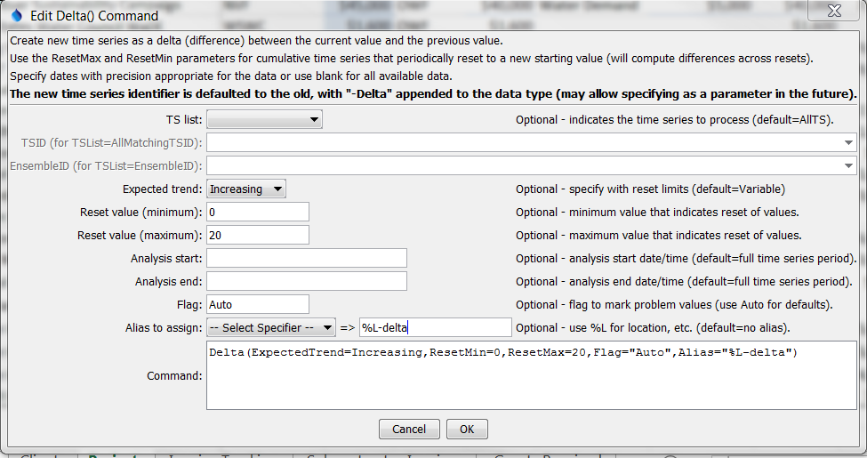

# TSTool / Command / Delta #

* [Overview](#overview)
* [Command Editor](#command-editor)
* [Command Syntax](#command-syntax)
* [Examples](#examples)
* [Troubleshooting](#troubleshooting)
* [See Also](#see-also)

-------------------------

## Overview ##

The `Delta` command creates a new time series from an input time series.
The resulting values are computed as the difference between each value and the previous value.
Consequently, the delta result is the change from the previous value.
The [`CheckTimeSeries`](../CheckTimeSeries/CheckTimeSeries) command can be used to check time series
for changes that exceed a threshold; however,
the `Delta` command handles the complexity of time series
that reset to a new starting value – the output can be used in conjunction with
[`CheckTimeSeries`](../CheckTimeSeries/CheckTimeSeries) command.
The `Delta` command will create as many output time series as there are input time series.
	
The output value is simply the current value minus the previous value.
The result is set to missing if this value cannot be computed due to missing values,
or in cases where a transition across a reset has errors.
	
If the data do reset, then the expected trend should be specified to allow the
`ResetMin` and `ResetMax` parameters to be properly interpreted.
For example, if Trend=Increasing and a decrease is detected,
it is assumed that the values have circled past the reset values.
In this case the command will attempt to compute the change across the reset values.
If this is not possible, then warnings will be generated and the result will be set to missing.
Specific cases that are handled are:
	
* The previous value is out of range – in this case the contribution from the out of
range previous value is added to the delta and default flag value is assigned (see Flag parameter description).  A warning will be generated.
* The current value is out of range – in this case the difference will be
decreased because the reset value has not be achieved.  A warning will be generated.
	
**The above special cases result in somewhat arbitrary difference values because
the inputs do not conform to expected values.
Out of range values indicate erroneous data that should be corrected before being used in further analysis.**
	
Irregular-interval time series that result in differences not being computed will have
missing values inserted at appropriate locations to maintain consistent data point spacing with the original data. 

## Command Editor ##

The following dialog is used to edit the command and illustrates the syntax of the command.
<a href="../Delta.png">See also the full-size image.</a>



**<p style="text-align: center;">
`Delta` Command Editor
</p>**

## Command Syntax ##

The command syntax is as follows:

```text
Delta(Parameter="Value",...)
```
**<p style="text-align: center;">
Command Parameters
</p>**

|**Parameter**&nbsp;&nbsp;&nbsp;&nbsp;&nbsp;&nbsp;&nbsp;&nbsp;&nbsp;&nbsp;&nbsp;|**Description**|**Default**&nbsp;&nbsp;&nbsp;&nbsp;&nbsp;&nbsp;&nbsp;&nbsp;&nbsp;&nbsp;&nbsp;&nbsp;&nbsp;&nbsp;&nbsp;&nbsp;&nbsp;&nbsp;&nbsp;&nbsp;&nbsp;&nbsp;&nbsp;&nbsp;&nbsp;&nbsp;&nbsp;|
|--------------|-----------------|-----------------|
|`TSList`|Indicates the list of time series to be processed, one of:<br><ul><li>`AllMatchingTSID` – all time series that match the TSID (single TSID or TSID with wildcards) will be processed.</li><li>`AllTS` – all time series before the command.</li><li>`EnsembleID` – all time series in the ensemble will be processed (see the EnsembleID parameter).</li><li>`FirstMatchingTSID` – the first time series that matches the TSID (single TSID or TSID with wildcards) will be processed.</li><li>`LastMatchingTSID` – the last time series that matches the TSID (single TSID or TSID with wildcards) will be processed.</li><li>`SelectedTS` – the time series are those selected with the [`SelectTimeSeries`](../SelectTimeSeries/SelectTimeSeries) command.</li></ul> | `AllTS` |
|`TSID`|The time series identifier or alias for the time series to be processed, using the `*` wildcard character to match multiple time series.  Can be specified using `${Property}`.|Required if `TSList=*TSID`|
|`EnsembleID`|The ensemble to be processed, if processing an ensemble. Can be specified using `${Property}`.|Required if `TSList=*EnsembleID`|
|`ResetMin`|The minimum expected data value, used when data are expected to increase (or decrease) to a threshold and then reset, for example raw precipitation values that reset to zero when a container fills.|Data are not expected to reset.|
|`ResetMax`|The maximum expected data value, used when data are expected to increase (or decrease) to a threshold and then reset, for example raw precipitation values that reset to zero when a container fills.|Data are not expected to reset.|
|`ExpectedTrend`|Indicates trend of data, used when values can reset:<ul><li>`Decreasing` – values should decrease and then reset</li><li>`Increasing` – values should increase and then reset</li><li>`Variable` – variable pattern increasing and decreasing and don’t reset at fixed thresholds|`Variable`|
|`AnalysisStart`|The date/time to start analyzing data.  Can be specified using `${Property}`.|Full period is analyzed.|
|`AnalysisEnd`|The date/time to end analyzing data.  Can be specified using `${Property}`.|Full period is analyzed.|
|`Flag`|A string to flag problem values, or Auto for default flags:</li><li>`R` – indicates reset transition out of range > `ResetMax`</li><li>`r` – indicates reset transition out of range < `ResetMin`</li><li>`V` – indicates value out of range > `ResetMax`</li><li>`v` – indicates value out of range < `ResetMin`</li><ul><br>Can be specified using `${Property}`.|Do not flag problem values.|
|`Alias`|Alias to assign to created time series.  A literal string can be specified or use %-specifiers to set the alias dynamically (e.g., `%L`) to use the location part of the identifier.|None (but is highly recommended).|

## Examples ##

See the [automated tests](https://github.com/OpenWaterFoundation/cdss-app-tstool-test/tree/master/test/regression/commands/general/Delta).

## Troubleshooting ##

## See Also ##

* [`CheckTimeSeries`](../CheckTimeSeries/CheckTimeSeries) command
* [`SelectTimeSeries`](../SelectTimeSeries/SelectTimeSeries) command
