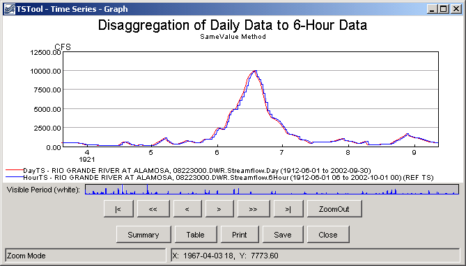
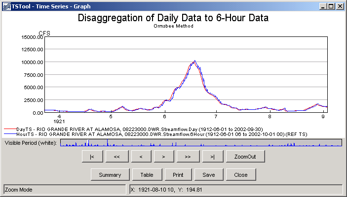

# TSTool / Command / Disaggregate #

* [Overview](#overview)
* [Command Editor](#command-editor)
* [Command Syntax](#command-syntax)
* [Examples](#examples)
* [Troubleshooting](#troubleshooting)
* [See Also](#see-also)

-------------------------

## Overview ##

The `Disaggregate` command creates a new time series by disaggregating a
time series with a longer data interval into a time series with a shorter data interval.
The resulting time series will have the same metadata and
identifier as the original time series, with a different data interval.
See also the general [`ChangeInterval`](../ChangeInterval/ChangeInterval.md) command.

Converting longer-interval data may cause a perceived shift in the time.
For example, 1Day data shifted to 24Hour data will result in the
daily values being set at hour zero of the following day.
This shift is necessary to generically represent different time precision.
Plots will also reflect the shift because hours are not considered
when computing plot positions for daily data.
It is important to understand how disaggregated data is treated with respect
to time when using with other applications.  If necessary, use the
[`ShiftTimeByInterval`](../ShiftTimeByInterval/ShiftTimeByInterval.md) command to manipulate the resulting output time series.

## Command Editor ##

The following dialog is used to edit the command and illustrates the syntax of the command.

**<p style="text-align: center;">

</p>**

**<p style="text-align: center;">
`Disaggregate` Command Editor (<a href="../Disaggregate.png">see also the full-size image</a>)
</p>**

## Command Syntax ##

The command syntax is as follows:

```text
Disaggregate(Parameter="Value",...)
```
**<p style="text-align: center;">
Command Parameters
</p>**

|**Parameter**&nbsp;&nbsp;&nbsp;&nbsp;&nbsp;&nbsp;&nbsp;&nbsp;&nbsp;&nbsp;&nbsp;|**Description**|**Default**&nbsp;&nbsp;&nbsp;&nbsp;&nbsp;&nbsp;&nbsp;&nbsp;&nbsp;&nbsp;&nbsp;&nbsp;&nbsp;&nbsp;&nbsp;&nbsp;&nbsp;&nbsp;&nbsp;&nbsp;&nbsp;&nbsp;&nbsp;&nbsp;&nbsp;&nbsp;&nbsp;|
|--------------|-----------------|-----------------|
|`TSID`<br>**required**|The time series identifier or alias for the time series to be disaggregated.|None – must be specified.|
|`Alias`<br>**required**|The alias to assign to the time series, as a literal string or using the special formatting characters listed by the command editor.  The alias is a short identifier used by other commands to locate time series for processing, as an alternative to the time series identifier (`TSID`).|None – must be specified.|
|`Method`<br>**required**|The method used to perform the disaggregation, one of the following:<ul><li>`Orsmbee` – this method was presented in “Rainfall Disaggregation Model for Continuous Hydrologic Modeling,” Ormsbee, Lindell E., Journal of Hydraulic Engineering, ASCE, April, 1989.  Currently the method has only been enabled for disaggregating 1Day (not 24Hour) data to 6Hour data.</li><li>`SameValue` – this simple method causes the resulting time series to have the same value as the original.  For example, a monthly time series that is disaggregated to a daily time series will result in each daily value being the same as for the corresponding value in the original monthly time series.  Currently the following disaggregations are supported:<ul><li>Year to Month</li><li>Month to Day</li><li>Day to NHour (including 24Hour)</li><li>Hour to NMinute (including 60Minute)</li></ul>|None – must be specified.|
|`NewInterval`<br>**required**|The data interval for the disaggregated time series (NHour, NDay, etc.).|None – must be specified.|
|`NewDataType`|The data type for the disaggregated time series, if different from the original.|Same data type as the original time series.|
|`NewUnits`|The units for the disaggregated time series, if different from the original.|Same units as the original time series.|

## Examples ##

See the [automated tests](https://github.com/OpenCDSS/cdss-app-tstool-test/tree/master/test/regression/commands/general/Disaggregate).

A sample command file to process a time series from the [State of Colorado’s HydroBase database](../../datastore-ref/CO-HydroBase/CO-HydroBase.md)
is as follows:

```text
# 08223000 - RIO GRANDE RIVER AT ALAMOSA
ReadTimeSeries(TSID="08223000.DWR.Streamflow.Day~HydroBase",Alias=”DayTS”)
Disaggregate(TSID="DayTS",Alias=”HourTS”,Method=Ormsbee,NewInterval=6Hour)
```

Examples of graphs for the original and disaggregated data are shown below, for the two disaggregation methods:

**<p style="text-align: center;">

</p>**

**<p style="text-align: center;">
Daily Input Time Series and 6-Hour Disaggregated Time Series using SameValue Method
</p>**

**<p style="text-align: center;">

</p>**

**<p style="text-align: center;">
Daily Input Time Series and 6-Hour Disaggregated Time Series using Ormsbee Method
</p>**

## Troubleshooting ##

## See Also ##

* [`ChangeInterval`](../ChangeInterval/ChangeInterval.md) command
* [`SelectTimeSeries`](../SelectTimeSeries/SelectTimeSeries.md) command
* [`ShiftTimeByInterval`](../ShiftTimeByInterval/ShiftTimeByInterval.md) command
