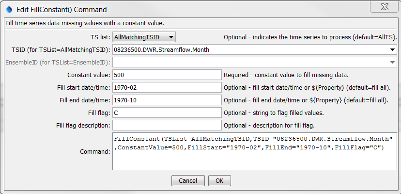

# TSTool / Command / FillConstant #

* [Overview](#overview)
* [Command Editor](#command-editor)
* [Command Syntax](#command-syntax)
* [Examples](#examples)
* [Troubleshooting](#troubleshooting)
* [See Also](#see-also)

-------------------------

## Overview ##

The `FillConstant` command fills the missing data in a time series with the specified value.
This fill technique is useful for filling missing data with zeros, perhaps as the last step in a sequence of filling commands.

## Command Editor ##

The following dialog is used to edit the command and illustrates the syntax of the command.



**<p style="text-align: center;">
`FillConstant` Command Editor (<a href="../FillConstant.png">see also the full-size image</a>)
</p>**

## Command Syntax ##

The command syntax is as follows:

```text
FillConstant(Parameter="Value",...)
```
**<p style="text-align: center;">
Command Parameters
</p>**

|**Parameter**&nbsp;&nbsp;&nbsp;&nbsp;&nbsp;&nbsp;&nbsp;&nbsp;&nbsp;&nbsp;&nbsp;|**Description**|**Default**&nbsp;&nbsp;&nbsp;&nbsp;&nbsp;&nbsp;&nbsp;&nbsp;&nbsp;&nbsp;&nbsp;&nbsp;&nbsp;&nbsp;&nbsp;&nbsp;&nbsp;&nbsp;&nbsp;&nbsp;&nbsp;&nbsp;&nbsp;&nbsp;&nbsp;&nbsp;&nbsp;|
|--------------|-----------------|-----------------|
|`TSList`|Indicates the list of time series to be processed, one of:<br><ul><li>`AllMatchingTSID` – all time series that match the TSID (single TSID or TSID with wildcards) will be processed.</li><li>`AllTS` – all time series before the command.</li><li>`EnsembleID` – all time series in the ensemble will be processed (see the EnsembleID parameter).</li><li>`FirstMatchingTSID` – the first time series that matches the TSID (single TSID or TSID with wildcards) will be processed.</li><li>`LastMatchingTSID` – the last time series that matches the TSID (single TSID or TSID with wildcards) will be processed.</li><li>`SelectedTS` – the time series are those selected with the [`SelectTimeSeries`](../SelectTimeSeries/SelectTimeSeries.md) command.</li></ul> | `AllTS` |
|`TSID`|The time series identifier or alias for the time series to be processed, using the `*` wildcard character to match multiple time series.  Can be specified using `${Property}`.|Required if `TSList=*TSID`|
|`EnsembleID`|The ensemble to be processed, if processing an ensemble. Can be specified using `${Property}`.|Required if `TSList=*EnsembleID`|
|`ConstantValue`|Constant value to use when filling missing data.  Can be specified with a processor `${Property}`.|None – must be specified.|
|`FillStart`|Date/time indicating the start of filling, using a precision appropriate for the time series, or `OutputStart`.  Can be specified with a processor `${Property}`.|Fill the entire time series.|
|`FillEnd`|Date/time indicating the end of filling, using a precision appropriate for the time series, or `OutputEnd`.  Can be specified with a processor `${Property}`.|Fill the entire time series.|
|`FillFlag`|If specified, data flags will be enabled for the time series and each filled value will be tagged with the specified string.  The flag can then be used later to label graphs, etc.  The flag will be appended to existing flags if necessary.  Can be specified with a processor `${Property}`.|No flag is assigned.|
|`FillFlagDesc`|Description to use for the fill flag.  The description is used in visual products such as reports and graphs.  Can be specified with a processor `${Property}`.|No description is assigned to the fill flag.|

## Examples ##

See the [automated tests](https://github.com/OpenCDSS/cdss-app-tstool-test/tree/master/test/regression/commands/general/FillConstant).

A sample command file to fill a time series from the [State of Colorado’s HydroBase database](../../datastore-ref/CO-HydroBase/CO-HydroBase.md)
is as follows:

```text
# 08236500 - ALAMOSA RIVER BELOW TERRACE RESERVOIR
08236500.DWR.Streamflow.Month~HydroBase
FillConstant(TSList=AllMatchingTSID,TSID="08236500.DWR.Streamflow.Month",
ConstantValue=500,FillStart="1970-02",FillEnd="1970-10",FillFlag="C")
```

## Troubleshooting ##

## See Also ##

* [`SelectTimeSeries`](../SelectTimeSeries/SelectTimeSeries.md) command
* [`SetConstant`](../SetConstant/SetConstant.md) command
