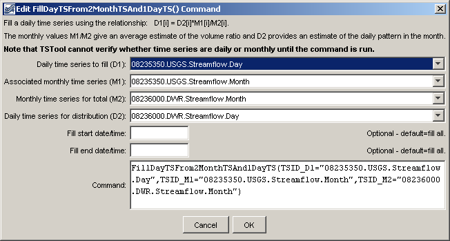
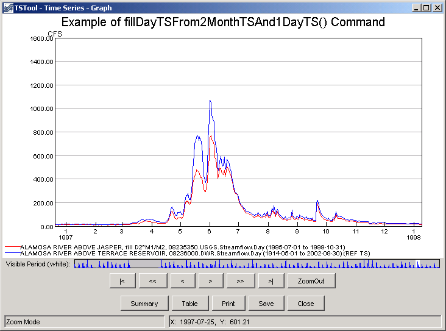

# TSTool / Command / FillDayTSFrom2MonthTSAnd1DayTS #

* [Overview](#overview)
* [Command Editor](#command-editor)
* [Command Syntax](#command-syntax)
* [Examples](#examples)
* [Troubleshooting](#troubleshooting)
* [See Also](#see-also)

-------------------------

## Overview ##

The `FillDayTSFrom2MonthTSAnd1DayTS` command fills a daily time series using the following relationship:

```
D1i = D2i*(M1i/M2i)
```

where:

`i` = day
`D1` is the daily data at location 1
`M1` is the monthly data at location 1 (for the month corresponding to the day)
`D2` is the daily data at location 2
`M2` is the monthly data at location 2 (for the month corresponding to the day)

This fill method assumes the monthly time series are filled and reasonably
correlated and that the daily pattern D2 can be applied at D1.
For example, use this command to fill daily streamflow where filled
monthly data are available at nearby locations and filled daily data is available at the independent (D2) station. 

## Command Editor ##

The following dialog is used to edit the command and illustrates the syntax of the command.
For all the time series identifiers, the last matching identifier before the command will be matched for processing.
Currently there is no way to fill multiple time series with one command.



**<p style="text-align: center;">
`FillDayTSFrom2MonthTSAnd1DayTS` Command Editor (<a href="../FillDayTSFrom2MonthTSAnd1DayTS.png">see also the full-size image</a>)
</p>**

## Command Syntax ##

The command syntax is as follows:

```text
FillDayTSFrom2MonthTSAnd1DayTS(Parameter="Value",...)
```
**<p style="text-align: center;">
Command Parameters
</p>**

|**Parameter**&nbsp;&nbsp;&nbsp;&nbsp;&nbsp;&nbsp;&nbsp;&nbsp;&nbsp;&nbsp;&nbsp;|**Description**|**Default**&nbsp;&nbsp;&nbsp;&nbsp;&nbsp;&nbsp;&nbsp;&nbsp;&nbsp;&nbsp;&nbsp;&nbsp;&nbsp;&nbsp;&nbsp;&nbsp;&nbsp;&nbsp;&nbsp;&nbsp;&nbsp;&nbsp;&nbsp;&nbsp;&nbsp;&nbsp;&nbsp;|
|--------------|-----------------|-----------------|
|`TSID_D1`|The time series identifier or alias for the daily time series to be filled.|None – must be specified.|
|`TSID_M1`|The time series identifier or alias for the monthly time series, corresponding to `TSID_D1`, to supply the monthly values to be distributed to daily.|None – must be specified.|
|`TSID_M2`|The time series identifier or alias for the independent monthly time series.|None – must be specified.|
|`TSID_D2`|The time series identifier or alias for the independent daily time series, corresponding to `TSID_M2`.|None – must be specified.|
|`FillStart`|Date/time indicating the start of filling, using a precision appropriate for the time series, or `OutputStart`.|Fill the entire time series.|
|`FillEnd`|Date/time indicating the end of filling, using a precision appropriate for the time series, or `OutputEnd`.|Fill the entire time series.|

## Examples ##

See the [automated tests](https://github.com/OpenCDSS/cdss-app-tstool-test/tree/master/test/regression/commands/general/FillDayTSFrom2MonthTSAnd1DayTS).

A sample command file to process a time series from the [State of Colorado’s HydroBase database](../../datastore-ref/CO-HydroBase/CO-HydroBase.md)
is as follows.

```text
# The following is D1:
# (1995-1998) ALAMOSA RIVER ABOVE JASPER, CO  USGS  Streamflow  Daily
08235350.USGS.Streamflow.Day~HydroBase
# The following is M1:
# (1995-1998) ALAMOSA RIVER ABOVE JASPER, CO  USGS  Streamflow  Monthly
08235350.USGS.Streamflow.Month~HydroBase
# The following is D2:
# (1914-1998) ALAMOSA RIVER ABOVE TERRACE RESERVOIR, CO.  DWR  Streamflow  Daily
08236000.DWR.Streamflow.Day~HydroBase
# The following is M2:
# (1914-1998) ALAMOSA RIVER ABOVE TERRACE RESERVOIR, CO.  DWR  Streamflow  Monthly
08236000.DWR.Streamflow.Month~HydroBase
FillRegression(TSID="08235350.USGS.Streamflow.Month",IndependentTSID="08236000.DWR.Streamflow.Month",NumberOfEquations=OneEquation,Transformation=Linear)
FillDayTSFrom2MonthTSAnd1DayTS(TSID_D1="08235350.USGS.Streamflow.Day",TSID_M1="08235350.USGS.Streamflow.Month",TSID_M2="08236000.DWR.Streamflow.Month",TSID_D2="08236000.DWR.Streamflow.Day")
```
The following graph shows the two daily time series used in the command (zoomed in).
Note that the shape of the filled time series is similar to the other time series.



**<p style="text-align: center;">
Example of Filled Data (<a href="../FillDayTSFrom2MonthTSAnd1DayTS_Graph.png">see also the full-size image</a>)
</p>**

## Troubleshooting ##

## See Also ##

* [`FillRegression`](../FillRegression/FillRegression.md) command
