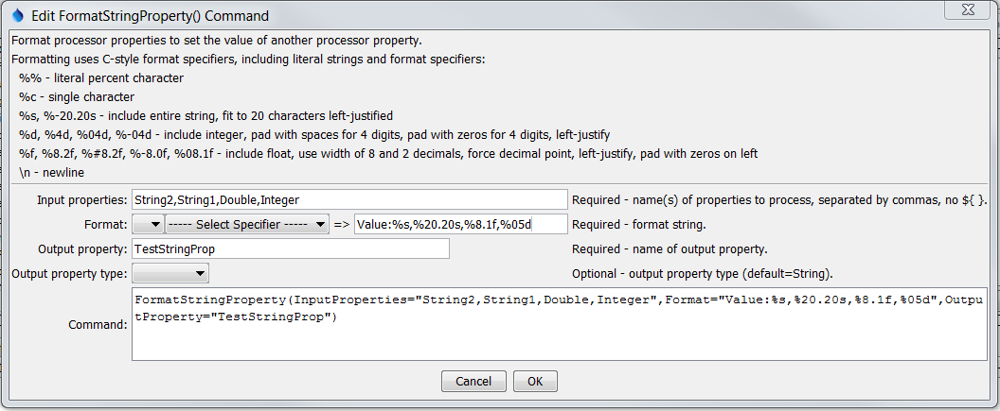

# TSTool / Command / FormatStringProperty #

* [Overview](#overview)
* [Command Editor](#command-editor)
* [Command Syntax](#command-syntax)
* [Examples](#examples)
* [Troubleshooting](#troubleshooting)
* [See Also](#see-also)

-------------------------

## Overview ##

The `FormatStringProperty` command uses zero or more processor properties
as input and formats an output processor property.
For example, it may be necessary to concatenate values from several properties
to create a string that can be used in a command.
The command also can be used to assign a literal string to property,
although [`SetProperty`](../SetProperty/SetProperty) is more suitable.
Formatting occurs as follows:
	
* The data types for input properties control the type of formatting that can be done.
For example, properties that are floating-point numbers must use the format specifiers for floating-point numbers.
* Format specifiers are consistent with the C programming language.
* A newline character can be inserted using `\n`, although properties with newlines may cause issues if output to a file.
* Null input properties will result in blanks in output.

## Command Editor ##

The following dialog is used to edit the command and illustrates the command syntax.
<a href="../FormatStringProperty.png">See also the full-size image.</a>



**<p style="text-align: center;">
`FormatStringProperty` Command Editor
</p>**

## Command Syntax ##

The command syntax is as follows:

```text
FormatStringProperty(Parameter="Value",...)
```
**<p style="text-align: center;">
Command Parameters
</p>**

| **Parameter**&nbsp;&nbsp;&nbsp;&nbsp;&nbsp;&nbsp;&nbsp;&nbsp;&nbsp;&nbsp;&nbsp;&nbsp;&nbsp;&nbsp;&nbsp;&nbsp;&nbsp;&nbsp;&nbsp;&nbsp;&nbsp;&nbsp;&nbsp;&nbsp;&nbsp;&nbsp; | **Description** | **Default**&nbsp;&nbsp;&nbsp;&nbsp;&nbsp;&nbsp;&nbsp;&nbsp;&nbsp;&nbsp; |
| --------------|-----------------|----------------- |
|`InputProperties`|The names of one or more input processor properties.  Values corresponding to the properties will be formatted according to the Format parameter.  Input properties can be omitted if the format string is a literal value.|Required if format specifiers are given.|
|`Format`<br>**required**|The format specifier string used to format the property values.  See the editor dialog for examples and refer to [`sprintf` documentation](https://en.wikipedia.org/wiki/Printf_format_string) for further explanation.  Specify as many format specifiers as there are input properties.  All other characters will be transferred literally to the output string.|None – must be specified.|
|`OutputProperty`<br>**required**|The name of the processor property to be set.|None – must be specified.|
|`PropertyType`|Indicate the output property type, which allows the command to create properties other than strings.  The formatted string must have an appropriate value to allow the conversion:<ul><li>`Boolean` – string must be true or false (case-insensitive)</li><li>`DateTime` – string must be a standard date/time format such as supported by [`SetProperty`](../SetProperty/SetProperty)</li><li>`Double` – floating point number</li><li>`Integer` – integer number</li><li>`String` – any text</li><ul>|`String`|

## Examples ##

See the [automated tests](https://github.com/OpenWaterFoundation/cdss-app-tstool-test/tree/master/test/regression/commands/general/FormatStringProperty).

## Troubleshooting ##

## See Also ##

* [`FormatDateTimeProperty`](../FormatDateTimeProperty/FormatDateTimeProperty) command
* [`SetProperty`](../SetProperty/SetProperty) command
