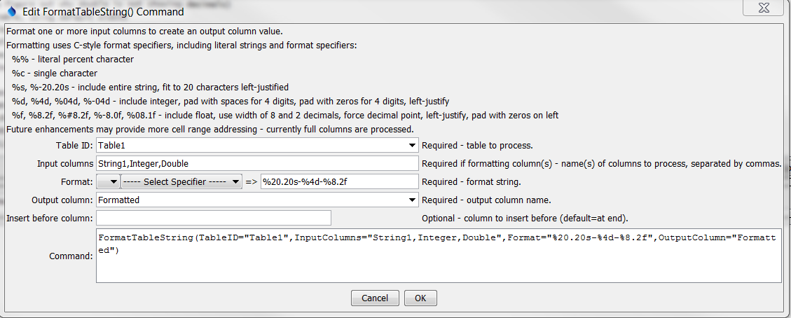

# Learn TSTool / Command / FormatTableString #

* [Overview](#overview)
* [Command Editor](#command-editor)
* [Command Syntax](#command-syntax)
* [Examples](#examples)
* [Troubleshooting](#troubleshooting)
* [See Also](#see-also)

-------------------------

## Overview ##

The `FormatTableString` uses zero or more table columns as input and formats an output table column.
For example, it may be necessary to concatenate information from several columns to create an identifier.
It can also be used to assign a literal string to a column.
See also the [`ManipulateTableString`](../ManipulateTableString/ManipulateTableString) command.
Formatting occurs as follows:
	
* The data types for input columns control the type of formatting that can be done.
For example, columns containing floating-point numbers must use the format specifiers for floating-point numbers.
* Format specifiers are consistent with the C programming language.
* Missing values in input will result in blanks in output.

## Command Editor ##

The following dialog is used to edit the command and illustrates the syntax of the command
(in this case illustrating how values in a column named `LocationID` are copied to a new table).  
<a href="../FormatTableString.png">See also the full-size image.</a>



**<p style="text-align: center;">
`FormatTableString` Command Editor
</p>**

## Command Syntax ##

The command syntax is as follows:

```text
FormatTableString(Parameter="Value",...)
```
**<p style="text-align: center;">
Command Parameters
</p>**

| **Parameter**&nbsp;&nbsp;&nbsp;&nbsp;&nbsp;&nbsp;&nbsp;&nbsp;&nbsp;&nbsp;&nbsp;&nbsp;&nbsp;&nbsp;&nbsp;&nbsp;&nbsp;&nbsp;&nbsp;&nbsp;&nbsp;&nbsp;&nbsp;&nbsp;&nbsp;&nbsp; | **Description** | **Default**&nbsp;&nbsp;&nbsp;&nbsp;&nbsp;&nbsp;&nbsp;&nbsp;&nbsp;&nbsp; |
| --------------|-----------------|----------------- |
|`TableID`|The identifier for the table to process.  Can specify using processor `${Property}`.|None – must be specified.|
|`InputColumns`|The names of one or more input columns.  Values from the columns will be formatted according to the `Format` parameter.  Input columns can be omitted if the format string is a literal value.|Required if format specifiers are given.|
|`Format`|The format specifier string used to format the data values.  See the editor dialog for examples and refer to [printf documentation](https://en.wikipedia.org/wiki/Printf_format_string).  Specify as many format specifiers as there are input columns.  All other characters will be transferred literally to the output string.|None – must be specified.|
|`OutputColumn`|The name of the column to receive the output.|None – must be specified.|
|`InsertBeforeColumn`|The name of the column before which to insert the new column.|After last column.|

## Examples ##

See the [automated tests](https://github.com/OpenWaterFoundation/cdss-app-tstool-test/tree/master/test/regression/commands/general/FormatTableString).

## Troubleshooting ##

## See Also ##

* [`FormatTableDateTime`](../FormatTableDateTime/FormatTableDateTime) command
* [`ManipulateTableString`](../ManipulateTableString/ManipulateTableString) command
