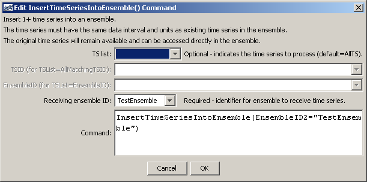

# Learn TSTool / Command / InsertTimeSeriesIntoEnsemble #

* [Overview](#overview)
* [Command Editor](#command-editor)
* [Command Syntax](#command-syntax)
* [Examples](#examples)
* [Troubleshooting](#troubleshooting)
* [See Also](#see-also)

-------------------------

## Overview ##

The `InsertTimeSeriesIntoEnsemble` command inserts 1+ time series into an ensemble.
The time series must have the same interval and data units as the time series in the ensemble.
For example, use the command to insert scenario time series into an ensemble.

## Command Editor ##

The following dialog is used to edit the command and illustrates the syntax of the command.
<a href="../InsertTimeSeriesIntoEnsemble.png">See also the full-size image.</a>



**<p style="text-align: center;">
`InsertTimeSeriesIntoEnsemble` Command Editor
</p>**

## Command Syntax ##

The command syntax is as follows:

```text
InsertTimeSeriesIntoEnsemble(Parameter="Value",...)
```
**<p style="text-align: center;">
Command Parameters
</p>**

|**Parameter**&nbsp;&nbsp;&nbsp;&nbsp;&nbsp;&nbsp;&nbsp;&nbsp;&nbsp;&nbsp;&nbsp;|**Description**|**Default**&nbsp;&nbsp;&nbsp;&nbsp;&nbsp;&nbsp;&nbsp;&nbsp;&nbsp;&nbsp;&nbsp;&nbsp;&nbsp;&nbsp;&nbsp;&nbsp;&nbsp;&nbsp;&nbsp;&nbsp;&nbsp;&nbsp;&nbsp;&nbsp;&nbsp;&nbsp;&nbsp;|
|--------------|-----------------|-----------------|
|`TSList`|Indicates the list of time series to be processed, one of:<br><ul><li>`AllMatchingTSID` – all time series that match the TSID (single TSID or TSID with wildcards) will be processed.</li><li>`AllTS` – all time series before the command.</li><li>`EnsembleID` – all time series in the ensemble will be processed (see the EnsembleID parameter).</li><li>`FirstMatchingTSID` – the first time series that matches the TSID (single TSID or TSID with wildcards) will be processed.</li><li>`LastMatchingTSID` – the last time series that matches the TSID (single TSID or TSID with wildcards) will be processed.</li><li>`SelectedTS` – the time series are those selected with the [`SelectTimeSeries`](../SelectTimeSeries/SelectTimeSeries) command.</li></ul> | `AllTS` |
|`TSID`|The time series identifier or alias for the time series to be processed, using the `*` wildcard character to match multiple time series.  Can be specified using `${Property}`.|Required if `TSList=*TSID`|
|`EnsembleID`|The ensemble from which to retrieve time series, if inserting time series from an ensemble.|Required when `TSList=EnsembleID`.|
|`EnsembleID2`<br>**required**|The identifier for the ensemble that is receiving the time series.|None – must be specified.|

## Examples ##

See the [automated tests](https://github.com/OpenWaterFoundation/cdss-app-tstool-test/tree/master/test/regression/commands/general/InsertTimeSeriesIntoEnsemble).

A sample command file to create an ensemble from user-defined time series is as follows:

```
# Test inserting time series into an ensemble from year interval time series
NewPatternTimeSeries(Alias="ts1",NewTSID="ts1..Flow.Year",SetStart="1960",SetEnd="2000",Units="ACFT",PatternValues="1,2,5,8,,20")
NewPatternTimeSeries(Alias="ts2",NewTSID="ts2..Flow.Year",SetStart="1950",SetEnd="2005",Units="ACFT",PatternValues="2,4,10,16,,40")
NewEnsemble(TSList=AllTS,NewEnsembleID="TestEnsemble",NewEnsembleName="Test Ensemble")
InsertTimeSeriesIntoEnsemble(Ensemble2=”TestEnsemble”)
```

## Troubleshooting ##

## See Also ##

* [`NewEnsemble`](../NewEnsemble/NewEnsemble) command
* [`SelectTimeSeries`](../SelectTimeSeries/SelectTimeSeries) command
