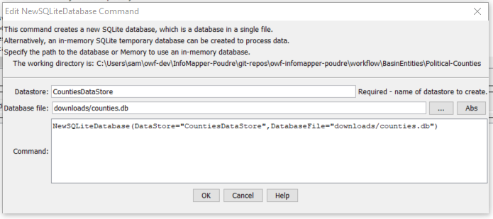

# TSTool / Command / NewSQLiteDatabase #

* [Overview](#overview)
* [Command Editor](#command-editor)
* [Command Syntax](#command-syntax)
* [Examples](#examples)
* [Troubleshooting](#troubleshooting)
* [See Also](#see-also)

-------------------------

## Overview ##

The `NewSQLiteDatabase` command creates a new, empty, SQLite database.
SQLite databases are single file databases that are useful for creating,
manipulating, and publishing datasets.
SQLite can also create an in-memory database that facilitates data processing.
TSTool tables can be read from a database using
[`ReadTableFromDataStore`](../ReadTableFromDataStore/ReadTableFromDataStore.md) command
and written to a database using
[`WriteTableToDataStore`](../WriteTableToDataStore/WriteTableToDataStore.md) command.
The following are technical considerations:

* database names typically have `.db` extension
* a database file that is in use cannot be written over; therefore any software
using an existing database file should close the connection before recreating
* if appropriate for a workflow, use the [`RemoveFile`](../RemoveFile/RemoveFile.md) or [`CopyFile`](../CopyFile/CopyFile.md)
commands to handle an existing database file before creating a new database with the same name
* use a [`CloseDataStore`](../CloseDataStore/CloseDataStore.md) command to close a previously created (and opened) datastore,
for example if rerunning a command file
* the datastore is dynamically created as a
[`GenericDatabase`](../../datastore-ref/GenericDatabase/GenericDatabase.md) using ODBC/JDBC connection
* not all commands will list the datastore in editor datastore
selector lists - software enhancements are being implemented to better handle dynamic datastores

## Command Editor ##

The following dialog is used to edit the command and illustrates the command syntax.

**<p style="text-align: center;">

</p>**

**<p style="text-align: center;">
`NewSQLiteDatabase` Command Editor (<a href="../NewSQLiteDatabase.png">see also the full-size image</a>)
</p>**

## Command Syntax ##

The command syntax is as follows:

```text
NewSQLiteDatabase(Parameter="Value",...)
```
**<p style="text-align: center;">
Command Parameters
</p>**

| **Parameter**&nbsp;&nbsp;&nbsp;&nbsp;&nbsp;&nbsp;&nbsp;&nbsp;&nbsp;&nbsp;&nbsp;&nbsp; | **Description** | **Default**&nbsp;&nbsp;&nbsp;&nbsp;&nbsp;&nbsp;&nbsp;&nbsp;&nbsp;&nbsp; |
| --------------|-----------------|----------------- |
|`DataStore`<br>**required**|DataStore name for the database that will be created.  Can be specified using processor `${Property}`.|None – must be specified.|
|`DatabaseFile`|The name of the database file as full path or path relative to the command file.  A file extension of `.db` is typical.  Specify as `Memory` to create an in-memory database that will be active while the TSTool session is active. **Rerunning a command file will recreate the database.  Use a datastore configuration file rather than this command if the database should be available throughout multiple TSTool sessions.**|None - must be specified.|

## Examples ##

See the [automated tests](https://github.com/OpenCDSS/cdss-app-tstool-test/tree/master/test/regression/commands/general/NewSQLiteDatabase).

## Troubleshooting ##

## See Also ##

* [`CloseDataStore`](../CloseDataStore/CloseDataStore.md) command
* [`CopyFile`](../CopyFile/CopyFile.md) command
* [`ReadTableFromDataStore`](../ReadTableFromDataStore/ReadTableFromDataStore.md) command
* [`RemoveFile`](../RemoveFile/RemoveFile.md) command
* [`WriteTableToDataStore`](../WriteTableToDataStore/WriteTableToDataStore.md) command.
