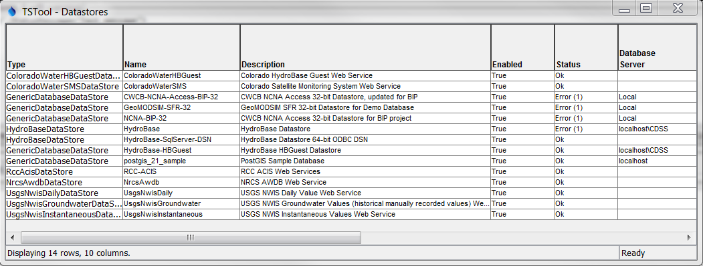
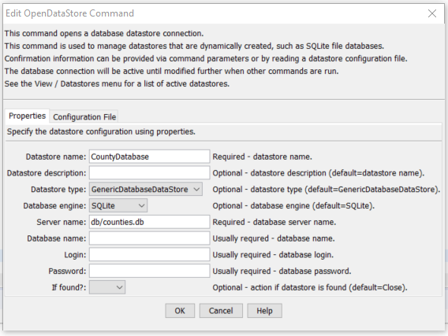

# TSTool / Command / OpenDataStore #

* [Overview](#overview)
* [Command Editor](#command-editor)
* [Command Syntax](#command-syntax)
* [Examples](#examples)
* [Troubleshooting](#troubleshooting)
* [See Also](#see-also)

-------------------------

## Overview ##

**This command has initially been developed to work with SQLite.
Support for other databases will be added and tested over time.**

The `OpenDataStore` command dynamically opens a database datastore.
This command is useful for a dynamic database connection that does not need to be open
throughout a TSTool session, such as when working with SQLite file database.
If a matching open datastore exists, it will by default be closed before the datastore is reopened.
See also the
[`CloseDataStore`](../CloseDataStore/CloseDataStore.md) command.

Datastores that are needed throughout a TSTool session should be configured with a datastore
configuration file to connect at startup,
which allows TSTool to initialize main user interface query filters.

The status of datastores can be shown in TSTool using the ***View / Datastores***
menu as shown in the following figure (the Status ***Message*** column on the far right,
not visible in the figure, provides additional information about the datastore):

**<p style="text-align: center;">

</p>**

**<p style="text-align: center;">
Datastore Information from *View / Datastores* (<a href="../View_Datastores.png">see also the full-size image</a>)
</p>**

## Command Editor ##

The following dialog is used to edit the command and illustrates the syntax of the command.

**<p style="text-align: center;">

</p>**

**<p style="text-align: center;">
`OpenDataStore` Command Editor using Properties (<a href="../OpenDataStore.png">see also the full-size image</a>)
</p>**

**<p style="text-align: center;">

</p>**

**<p style="text-align: center;">
`OpenDataStore` Command Editor using Configuration File (<a href="../OpenDataStore-config.png">see also the full-size image</a>)
</p>**

## Command Syntax ##

The command syntax is as follows:

```text
OpenDataStore(Parameter="Value",...)
```
**<p style="text-align: center;">
Command Parameters
</p>**

|**Parameter**&nbsp;&nbsp;&nbsp;&nbsp;&nbsp;&nbsp;&nbsp;&nbsp;&nbsp;&nbsp;&nbsp;&nbsp;&nbsp;&nbsp;&nbsp;&nbsp;&nbsp;&nbsp;&nbsp;&nbsp;&nbsp;&nbsp;&nbsp;&nbsp;&nbsp;&nbsp;&nbsp;&nbsp;&nbsp;&nbsp;&nbsp;&nbsp;&nbsp;&nbsp;&nbsp;|**Description**|**Default**&nbsp;&nbsp;&nbsp;&nbsp;&nbsp;&nbsp;&nbsp;&nbsp;&nbsp;&nbsp;&nbsp;&nbsp;&nbsp;&nbsp;&nbsp;&nbsp;&nbsp;&nbsp;&nbsp;&nbsp;&nbsp;&nbsp;&nbsp;&nbsp;&nbsp;&nbsp;&nbsp;|
|--------------|-----------------|-----------------|
|`DataStoreName`|The name of the database datastore to open.| None – must be specified.|
|`DataStoreDescription`|The description of the database datastore to open.| `DataStoreName`|
|`DataStoreType`|The datastore type, which indicates the software interface to use for the database, currently limited to: <ul><li>`GenericDatabaseDataStore`</li></ul>|`GenericDatabaseDataStore`|
|`DatabaseEngine`|The database software:<ul><li>`Access` - Microsoft Access</li><li>`Derby` - Java built-in database</li><li>`MySQL`</li><li>`Oracle`</li><li>`PostgreSQL`</li><li>`SQLite`</li><li>`SQLServer`</li></</ul>|`SQLite`|
|`ServerName`|Database server name as recognized name on network or IP address.  Additional details for `DatabaseEngine` are:  <ul><li>`SQLite` - specify the relative or absolute path to the existing database file.</li></ul>| None - must be specified |
|`DatabaseName`|Database name.  Additional details for `DatabaseEngine` are:<ul><li>`SQLite` - not used</li></ul> | |
|`Login`|Login for account used to connect to the database, may be a shared service account.  Additional details for `DatabaseEngine` are:<ul><li>`SQLite` - not used unless database is locked</li></ul>||
|`Password`|Password for account used to connect to the database, may be a shared service account.  Additional details for `DatabaseEngine` are:<ul><li>`SQLite` - not used unless database is locked</li></ul>||
|`IfFound`|Action to be taken if an open datastore is found:<ul><li>`Close`- close the datastore before reopening</li><li>`Warn` - generate a warning messge and do not reopen</li><li>`Fail` - generate a failure message and do not reopen</li></ul>| `Close` |

## Examples ##

See the [automated tests](https://github.com/OpenCDSS/cdss-app-tstool-test/tree/master/test/regression/commands/general/OpenDataStore).

## Troubleshooting ##

## See Also ##

* [`CloseDataStore`](../CloseDataStore/CloseDataStore.md) command
* [`NewSQLiteDatabase`](../NewSQLiteDatabase/NewSQLiteDatabase.md) command
