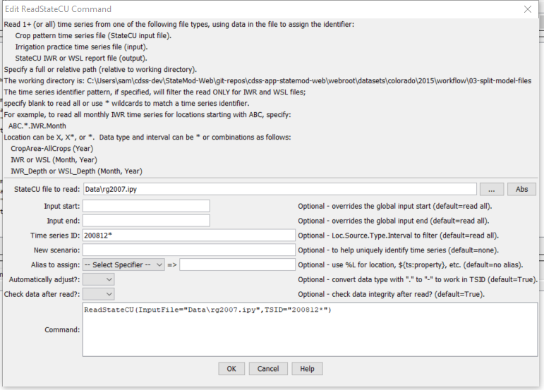

# TSTool / Command / ReadStateCU #

* [Overview](#overview)
* [Command Editor](#command-editor)
* [Command Syntax](#command-syntax)
* [Examples](#examples)
* [Troubleshooting](#troubleshooting)
* [See Also](#see-also)

-------------------------

## Overview ##

The `ReadStateCU` command reads all the time series in a StateCU time series file
(e.g., frost dates) or report file (e.g., IWR, WSL).
See the [StateCU Input Type Appendix](../../datastore-ref/StateCU/StateCU).

## Command Editor ##

The following dialog is used to edit the command and illustrates the syntax of the command.
<a href="../ReadStateCU.png">See also the full-size image.</a>



**<p style="text-align: center;">
`ReadStateCU` Command Editor
</p>**

## Command Syntax ##

The command syntax is as follows:

```text
ReadStateCU(Parameter="Value",...)
```
**<p style="text-align: center;">
Command Parameters
</p>**

|**Parameter**&nbsp;&nbsp;&nbsp;&nbsp;&nbsp;&nbsp;&nbsp;&nbsp;&nbsp;&nbsp;&nbsp;|**Description**|**Default**&nbsp;&nbsp;&nbsp;&nbsp;&nbsp;&nbsp;&nbsp;&nbsp;&nbsp;&nbsp;&nbsp;&nbsp;&nbsp;&nbsp;&nbsp;&nbsp;&nbsp;&nbsp;&nbsp;&nbsp;&nbsp;&nbsp;&nbsp;&nbsp;&nbsp;&nbsp;&nbsp;|
|--------------|-----------------|-----------------|
|`InputFile`<br>**required**|The name of the StateCU time series or report file to read, surrounded by double quotes.|None – must be specified.|
|`InputStart`|The starting date/time to read, specified to a precision (month or year) that matches the data file.|Read all the data.|
|`InputEnd`|The ending date/time to read, specified to a precision (month or year) that matches the data file.|Read all the data.|
|`TSID`|A time series identifier pattern that will be used to filter the list of time series that are read.  See the figure above for examples.|Read all time series.|
|`NewScenario`|A new scenario to use for the TSID.  This is useful when reading data from multiple model runs that otherwise would have the same TSIDs.|No scenario.|
|`AutoAdjust`|Indicate whether to automatically adjust time series identifiers to use a dash `-` instead of period `.` in the data type, necessary because StateCU data types (e.g., crop types that include CU method)  have a period that interferes with the normal TSID convention.|`True`|
|`CheckData`|Indicate whether to check the data for integrity after reading.  Currently only the irrigation practice time series can be checked, to verify that the acreage totals are the sum of the parts. |`True`|

## Examples ##

See the [automated tests](https://github.com/OpenWaterFoundation/cdss-app-tstool-test/tree/master/test/regression/commands/general/ReadStateCU).

## Troubleshooting ##

## See Also ##

* [`ReadStateCUB`](../ReadStateCUB/ReadStateCUB) command
* [`WriteStateCU`](../WriteStateCU/WriteStateCU) command
