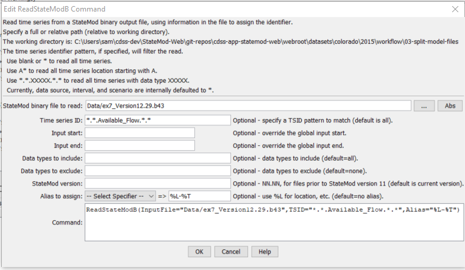

# TSTool / Command / ReadStateModB #

* [Overview](#overview)
* [Command Editor](#command-editor)
* [Command Syntax](#command-syntax)
* [Examples](#examples)
* [Troubleshooting](#troubleshooting)
* [See Also](#see-also)

-------------------------

## Overview ##

The `ReadStateModB` command reads time series from a StateMod binary output time series file.
See the [StateModB Input Type Appendix](../../datastore-ref/StateModB/StateModB).
The identifiers (or aliases) from the time series will be available as choices when editing other commands.
If this causes performance issues due to the large number of time series that may be read,
limit the time series that are read using the `TSID` parameter.

## Command Editor ##

The following dialog is used to edit the command and illustrates the syntax of the command.
<a href="../ReadStateModB.png">See also the full-size image.</a>



**<p style="text-align: center;">
`ReadStateModB` Command Editor
</p>**

## Command Syntax ##

The command syntax is as follows:

```text
ReadStateModB(Parameter="Value",...)
```
**<p style="text-align: center;">
Command Parameters
</p>**

|**Parameter**&nbsp;&nbsp;&nbsp;&nbsp;&nbsp;&nbsp;&nbsp;&nbsp;&nbsp;&nbsp;&nbsp;|**Description**|**Default**&nbsp;&nbsp;&nbsp;&nbsp;&nbsp;&nbsp;&nbsp;&nbsp;&nbsp;&nbsp;&nbsp;&nbsp;&nbsp;&nbsp;&nbsp;&nbsp;&nbsp;&nbsp;&nbsp;&nbsp;&nbsp;&nbsp;&nbsp;&nbsp;&nbsp;&nbsp;&nbsp;|
|--------------|-----------------|-----------------|
|`InputFile`<br>**required**|The name of the StateMod binary time series file to read, surrounded by double quotes.  The path to the file can be absolute or relative to the working directory.  Global property values can be inserted using the syntax `${PropertyName}`.|None – must be specified.|
|`TSID`|Time series identifier pattern to filter the read.  Use periods to indicate separate TSID parts and use * to match patterns within the parts.|Read all time series.|
|`InputStart`|The starting date/time to read data, specified to Day or Month precision based on whether a daily or monthly model run.|Read all data.|
|`InputEnd`|The ending date/time to read data, specified to Day or Month precision based on whether a daily or monthly model run.|Read all data.|
|`Version`|StateMod version number using the form `NN.NN` (padded with leading zero for version 9) corresponding to the file, necessary because the file version number (and consequently parameters) cannot be automatically detected in older versions.  Changes in binary file format occurred with version 9.01 and 9.69, mainly to add new data types.  The StateMod file version for version 11+ is automatically detected.|Detect from the file if possible.|
|`Alias`|The alias to assign to the time series that are read.  Use the format choices and other characters to define a unique alias.|No alias is assigned.|

## Examples ##

See the [automated tests](https://github.com/OpenWaterFoundation/cdss-app-tstool-test/tree/master/test/regression/commands/general/ReadStateModB).

The following example command file illustrates how to read all `Available_Flow`
time series for identifiers starting with `44` (e.g., to extract all such time series for a water district):

```text
ReadStateModB(InputFile="..\StateMod\ym2002b.b43",TSID="44*.*.Available_Flow.*")
```

The following example illustrates how to read all time series from a binary file
that was created with StateMod version 9.53.
As shown in the example, debug can be turned on for the log file to evaluate issues with the file format.  

```text
StartLog(LogFile="commands.TSTool.log")
SetDebugLevel(0,1)
ReadStateModB(InputFile="COLOFB.B43",Version="09.53")
```

## Troubleshooting ##

## See Also ##

* [`ReadStateMod`](../ReadStateMod/ReadStateMod) command
