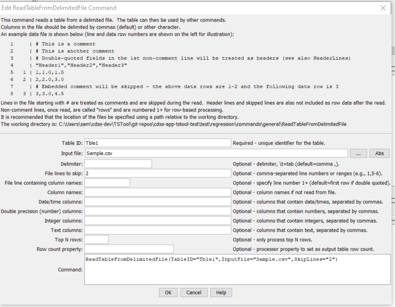

# Learn TSTool / Command / ReadTableFromDelimitedFile #

* [Overview](#overview)
* [Command Editor](#command-editor)
* [Command Syntax](#command-syntax)
* [Examples](#examples)
* [Troubleshooting](#troubleshooting)
* [See Also](#see-also)

-------------------------

## Overview ##

The `ReadTableFromDelimitedFile` command reads a table from a comma-delimited file.
Tables are used by other commands when performing lookups of
information or generating summary information from processing.
Table files have the following characteristics:
	
* Comments indicated by lines starting with # are stripped during the read.
* Extraneous lines in the file can be skipped during the read using the `SkipLines` parameter.
* Column headings indicated by “quoted” values in the first non-comment
line will be used to assign string names to the columns.
If no quoted values are present, columns will not have headings.
* Data in columns are assumed to be of consistent type
(i.e., all numerical data or all text), based on rows after the header.
The data type for the column will be determined automatically by examining all data.
* Missing values can be indicated by blanks.
However, a line ending with the delimiter may cause warnings because blank
is not assumed at the end of the line (this is a software limitation that may be addressed
in the future) – work around by adding an extra delimiter or ensure that the last column is not blank.
* Strings containing the delimiter should be surrounded by double quotes.
Strings that contain quotes are checked.
If two sequential quotes are found in input,
they are converted to one quote in the table values
(see [comma-separated-value, CSV, standards](http://en.wikipedia.org/wiki/Comma-separated_values).
Subsequent writes of the table will re-introduce the repeated quote to indicate an embedded quote.

## Command Editor ##

The following dialog is used to edit the command and illustrates the command syntax.
<a href="../ReadTableFromDelimitedFile.png">See also the full-size image.</a>



**<p style="text-align: center;">
`ReadTableFromDelimitedFile` Command Editor
</p>**

## Command Syntax ##

The command syntax is as follows:

```text
ReadTableFromDelimitedFile(Parameter="Value",...)
```
**<p style="text-align: center;">
Command Parameters
</p>**

| **Parameter**&nbsp;&nbsp;&nbsp;&nbsp;&nbsp;&nbsp;&nbsp;&nbsp;&nbsp;&nbsp;&nbsp;&nbsp;&nbsp;&nbsp;&nbsp;&nbsp;&nbsp;&nbsp;&nbsp;&nbsp;&nbsp;&nbsp;&nbsp;&nbsp;&nbsp;&nbsp; | **Description** | **Default**&nbsp;&nbsp;&nbsp;&nbsp;&nbsp;&nbsp;&nbsp;&nbsp;&nbsp;&nbsp; |
| --------------|-----------------|----------------- |
|`TableID`<br>**required**|Identifier to assign to the table that is read, which allows the table data to be used with other commands.  Can be specified using processor `${Property}`.|None – must be specified.|
|`InputFile`<br>**required**|The name of the file to read, as an absolute path or relative to the command file location.  Can be specified using processor `${Property}`.|None – must be specified.|
|`Delimiter`|The delimiter character between columns.  Specify `\t` to indicate tab.  Can be specified using processor `${Property}`.|`,` (comma)|
|`SkipLines`|Indicates the number of lines in the file to skip, which otherwise would interfere with reading row data.  Individual row numbers and ranges can be specified, for example:  `1,5-6,17`|No lines are skipped.|
|`HeaderLines`|Indicate the rows that include header information, which should be used for column names.  Currently this should only be one row, although a range may be fully supported in the future.|If the first non-comment line contains quoted field names, they are assumed to be headers.  Otherwise, no headers are read.|
|`DateTimeColumns`|List of comma-separated column names for columns that should be treated as containing date/time values.  Can be specified using processor `${Property}`.|Date/times default to string (text) columns.|
|`DoubleColumns`|List of comma-separated column names for columns that should be treated as containing floating point double precision values.  Can be specified using processor `${Property}`.|Automatically determine column types from data.|
|`IntegerColumns`|List of comma-separated column names for columns that should be treated as containing integer values.  Can be specified using processor `${Property}`.|Automatically determine column types from data.|
|`TextColumns`|List of comma-separated column names for columns that should be treated as containing text values.  Can be specified using processor `${Property}`.|Automatically determine column types from data.|
|`Top`|Specify the number of data rows to read, useful when prototyping an analysis process.|Process all rows.|
|`RowCountProperty`|The name of the property to set to the number of rows read, useful for looping and error-checks.|Don’t set property.|

## Examples ##

See the [automated tests](https://github.com/OpenWaterFoundation/cdss-app-tstool-test/tree/master/test/regression/commands/general/ReadTableFromDelimitedFile).

The following example command file illustrates how to read a table from a delimited file:

```
ReadTableFromDelimitedFile(TableID="Table1",InputFile="Sample.csv",SkipRows="2")
```

An excerpt from a simple delimited file is:

```
# A comment
some junk to be skipped
“Header1”,”Header2”,”Header3”
1,1.0,1.0
2,2.0,1.5
3,3.0,2.0
```

## Troubleshooting ##

## See Also ##

* [`WriteTableToDelimitedFile`](../WriteTableToDelimitedFile/WriteTableToDelimitedFile) command
