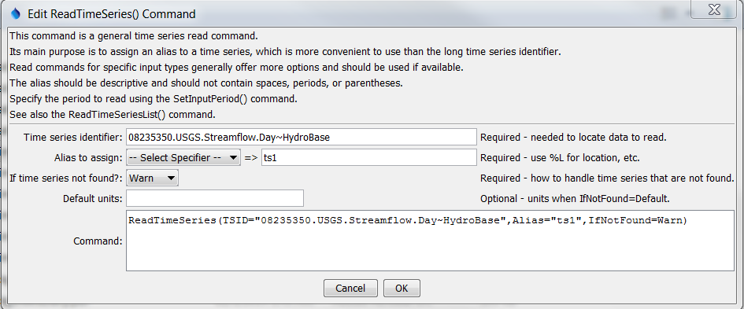

# TSTool / Command / ReadTimeSeries #

* [Overview](#overview)
* [Command Editor](#command-editor)
* [Command Syntax](#command-syntax)
* [Examples](#examples)
* [Troubleshooting](#troubleshooting)
* [See Also](#see-also)

-------------------------

## Overview ##

The `ReadTimeSeries` reads a single time series using the time series
identifier to uniquely identify the time series.
This generalized command is useful for converting time series identifiers from the
TSTool interface into read commands that assign an alias to a time series.
Because the command is generic, it does not offer specific parameters
that may be found in read commands for specific input types.
Use the specific read commands where available for additional
functionality and more specific error handling.
See also the [`ReadTimeSeriesList`](../ReadTimeSeriesList/ReadTimeSeriesList.md) command.

## Command Editor ##

The following dialog is used to edit the command and illustrates the syntax of the command.



**<p style="text-align: center;">
`ReadTimeSeries` Command Editor (<a href="../ReadTimeSeries.png">see also the full-size image</a>)
</p>**

## Command Syntax ##

The command syntax is as follows:

```text
ReadTimeSeries(Parameter="Value",...)
```
The following older command syntax is updated to the above syntax when a command file is read:

```
TS Alias = ReadTimeSeries (Parameter=Value,...)
```

**<p style="text-align: center;">
Command Parameters
</p>**

|**Parameter**&nbsp;&nbsp;&nbsp;&nbsp;&nbsp;&nbsp;&nbsp;&nbsp;&nbsp;&nbsp;&nbsp;|**Description**|**Default**&nbsp;&nbsp;&nbsp;&nbsp;&nbsp;&nbsp;&nbsp;&nbsp;&nbsp;&nbsp;&nbsp;&nbsp;&nbsp;&nbsp;&nbsp;&nbsp;&nbsp;&nbsp;&nbsp;&nbsp;&nbsp;&nbsp;&nbsp;&nbsp;&nbsp;&nbsp;&nbsp;|
|--------------|-----------------|-----------------|
|`TSID`<br>**required**|The time series identifier of the time series to read.  The identifier should include the input type (and input name, if required).  See the input type appendices for examples of time series identifiers for various input types.  Can be specified using `${Property}` notation.|None – must be specified.|
|`Alias`<br>**required**|The alias to assign to the time series, as a literal string or using the special formatting characters listed by the command editor.  The alias is a short identifier used by other commands to locate time series for processing, as an alternative to the time series identifier (`TSID`).|None – must be specified.|
|`IfNotFound`|Indicates how to handle missing time series, one of:<ul><li>`Warn` – generate fatal warnings and do not include in output.</li><li>`Ignore` – generate non-fatal warnings and do not include in output.</li><li>`Default` – generate non-fatal warnings and create empty time series for those that could not be found.  This requires that a [`SetOutputPeriod`](../SetOutputPeriod/SetOutputPeriod.md) command be used before the command to define the period for default time series.|`Warn`|
|`DefaultUnits`|Default units when `IfNotFound=Default`.|Blank – no units.|

## Examples ##

See the [automated tests](https://github.com/OpenCDSS/cdss-app-tstool-test/tree/master/test/regression/commands/general/ReadTimeSeries).

A sample command file to read a time series from the [State of Colorado’s HydroBase database](../../datastore-ref/CO-HydroBase/CO-HydroBase.md)
is as follows:

```text
ReadTimeSeries(TSID="08235350.USGS.Streamflow.Day~HydroBase",Alias=TS1)
```

## Troubleshooting ##

## See Also ##

* [`ReadTimeSeriesList`](../ReadTimeSeriesList/ReadTimeSeriesList.md) command
* [`SetOutputPeriod`](../SetOutputPeriod/SetOutputPeriod.md) command
