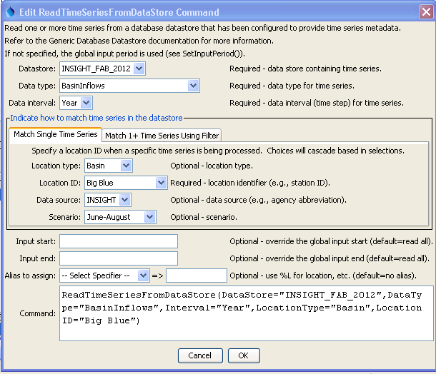
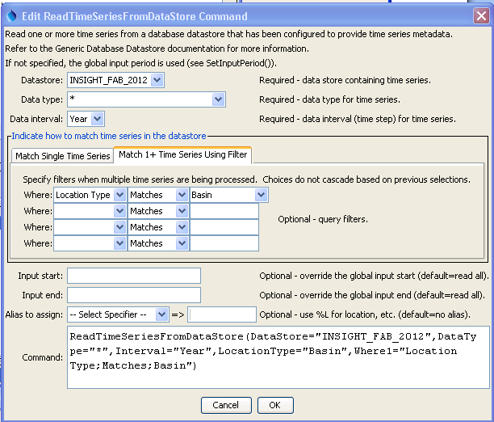

# TSTool / Command / ReadTimeSeriesFromDataStore #

* [Overview](#overview)
* [Command Editor](#command-editor)
* [Command Syntax](#command-syntax)
* [Examples](#examples)
* [Troubleshooting](#troubleshooting)
* [See Also](#see-also)

-------------------------

## Overview ##

The `ReadTimeSeriesFromDataStore` command reads one or more time series from a
generic database datastore that has been configured to provide time series data.
See the [Generic Database Datastore appendix](../../datastore-ref/GenericDatabase/GenericDatabase),
in particular for information about configuring a data store to support time series queries.
Such a configuration relies on a simple database design that can be handled in a general way.

## Command Editor ##

The following dialog is used to edit the command and illustrates the
syntax for the command when reading a single time series.
This is appropriate when a specific location is being processed.
<a href="../ReadTimeSeriesFromDataStore_Single.png">See also the full-size image.</a>



**<p style="text-align: center;">
`ReadTimeSeriesFromDataStore` Command Editor for Reading Single Time Series
</p>**

The following dialog is used to edit the command and illustrates the syntax
for the command when reading multiple time series.
This is appropriate when performing bulk processing.
Mouse over the Where data entry fields to see information about choices.
<a href="../ReadTimeSeriesFromDataStore_Multiple.png">See also the full-size image.</a>



**<p style="text-align: center;">
`ReadTimeSeriesFromDataStore` Command Editor for Reading Multiple Time Series
</p>**

## Command Syntax ##

The command syntax is as follows:

```text
ReadTimeSeriesFromDataStore(Parameter="Value",...)
```
**<p style="text-align: center;">
Command Parameters
</p>**

|**Parameter**&nbsp;&nbsp;&nbsp;&nbsp;&nbsp;&nbsp;&nbsp;&nbsp;&nbsp;&nbsp;&nbsp;|**Description**|**Default**&nbsp;&nbsp;&nbsp;&nbsp;&nbsp;&nbsp;&nbsp;&nbsp;&nbsp;&nbsp;&nbsp;&nbsp;&nbsp;&nbsp;&nbsp;&nbsp;&nbsp;&nbsp;&nbsp;&nbsp;&nbsp;&nbsp;&nbsp;&nbsp;&nbsp;&nbsp;&nbsp;|
|--------------|-----------------|-----------------|
|`DataStore`<br>**required**|The name of the data store from which to read. |None – must be specified.|
|`DataType`<br>**required**|The data type to be queried.  A choice of `*` is automatically added to choices to allow all data types to be queried (when reading multiple time series).|None – must be specified.|
|`Interval`<br>**required**|The data interval for the time series.|None – must be specified.|
|`LocationType`|Location type, used when reading a single time series.||
|`LocationID`|Location identifier, used when reading a single time series.|If not specified, the `WhereN` filters are used.|
|`DataSource`|Data source, used when reading a single time series.||
|`Scenario`|Scenario, used when reading a single time series.||
|`WhereN`|Used when reading 1+ time series.  The “where” clauses to be applied to filter the list of stations, matching the values in the Where fields in the command editor dialog and the TSTool main interface.  The parameters should be named `Where1`, `Where2`, etc., and a gap in numbering will result in the remaining items being ignored.  The format of each value is:<br>`Item;Operator;Value`<br>where `Item` indicates a data field to be filtered on, `Operator` is the type of constraint, and `Value` is the value to be checked when querying.|If not specified, the query will not be limited and very large numbers of time series may be queried.|
|`InputStart`|Start of the period to query, specified as a date/time with a precision that matches the requested data interval.  Can specify using `${Property}` notation.|Read all available data.|
|`InputEnd`|End of the period to query, specified as a date/time with a precision that matches the requested data interval.  Can specify using `${Property}` notation.|Read all available data.|
|`Alias`<br>**required**|The alias to assign to the time series, as a literal string or using the special formatting characters listed by the command editor.  The alias is a short identifier used by other commands to locate time series for processing, as an alternative to the time series identifier (TSID).|None – must be specified.|

## Examples ##

See the [automated tests](https://github.com/OpenWaterFoundation/cdss-app-tstool-test/tree/master/test/regression/commands/general/ReadTimeSeriesFromDataStore).

## Troubleshooting ##

## See Also ##

* [`WriteTimeSeriesToDataStore`](../WriteTimeSeriesToDataStore/WriteTimeSeriesToDataStore) command
