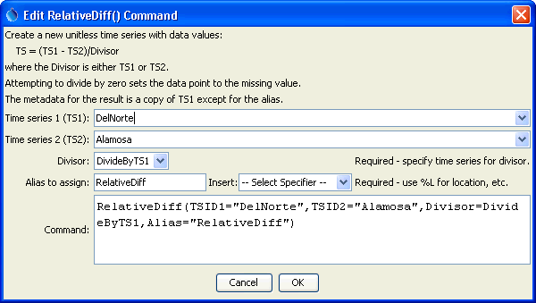

# TSTool / Command / RelativeDiff #

* [Overview](#overview)
* [Command Editor](#command-editor)
* [Command Syntax](#command-syntax)
* [Examples](#examples)
* [Troubleshooting](#troubleshooting)
* [See Also](#see-also)

-------------------------

## Overview ##

A `RelativeDiff` command creates a new relative difference time series,
computed by subtracting the time series and then dividing by one of the time series.
This is useful when analyzing the relative magnitudes of two time series over time.
Most of the properties for the new time series are the same as the first time series.
The alias for the result can be referenced by other commands.
The divisor can be either of the time series.
The result is set to missing if either time series value is missing or the divisor is zero.

## Command Editor ##

The following dialog is used to edit the command and illustrates the syntax of the command.
<a href="../RelativeDiff.png">See also the full-size image.</a>



**<p style="text-align: center;">
`RelativeDiff` Command Editor
</p>**

## Command Syntax ##

The command syntax is as follows:

```text
RelativeDiff(Parameter="Value",...)
```
The following older command syntax is updated to the above syntax when a command file is read:

```
TS Alias = RelativeDiff(Parameter=Value,...)
```

**<p style="text-align: center;">
Command Parameters
</p>**

|**Parameter**&nbsp;&nbsp;&nbsp;&nbsp;&nbsp;&nbsp;&nbsp;&nbsp;&nbsp;&nbsp;&nbsp;|**Description**|**Default**&nbsp;&nbsp;&nbsp;&nbsp;&nbsp;&nbsp;&nbsp;&nbsp;&nbsp;&nbsp;&nbsp;&nbsp;&nbsp;&nbsp;&nbsp;&nbsp;&nbsp;&nbsp;&nbsp;&nbsp;&nbsp;&nbsp;&nbsp;&nbsp;&nbsp;&nbsp;&nbsp;|
|--------------|-----------------|-----------------|
|`TSID1`<br>**required**|The time series identifier or alias for the first time series.|None – must be specified.|
|`TSID2`<br>**required**|The time series identifier or alias for the second time series (subtracted from the first).|None – must be specified.|
|`Divisor`<br>**required**|Indicates whether the first time series is the divisor (`DivideByTS1`) or the second time series is the divisor (`DivideByTS2`).|None – must be specified.|
|`Alias`<br>**required**|The alias to assign to the time series, as a literal string or using the special formatting characters listed by the command editor.  The alias is a short identifier used by other commands to locate time series for processing, as an alternative to the time series identifier (`TSID`).|None – must be specified.|

## Examples ##

See the [automated tests](https://github.com/OpenWaterFoundation/cdss-app-tstool-test/tree/master/test/regression/commands/general/RelativeDiff).

A sample command file to process a time series from the [State of Colorado’s HydroBase database](../../datastore-ref/CO-HydroBase/CO-HydroBase)
is as follows:

```text
StartLog(LogFile="Example_RelativeDiff.log")
SetOutputPeriod(OutputStart="01/1912",OutputEnd="12/1998")
# (1912-1998) RIO GRANDE AT ALAMOSA, CO.  DWR  Streamflow  Monthly
ReadTimeSeries(Alias=”Alamosa”,"08223000.DWR.Streamflow.Month~HydroBase")
# (1890-1998) RIO GRANDE NEAR DEL NORTE, CO.  DWR  Streamflow  Monthly
ReadTimeSeries(TSID="08220000.USGS.Streamflow.Month~HydroBase",Alias=”DelNorte”)
RelativeDiff(TSID1="DelNorte",TSID2="Alamosa",Divisor=DivideByTS1,Alias=”RelativeDiff”)
```
The input time series for the command are shown in the following figure:


**<p style="text-align: center;">
Data for the `RelativeDiff` Command
</p>**

The results of processing the commands are shown in the following figure:


**<p style="text-align: center;">
Results of `RelativeDiff` Command
</p>**

## Troubleshooting ##

## See Also ##

* [`Normalize`](../Normalize/Normalize) command
