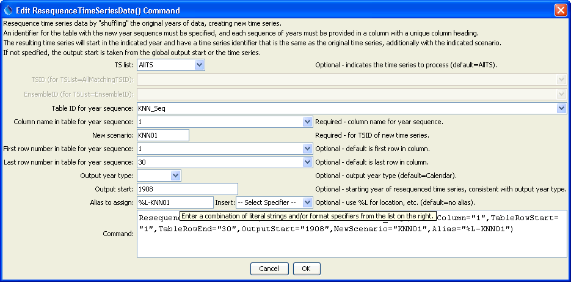

# TSTool / Command / ResequenceTimeSeriesData #

* [Overview](#overview)
* [Command Editor](#command-editor)
* [Command Syntax](#command-syntax)
* [Examples](#examples)
* [Troubleshooting](#troubleshooting)
* [See Also](#see-also)

-------------------------

## Overview ##

The `ResequenceTimeSeriesData` command resequences data in time series by
shifting/shuffling/repeating values from one year to another,
creating new time series for each time series.
For example, January 1950 might be shifted to January 1990.
This command is useful for generating synthetic time series by resequencing historical data.
The following constraints apply to the command as currently implemented:

1. Processing by default occurs by calendar year, with the sequence specified as calendar years.
If an alternate output year type is used (see the `OutputYearType` parameter).
The `OutputStart` year is considered to be consistent with the output year type.
2. The sequence of years must currently be supplied as a column of years
in a table (rows of years may be added in a future enhancement).
3. Full start and end years are required, matching the output year type.
4. Currently the command can only be applied to month interval data.
For a daily data interval, several technical issues must be resolved before the feature can be implemented:
	1. If a short year (i.e., non-leap year with 365 days) is transferred to a long year (i.e., a leap year with 366 days),
	the first day after the short year is used for the 366th day during the transfer.
 	What to do if the year being transferred is the last in the data set and no more years are available for the 366th day – repeat the last day?
	2. If a long year (i.e., leap year with 366 days) is transferred to a short year
	(i.e., a non-leap year with 365 days), the 366th day in the leap year is not transferred.
5. The original period is by default retained in the output time series.
For example, if the original data are 1937 to 1997,
the resequenced data will also be in a time series with a period 1937 to 1997.
The `OutputStart` parameter can be used to shift the start year of output.
	
The command is designed to work with a table that provides sequence information.
For example, see the [`ReadTableFromDelimitedFile`](../ReadTableFromDelimitedFile/ReadTableFromDelimitedFile.md)
command and the example shown below.

## Command Editor ##

The following dialog is used to edit the command and illustrates the syntax of the command.



**<p style="text-align: center;">
`ResequenceTimeSeries` Command Editor (<a href="../ResequenceTimeSeriesData.png">see also the full-size image</a>)
</p>**

## Command Syntax ##

The command syntax is as follows:

```text
ResequenceTimeSeriesData(Parameter="Value",...)
```
**<p style="text-align: center;">
Command Parameters
</p>**

|**Parameter**&nbsp;&nbsp;&nbsp;&nbsp;&nbsp;&nbsp;&nbsp;&nbsp;&nbsp;&nbsp;&nbsp;&nbsp;&nbsp;|**Description**|**Default**&nbsp;&nbsp;&nbsp;&nbsp;&nbsp;&nbsp;&nbsp;&nbsp;&nbsp;&nbsp;&nbsp;&nbsp;&nbsp;&nbsp;&nbsp;&nbsp;&nbsp;&nbsp;&nbsp;&nbsp;&nbsp;&nbsp;&nbsp;&nbsp;&nbsp;&nbsp;&nbsp;|
|--------------|-----------------|-----------------|
|`TSList`|Indicates the list of time series to be processed, one of:<br><ul><li>`AllMatchingTSID` – all time series that match the TSID (single TSID or TSID with wildcards) will be processed.</li><li>`AllTS` – all time series before the command.</li><li>`EnsembleID` – all time series in the ensemble will be processed (see the EnsembleID parameter).</li><li>`FirstMatchingTSID` – the first time series that matches the TSID (single TSID or TSID with wildcards) will be processed.</li><li>`LastMatchingTSID` – the last time series that matches the TSID (single TSID or TSID with wildcards) will be processed.</li><li>`SelectedTS` – the time series are those selected with the [`SelectTimeSeries`](../SelectTimeSeries/SelectTimeSeries.md) command.</li></ul> | `AllTS` |
|`TSID`|The time series identifier or alias for the time series to be processed, using the `*` wildcard character to match multiple time series.  Can be specified using `${Property}`.|Required if `TSList=*TSID`|
|`EnsembleID`|The ensemble to be processed, if processing an ensemble. Can be specified using `${Property}`.|Required if `TSList=*EnsembleID`|
|`TableID`<br>**required**|The identifier for the sequence table to use, which indicates the dates to use when resequencing data (e.g., list of years for data sequence).  For example, see the [`ReadTableFromDelimitedFile`](../ReadTableFromDelimitedFile/ReadTableFromDelimitedFile.md) command.  The years should be consistent with the `OutputYearType`.|None – must be specified.|
|`TableColumn`<br>**required**|The column name containing the sequence information.  Note that the input table must have column names in a header record.|None – must be specified.|
|`TableRowStart`|The first data row number (1+) containing the first year in the new sequence.|Use all rows.|
|`TableRowEnd`|The last data row number (1+) containing the first year in the new sequence.|Use all rows.|
|`OutputYearType`|The output year type, indicating the year extent for the resequencing, one of:<ul><li>`Calendar` – January to December</li><li>`NovToDec` – November of previous calendar year to October of current year.</li><li>`Water` – October of previous calendar year to September of current year.</li></ul>|`Calendar`|
|`OutputStart`|The output start as a four-digit year that is consistent with `OutputYearType`.  For example, if processing water years, the `OutputStart` would be the first water year in the output (and start in October of the previous calendar year).  The output end is relative to the output start and includes the number of years in the sequence.|Same as the original input data or use the global output start if specified.  The output months will be adjusted for the output year type.|
|`NewScenario`|The new scenario to assign to the created time series, resulting in a unique TSID.|Not specified, but a new scenario and/or alias must be specified.|
|`Alias`|Alias to assign to the output time series.  See the `LegendFormat` property described in the [TSView Time Series Viewing Tools appendix](../../appendix-tsview/tsview.md).  For example, `%L` is full location, `%T` is data type, `%I` is interval, and `%Z` is scenario.|Not specified, but a new scenario and/or alias must be specified.|

## Examples ##

See the [automated tests](https://github.com/OpenCDSS/cdss-app-tstool-test/tree/master/test/regression/commands/general/ResequenceTimeSeriesData).

The following example:

1. Reads a list of time series from a StateMod model file.
2. Reads a sequence of years from a delimited file.
3. Resequences the StateMod time series data.
4. Writes the resequenced file to a new StateMod file.

```
# Read all demand time series…
ReadStateMod(InputFile=”..\StateMod\gunnC2005.xbm”)
# Read the sequence of years to use…
Table 0001HK0101 = ReadTableFromDelimitedFile(InputFile=”0001HK0101.csv”)
# Resequence the StateMod time series…
ResequenceTimeSeriesData(TSList=AllTS,TableID=”0001HK0101”,
TableColumn=”Trace1”,NewScenario=”KNN0101”,Alias=”%L-KNN0101”)
# Write the resequenced data for StateMod
WriteStateMod(TSList=AllMatchingTSID,TSID=”*KNN*”,OutputFile=”..\StateMod0101\gunnC2005.xbm”)
```

The year sequence is specified in a file similar to the following.

```
# Some comments
“Trace1”,”Trace2”,…
1905,1967,…
1920,1943,…
etc.
```
Variations on the example can be implemented, for example, to process output products after the run.

## Troubleshooting ##

## See Also ##

* [`ReadTableFromDelimitedFile`](../ReadTableFromDelimitedFile/ReadTableFromDelimitedFile.md) command
* [`SelectTimeSeries`](../SelectTimeSeries/SelectTimeSeries.md) command
