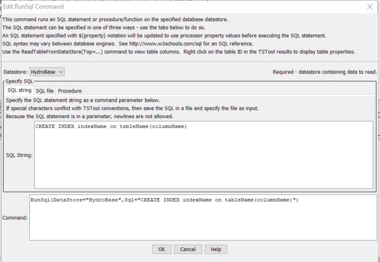

# Learn TSTool / Command / RunSql #

* [Overview](#overview)
* [Command Editor](#command-editor)
* [Command Syntax](#command-syntax)
* [Examples](#examples)
* [Troubleshooting](#troubleshooting)
* [See Also](#see-also)

-------------------------

## Overview ##

The `RunSql` command executes a Structured Query Language (SQL) statement on the specified database datastore.
This command cannot be used with web service datastores because the
underlying software relies on a database to execute the SQL statement.
If database datastore support is not specifically provided by TSTool,
a generic database datastore can be used (see the
[Generic Database DataStore appendix](../../datastore-ref/GenericDatabase/GenericDatabase).
For example, use a generic database datastore to configure a connection to a Microsoft Access database.
See also the
[`ReadTableFromDataStore`](../ReadTableFromDataStore/ReadTableFromDataStore),
[`WriteTableToDataStore`](../WriteTableToDataStore/WriteTableToDataStore),
and other commands specific to datastores.
This command is useful when a database task needs to be automated in sequence with other TSTool commands.
The SQL statement can be specified in the following ways:

* Specify a SQL statement as a command parameter:
	+ SQL must be valid for the database (syntax may vary based on database software).
	+ Use `${Property}` notation to insert processor property values set with
	[`SetProperty`](../SetProperty/SetProperty).
	+ SQL syntax is not checked for validity and therefore error messages
	from the database need to be diagnosed based on familiarity with the database.
	+ Comments in SQL can be specified using
	[`/* */`](../CommentBlockStart/CommentBlockStart) notation or `--` (double dash) for end of line comments.
	These comments are removed by TSTool for Microsoft Access because Access does not support comments in SQL statements.
* Specify an SQL select statement in a file:
	+ Similar to the above option; however, the SQL statement is read from a file.
	+ Useful if the SQL statement is also used by other tools.
* Specify a procedure to run:
	+ Available procedures are listed and can be selected.
	+ Currently, only procedures that do not require parameters can be run.

General constraints on executing the statement are as follows:

* The table, views, and procedures being queried must be readable
(some databases restrict direct access to data and require using stored procedures).
* Any SQL statement can be run; consequently, suitable authentication and permissions
should be in place to protect against unintended changes to the database
* SQL syntax varies between database software so care should be take to use standard SQL if possible.
* Results from the statement currently are not displayed,
although errors will be shown and added to the log file.
Use the [`ReadTableFromDataStore`](../ReadTableFromDataStore/ReadTableFromDataStore)
command to process statements that return a result set.

## Command Editor ##

The following dialog is used to edit the command and illustrates the syntax for the command, in this case creating a database index.
<a href="../RunSql.png">See also the full-size image.</a>



**<p style="text-align: center;">
`RunSql` Command Editor
</p>**

The following dialog is used to edit the command and illustrates the syntax for the command when using a file to specify the SQL statement.
<a href="../RunSql_File.png">See also the full-size image.</a>


**<p style="text-align: center;">
`RunSql` Command Editor when Specifying the SQL Statement Using a File
</p>**

The following dialog is used to edit the command and illustrates the syntax for the command when running a stored procedure.
<a href="../RunSql_Procedure.png">See also the full-size image.</a>


**<p style="text-align: center;">
`RunSql` Command Editor when Specifying a Stored Procedure to Run
</p>**

## Command Syntax ##

The command syntax is as follows:

```text
RunSql(Parameter="Value",...)
```
**<p style="text-align: center;">
Command Parameters
</p>**

|**Parameter**&nbsp;&nbsp;&nbsp;&nbsp;&nbsp;&nbsp;&nbsp;&nbsp;&nbsp;&nbsp;&nbsp;&nbsp;&nbsp;&nbsp;&nbsp;&nbsp;&nbsp;&nbsp;&nbsp;&nbsp;&nbsp;|**Description**|**Default**&nbsp;&nbsp;&nbsp;&nbsp;&nbsp;&nbsp;&nbsp;&nbsp;&nbsp;&nbsp;&nbsp;&nbsp;&nbsp;&nbsp;&nbsp;&nbsp;&nbsp;&nbsp;&nbsp;&nbsp;&nbsp;&nbsp;&nbsp;&nbsp;&nbsp;&nbsp;&nbsp;|
|--------------|-----------------|-----------------|
|`DataStore`<br>**required**|The name of a database datastore.|None – must be specified.|
|`Sql`|The SQL statement text that will be executed, optionally using `${Property}` notation to insert processor property values.  If specified, do not specify `SqlFile` or `DataStoreProcedure`.|None.|
|`SqlFile`|The name of the file containing an SQL statement to execute, optionally using `${Property}` notation in the SQL file contents to insert processor property values.  If specified, do not specify `Sql` or `DataStoreProcedure`.|None.|
|`DataStoreProcedure`|The name of the database procedure to run.  Currently, only procedures that do not require parameters can be run.  If specified, do not specify `Sql` or `SqlFile`.|None.|

## Examples ##

See the [automated tests](https://github.com/OpenWaterFoundation/cdss-app-tstool-test/tree/master/test/regression/commands/general/RunSql).

## Troubleshooting ##

## See Also ##

* [`ReadTableFromDataStore`](../ReadTableFromDataStore/ReadTableFromDataStore) command
* [`SetProperty`](../SetProperty/SetProperty) command
* [`WriteTableToDataStore`](../WriteTableToDataStore/WriteTableToDataStore) command
