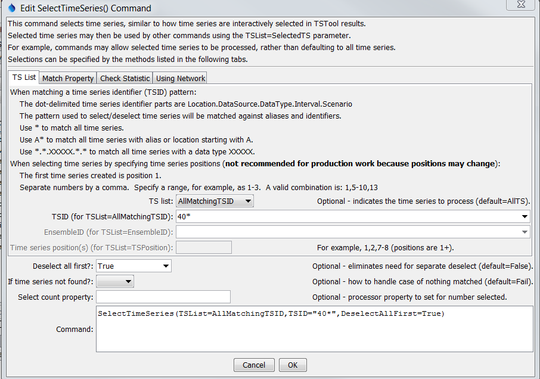

# TSTool / Command / SelectTimeSeries #

* [Overview](#overview)
* [Command Editor](#command-editor)
* [Command Syntax](#command-syntax)
* [Examples](#examples)
* [Troubleshooting](#troubleshooting)
* [See Also](#see-also)

-------------------------

## Overview ##

The `SelectTimeSeries` command selects output time series, as if done interactively,
to indicate which time series should be operated on by following commands.
The command minimizes the need for the [`Free`](../Free/Free.md) command because other
commands that operate on a time series list can use `TSList=SelectedTS`.
See also the [`DeselectTimeSeries`](../DeselectTimeSeries/DeselectTimeSeries.md) command.

## Command Editor ##

The following dialog is used to edit the command and illustrates the command
syntax for selecting time series using the `TSList` parameter.
This parameter provides the initial filter for the list of time series.
The `TSPosition` parameter is generally not available in other commands - its use is discouraged in
most cases because time series position in the output list can vary.



**<p style="text-align: center;">
`SelectTimeSeries` Command Editor (<a href="../SelectTimeSeries.png">see also the full-size image</a>)
</p>**

The following dialog is used to edit the command and illustrates selecting time series by matching a property value.


**<p style="text-align: center;">
`SelectTimeSeries` Command Editor Specifying a Property to Match (<a href="../SelectTimeSeries_Property.png">see also the full-size image</a>)
</p>**

The following dialog is used to edit the command and illustrates selecting time series by evaluating a time series statistic.


**<p style="text-align: center;">
`SelectTimeSeries` Command Editor Specifying a Statistic to Check (<a href="../SelectTimeSeries_Statistic.png">see also the full-size image</a>)
</p>**

The following dialog is used to edit the command and illustrates selecting time series by matching locations in a network.


**<p style="text-align: center;">
`SelectTimeSeries` Command Editor Specifying Network Nodes (<a href="../SelectTimeSeries_Network.png">see also the full-size image</a>)
</p>**

## Command Syntax ##

The command syntax is as follows:

```text
SelectTimeSeries(Parameter="Value",...)
```
**<p style="text-align: center;">
Command Parameters
</p>**

|Parameter**&nbsp;&nbsp;&nbsp;&nbsp;&nbsp;&nbsp;&nbsp;&nbsp;&nbsp;&nbsp;&nbsp;&nbsp;&nbsp;&nbsp;&nbsp;&nbsp;&nbsp;&nbsp;&nbsp;&nbsp;|**Description**|**Default**&nbsp;&nbsp;&nbsp;&nbsp;&nbsp;&nbsp;&nbsp;&nbsp;&nbsp;&nbsp;&nbsp;&nbsp;&nbsp;&nbsp;&nbsp;&nbsp;&nbsp;&nbsp;&nbsp;&nbsp;&nbsp;&nbsp;&nbsp;&nbsp;&nbsp;&nbsp;&nbsp;|
|--------------|-----------------|-----------------|
|`TSList`|Indicates the list of time series to be processed, one of:<br><ul><li>`AllMatchingTSID` – all time series that match the TSID (single TSID or TSID with wildcards) will be processed.</li><li>`AllTS` – all time series before the command.</li><li>`EnsembleID` – all time series in the ensemble will be processed (see the EnsembleID parameter).</li><li>`FirstMatchingTSID` – the first time series that matches the TSID (single TSID or TSID with wildcards) will be processed.</li><li>`LastMatchingTSID` – the last time series that matches the TSID (single TSID or TSID with wildcards) will be processed.</li><li>`TSPosition` – time series specified by position in the results list (see `TSPosition` parameter below).</li></ul> | `AllTS` |
|`TSID`|The time series identifier or alias for the time series to be processed, using the `*` wildcard character to match multiple time series.  Can be specified using `${Property}`.|Required if `TSList=*TSID`|
|`EnsembleID`|The ensemble to be processed, if processing an ensemble. Can be specified using `${Property}`.|Required if `TSList=*EnsembleID`|
|`TSPosition`|A list of time series positions (1+) in output, separated by commas.  Ranges can be specified as `Start-End`.|Required if `TSList=TSPosition`|
|`DeselectAllFirst`|Indicate whether all time series should be deselected before selecting the specified time series:  `True` or `False`.|`False`|
|`IfNotFound`|Indicate how to handle the case of no time series being matched:<ul><li>`Ignore` – OK if nothing selected</li><li>`Warn` – generate a warning message</ul><li>`Fail` – generate a failure message|`Fail`|
|`PropertyName`|Name of user-defined property to check.  A property, if specified, is additive to selections from the `TSList` parameter.  Can be specified using processor `${Property}`.||
|`PropertyCriterion`|Criterion to evaluate to determine which properties match.	Required if `PropertyName` is specified.||
|`PropertyValue`|Value to check against the property value, using criterion.  Can be specified using processor `${Property}`.|Required if `PropertyName` is specified.||
|`NetworkID`|The identifier for the network if selecting based on match of network node identifiers and location part of time series identifier.|Network select is not used.|
|`DownstreamNodeID`|The downstream node in the network to match.  If preceded by a dash, don’t include the node in output.|Network select is not used.|
|`UpstreamNodeIDs`|Comma-separated list of upstream network node identifiers to match.  If any identifier is preceded by a dash, don’t include the node in output.|If selecting from network, select all nodes upstream of the downstream node.|
|`SelectCountProperty`|If specified, the corresponding time series property will be set to the number of selected time series after the command is executed.  This is useful in cases where following commands are wrapped in an [`If`](../If/If) command and should only be executed if the count is > 0.  Also use to check for count of 0 and warn with the [`Message`](../Message/Message) command.  Can be specified using processor `${Property}`.||

## Examples ##

See the [automated tests](https://github.com/OpenCDSS/cdss-app-tstool-test/tree/master/test/regression/commands/general/SelectTimeSeries).

A sample command file is as follows:

```text
NewPatternTimeSeries(Alias="401234",NewTSID="401234..Precip.Day",
Description="Example data",SetStart="2000-01-01",SetEnd="2000-12-31",Units="IN",PatternValues="0,1,3,0,0,0")
SelectTimeSeries(TSList=AllMatchingTSID,TSID="40*",DeselectAllFirst=True)
```

## Troubleshooting ##

## See Also ##

* [`DeselectTimeSeries`](../DeselectTimeSeries/DeselectTimeSeries.md) command
* [`Free`](../Free/Free.md) command
