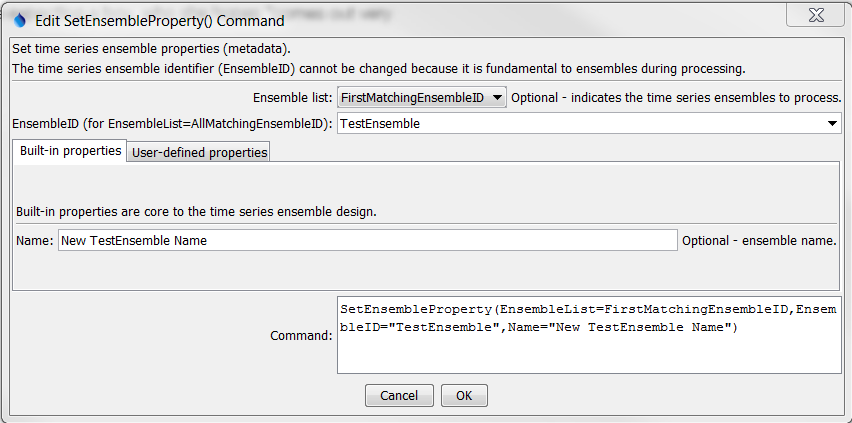

# Learn TSTool / Command / SetEnsembleProperty #

* [Overview](#overview)
* [Command Editor](#command-editor)
* [Command Syntax](#command-syntax)
* [Examples](#examples)
* [Troubleshooting](#troubleshooting)
* [See Also](#see-also)

-------------------------

## Overview ##

The `SetEnsembleProperty` command sets the value of one or more time series ensemble properties.
The `EnsembleID` property is a built-in property that has special meaning because it is
used to identify the time series and cannot be changed.
User-defined properties are handled as a list of properties that can be referenced by other commands
using the `${tsensemble:Property}` notation.  Property names are case-specific.

## Command Editor ##

The following dialog is used to edit the command and illustrates the syntax of the command for built-in properties.
<a href="../SetEnsembleProperty_BuiltIn.png">See also the full-size image.</a>



**<p style="text-align: center;">
`SetEnsembleProperty` Command Editor for Built-in Properties
</p>**

The following dialog is used to edit the command and illustrates the syntax of the command for user-defined properties.
<a href="../SetEnsembleProperty_User.png">See also the full-size image.</a>


**<p style="text-align: center;">
`SetEnsembleProperty` Command Editor for User-defined Properties
</p>**

## Command Syntax ##

The command syntax is as follows:

```text
SetEnsembleProperty(Parameter="Value",...)
```
**<p style="text-align: center;">
Command Parameters
</p>**

|**Parameter**&nbsp;&nbsp;&nbsp;&nbsp;&nbsp;&nbsp;&nbsp;&nbsp;&nbsp;&nbsp;&nbsp;|**Description**|**Default**&nbsp;&nbsp;&nbsp;&nbsp;&nbsp;&nbsp;&nbsp;&nbsp;&nbsp;&nbsp;&nbsp;&nbsp;&nbsp;&nbsp;&nbsp;&nbsp;&nbsp;&nbsp;&nbsp;&nbsp;&nbsp;&nbsp;&nbsp;&nbsp;&nbsp;&nbsp;&nbsp;&nbsp;&nbsp;&nbsp;&nbsp;&nbsp;&nbsp;&nbsp;&nbsp;&nbsp;&nbsp;&nbsp;&nbsp;&nbsp;|
|--------------|-----------------|-----------------|
|`EnsembleList`<br>**required**|Indicates the list of time series to be processed, one of:<ul><li>`AllMatchingEnsembleID` – all time series ensembles that match the EnsembleID (single EnsembleID or EnsembleID with wildcards) will be modified.  **Currently not enabled**.</li><li>`AllEnsemble` – all time series ensembles before the command.  **Currently not enabled.**</li><li>`EnsembleID` – the matching ensemble will be modified.  **Currently not enabled.**</li><li>`FirstMatchingEnsembleID` – the first time series ensemble that matches the EnsembleID (single EnsembleID or EnsembleID with wildcards) will be modified.</li><li>`LastMatchingEnsembleID` – the last time series that matches the EnsembleID (single EnsembleID or EnsembleID with wildcards) will be modified.  **Currently not enabled.**</li></ul>|None – must be specified.|
|`EnsembleID`|The time series ensemble identifier for the ensemble to be modified.  Can be specified using processor `${Property}`.|Required if `EnsembleList=*EnsembleID`.|
|`Name`|The ensemble name.  Can be specified using processor `${Property}`.|None.|
|`PropertyName`|Name of user-defined property.||
|`PropertyType`|Property type, to ensure proper initialization and data check.|Required if `PropertyName` is specified.|
|`PropertyValue`|Value for property as a string but adhering to the property type requirements (e.g., date as a string must match format that can be parsed).  Can be specified using processor `${Property}`.|Required if `PropertyName` is specified.|


## Examples ##

See the [automated tests](https://github.com/OpenWaterFoundation/cdss-app-tstool-test/tree/master/test/regression/commands/general/SetEnsembleProperty).

## Troubleshooting ##

## See Also ##

* [`NewEnsemble`](../NewEnsemble/NewEnsemble) command
