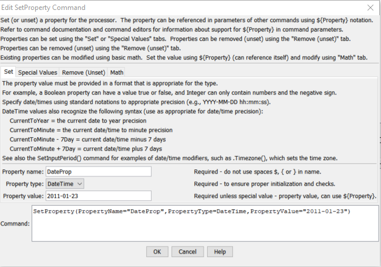
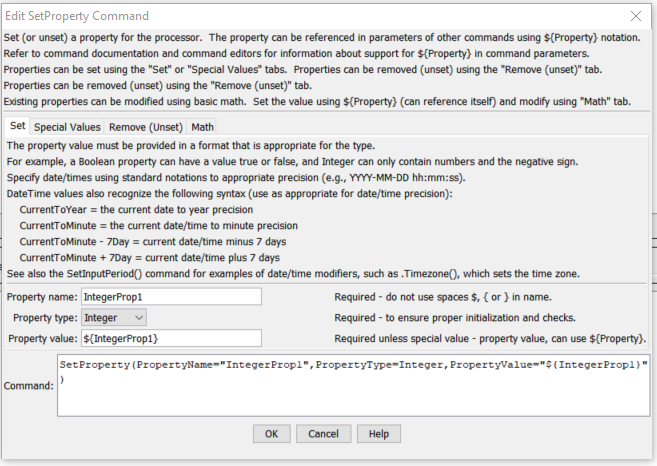

# TSTool / Command / SetProperty #

* [Overview](#overview)
* [Command Editor](#command-editor)
* [Command Syntax](#command-syntax)
* [Examples](#examples)
* [Troubleshooting](#troubleshooting)
* [See Also](#see-also)

-------------------------

## Overview ##

The `SetProperty` command sets the value of a property used by the time series processor.
The property will be available to subsequent commands that support using `${Property}` notation in parameters,
for example to specify filenames more dynamically or use with [`If`](../If/If.md) commands.
This command should not be confused with the [`SetTimeSeriesProperty`](../SetTimeSeriesProperty/SetTimeSeriesProperty.md) command,
which sets a property on specific time series.  The following functionality is provided:

* Set a property to a specified value, where the property can be a Boolean, String, DateTime, Double, or Integer type.
* Set a property to a special value such as empty string or other special values.
* Remove an existing property so that it is no longer available to the processor.
Care should be taken to understand the implications of removing a property.
For example, if the property is used in later commands, then removing will cause the processor to not find the property.
It may be more appropriate, for example, to set a string property to an empty string rather than removing.
* Set a property by modifying a previous global property using basic manipulations.

## Command Editor ##

The following dialog is used to edit the command and illustrates the command syntax for general parameters.



**<p style="text-align: center;">
`SetProperty` Command Editor for General Set Parameters (<a href="../SetProperty.png">see also the full-size image</a>)
</p>**

The following dialog is used to edit the command and illustrates the command syntax for special value parameters.


**<p style="text-align: center;">
`SetProperty` Command Editor for Special Value Parameters (<a href="../SetProperty_Special.png">see also the full-size image</a>)
</p>**

The following dialog is used to edit the command and illustrates the command syntax for removing a property.


**<p style="text-align: center;">
`SetProperty` Command Editor for Removing a Property (<a href="../SetProperty_Remove.png">see also the full-size image</a>)
</p>**

The following illustrates how to perform a math operation on a property.
In this case, a new property name can be assigned (or existing name reused) in the `PropertyName` parameter.
The `PropertyValue` parameter must specify the name of an existing property using `${Property}` notation.
This causes the old value to be retrieved and then the math operation is performed.
A common operation would be to increment a property’s value in a [`For`](../For/For.md) loop.



**<p style="text-align: center;">
`SetProperty` Command Editor for Performing Math showing Main Property Parameters (<a href="../SetProperty_Math1.png">see also the full-size image</a>)
</p>**

The following illustrates the math input parameters.


**<p style="text-align: center;">
`SetProperty` Command Editor for Performing Math showing Math Input (<a href="../SetProperty_Math2.png">see also the full-size image</a>)
</p>**

## Command Syntax ##

The command syntax is as follows:

```text
SetProperty(Parameter="Value",...)
```
**<p style="text-align: center;">
Command Parameters
</p>**

| **Parameter**&nbsp;&nbsp;&nbsp;&nbsp;&nbsp;&nbsp;&nbsp;&nbsp;&nbsp;&nbsp;&nbsp;&nbsp;&nbsp;&nbsp;&nbsp;&nbsp;&nbsp;&nbsp;&nbsp;&nbsp;&nbsp;&nbsp;&nbsp;&nbsp;&nbsp;&nbsp; | **Description** | **Default**&nbsp;&nbsp;&nbsp;&nbsp;&nbsp;&nbsp;&nbsp;&nbsp;&nbsp;&nbsp; |
| --------------|-----------------|----------------- |
| `PropertyName`<br>**required** | The property name. | None - must be specified. |
| `PropertyType`| The property type, used for validation, one of:<br><br><ul><li>`Boolean` – a boolean</li><li>`DateTime` – a date/time</li><li>`Double` – a floating point number</li><li>`Integer` – an integer</li><li>`String` – a string</li></ul><br><br>DateTime objects can be specified with special syntax to use current time and modifiers on the DateTime.  See the [`SetInputPeriod`](../SetInputPeriod/SetInputPeriod.md) command for more information. | None – must be specified when setting a new property, although is not needed when setting to null or removing.|
| `PropertyValue`|The value of the property, adhering to property type constraints.  Date/time properties should be specified using standard formats such as `YYYY-MM-DD hh:mm:ss`, to an appropriate precision.  Special date/time syntax is recognized, as shown in the above figure.  Global properties can be used with the `${Property}` syntax.|None – must be specified when setting a value.  The parameter is not needed when setting special values or removing the property. |
| `SetEmpty`|If specified as `True`, the String property will be set to an empty string.|The `PropertyValue` parameter will be used.|
| `SetNaN`|If specified as `True`, the Double property will be set to the special “not a number” (`NaN`) value.|The `PropertyValue` parameter will be used.|
| `SetNull`|If specified as True, the property will be set to null (not specified).|The PropertyValue parameter will be used.|
| `RemoveProperty`|If specified as `True`, the property will be removed and will be unavailable to the processor.  Only user-defined properties can be removed (not important internal properties).|The `PropertyValue` parameter will be used.|
| `Add`|Value to add to the property value:<br><br><ul><li>Double or Integer property value will be incremented by `Add`.</li><li>String property value will have `Add` appended.</li><li>DateTime property value will be shifted forward in time by `Add` (e.g., `Add=1Day`).</li></ul>|No addition.|
| `Subtract`|Value to subtract from the property value:<br><br><ul><li>Double or Integer property value will be decremented by `Subtract`.</li><li>String property value will have `Subtract` removed for all occurrences.</li><li>DateTime property value will be shifted back in time by `Subtract` (e.g., `Subtract=1Day`).</li></ul>|No subtraction.|
| `Multiply`|Value to multiply the property value:<br><br><ul><li>Double or Integer property value will be multiplied by `Multiply.`</li></ul>|No multiplication.|
| `Divide`|Value to divide the property value:<br><br><ul><li>Double or Integer property value will be divided by `Divide`.  Dividing by zero will set the result to `NaN` for Double and null for Integer.|No division.|

## Examples ##

See the [automated tests](https://github.com/OpenCDSS/cdss-app-tstool-test/tree/master/test/regression/commands/general/SetProperty).

## Troubleshooting ##

## See Also ##

* [`For`](../For/For.md) command
* [`If`](../If/If.md) command
* [`SetPropertyFromTimeSeries`](../SetPropertyFromTimeSeries/SetPropertyFromTimeSeries.md) command
* [`SetTimeSeriesProperty`](../SetTimeSeriesProperty/SetTimeSeriesProperty.md) command
* [`WritePropertiesToFile`](../WritePropertiesToFile/WritePropertiesToFile.md) command
