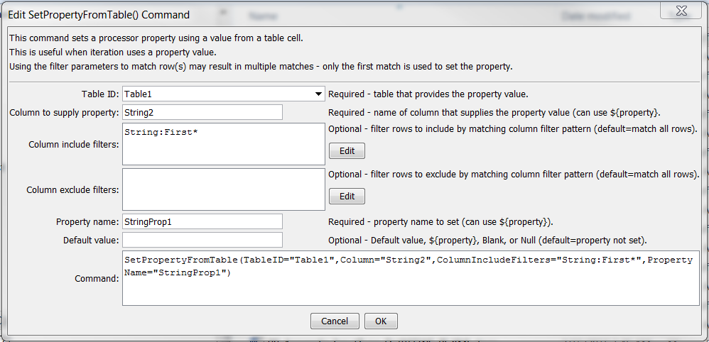

# TSTool / Command / SetPropertyFromTable #

* [Overview](#overview)
* [Command Editor](#command-editor)
* [Command Syntax](#command-syntax)
* [Examples](#examples)
* [Troubleshooting](#troubleshooting)
* [See Also](#see-also)

-------------------------

## Overview ##

The `SetPropertyFromTable` command sets the value of a property used by the time series processor,
using a table cell value.  The property will be available to subsequent
commands that support using `${Property}` notation in parameters,
for example to specify filenames more dynamically.
This command is useful in cases where iteration is processing data from a table using a
[`For`](../For/For.md) command, in which case the property can be used in other commands.
Filters are used to match one or more rows.  The first matched row is used to set the property.

## Command Editor ##

The following dialog is used to edit the command and illustrates the command syntax for general parameters.

**<p style="text-align: center;">

</p>**

**<p style="text-align: center;">
`SetPropertyFromTable` Command Editor for General Set Parameters (<a href="../SetPropertyFromTable.png">see also the full-size image</a>)
</p>**

## Command Syntax ##

The command syntax is as follows:

```text
SetPropertyFromTable(Parameter="Value",...)
```
**<p style="text-align: center;">
Command Parameters
</p>**

| **Parameter**&nbsp;&nbsp;&nbsp;&nbsp;&nbsp;&nbsp;&nbsp;&nbsp;&nbsp;&nbsp;&nbsp;&nbsp;&nbsp;&nbsp;&nbsp;&nbsp;&nbsp;&nbsp;&nbsp;&nbsp;&nbsp;&nbsp;&nbsp;&nbsp;&nbsp;&nbsp; | **Description** | **Default**&nbsp;&nbsp;&nbsp;&nbsp;&nbsp;&nbsp;&nbsp;&nbsp;&nbsp;&nbsp; |
| --------------|-----------------|----------------- |
|`TableID`|The identifier for the table.  Can be specified using `${Property}`.|None – must be specified.|
|`Column`|The name of the column containing the value that will be used to set the processor property.   Can be specified using `${Property}`.|None – must be specified.|
|`ColumnIncludeFilters`|Filters that include rows being matched, by matching column values:<br>`ColumnIncludeFilter1:FilterPattern1,ColumnIncludeFilter2:FilterPattern2`<br>Patterns can use `*` to indicate wildcards for matches.  Only string values can be checked (other data types are converted to strings for comparison).  All patterns must be matched to exclude the row.  Can be specified using `${Property}`.|All rows are matched.|
|`ColumnExcludeFilters`|Filters that exclude rows being copied, by matching column values:<br>`ColumnExcludeFilter1:FilterPattern1,ColumnExcludeFilter2:FilterPattern2`<br>Patterns can use `*` to indicate wildcards for matches.  Only string values can be checked (other data types are converted to strings for comparison).  All patterns must be matched to exclude the row.  Can be specified using `${Property}`.|All rows are matched.|
|`PropertyName`|The property name to be set.  Can be specified using `${Property}`.|None – must be specified.|
|`DefaultValue`|The default value to use if no table cell is matched:<br><ul><li>`Blank` – to use a blank string</li><li>`Null` – to use a null value</li><li>Specified value to set to a string value.</li></ul><br>Can be specified using `${Property}`.|Property is set to null.|

## Examples ##

See the [automated tests](https://github.com/OpenCDSS/cdss-app-tstool-test/tree/master/test/regression/commands/general/SetPropertyFromTable).

The command shown in the editor dialog, used with the following table, will set `StringProp=“Abba”`

**<p style="text-align: center;">

</p>**

**<p style="text-align: center;">
`SetPropertyFromTable` Input Example (<a href="../SetPropertyFromTable_table.png">see also the full-size image</a>)
</p>**

## Troubleshooting ##

## See Also ##

* [`For`](../For/For.md) command
* [`If`](../If/If.md) command
* [`SetPropertyFromTimeSeries`](../SetPropertyFromTimeSeries/SetPropertyFromTimeSeries.md) command
* [`SetTimeSeriesProperty`](../SetTimeSeriesProperty/SetTimeSeriesProperty.md) command
* [`WritePropertiesToFile`](../WritePropertiesToFile/WritePropertiesToFile.md) command
