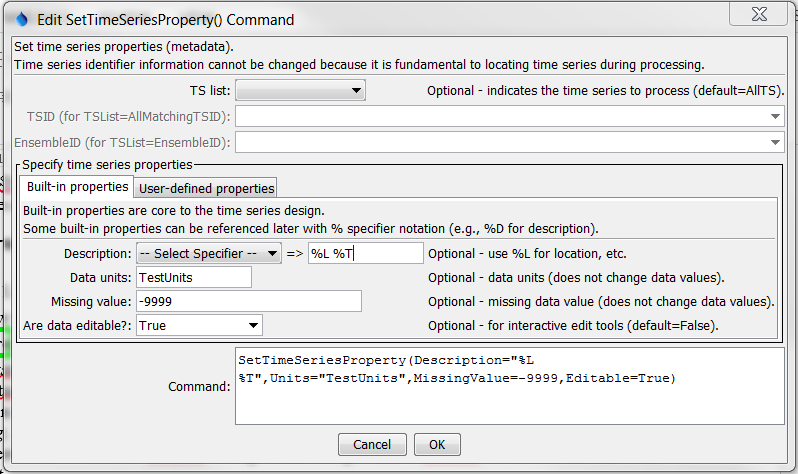

# TSTool / Command / SetTimeSeriesProperty #

* [Overview](#overview)
* [Command Editor](#command-editor)
* [Command Syntax](#command-syntax)
* [Examples](#examples)
* [Troubleshooting](#troubleshooting)
* [See Also](#see-also)

-------------------------

## Overview ##

The `SetTimeSeriesProperty` command sets the value of one or more time series properties.
Properties that are used to uniquely identify the time series cannot be set because other commands
need to utilize this information to reference the time series,
including the location identifier, data source, data type, interval, and scenario.
Built-in properties are those that are part of the internal time series data object and can be used as `%` format specifiers.
User-defined properties are handled as a list of properties that can be referenced by other commands using the `${ts:Property} `notation.
See also the [`SetTimeSeriesPropertiesFromTable`](../SetTimeSeriesPropertiesFromTable/SetTimeSeriesPropertiesFromTable) and
[`SelectTimeSeries`](../SelectTimeSeries/SelectTimeSeries) commands.  

## Command Editor ##

The following dialog is used to edit the command and illustrates the command syntax.
<a href="../SetTimeSeriesProperty.png">See also the full-size image.</a>



**<p style="text-align: center;">
`SetTimeSeriesProperty` Command Editor for Built-in Properties
</p>**

The following dialog is used to edit the command and illustrates the command syntax for user-defined properties.
<a href="../SetTimeSeriesProperty_User.png">See also the full-size image.</a>


**<p style="text-align: center;">
`SetTimeSeriesProperty` Command Editor for User-defined Properties
</p>**

## Command Syntax ##

The command syntax is as follows:

```text
SetTimeSeriesProperty(Parameter="Value",...)
```
**<p style="text-align: center;">
Command Parameters
</p>**

| **Parameter**&nbsp;&nbsp;&nbsp;&nbsp;&nbsp;&nbsp;&nbsp;&nbsp;&nbsp;&nbsp;&nbsp;&nbsp; | **Description** | **Default**&nbsp;&nbsp;&nbsp;&nbsp;&nbsp;&nbsp;&nbsp;&nbsp;&nbsp;&nbsp;&nbsp;&nbsp;&nbsp;&nbsp;&nbsp;&nbsp;&nbsp;&nbsp;&nbsp;&nbsp;&nbsp;&nbsp;&nbsp;&nbsp; |
| --------------|-----------------|----------------- |
|`TSList`|Indicates the list of time series to be processed, one of:<br><br><ul><li>`AllMatchingTSID` – all time series that match the TSID (single TSID or TSID with wildcards) will be modified.</li><li>`AllTS`– all time series before the command.</li><li>`EnsembleID` – all time series in the ensemble will be modified.</li><li>`FirstMatchingTSID` – the first time series that matches the TSID (single TSID or TSID with wildcards) will be modified.</li><li>`LastMatchingTSID` – the last time series that matches the TSID (single TSID or TSID with wildcards) will be modified.</li><li>`SelectedTS` – the time series are those selected with the [`SelectTimeSeries`](../SelectTimeSeries/SelectTimeSeries) command.|`AllTS`|
|`TSID`|The time series identifier or alias for the time series to be modified, using the `*` wildcard character to match multiple time series.  Can be specified using processor `${Property}`.|Required if `TSList=*TSID`|
|`EnsembleID`|The ensemble to be modified, if processing an ensemble.  Can be specified using processor `${Property}`.|Required if `TSList=EnsembleID`|
|`Description`|The description to assign to the time series.  Can be specified using processor `${Property}`.|None.|
|`Units`|The data units to assign to the time series.  The units should agree with the time series data values.  Can be specified using processor `${Property}`.|None.|
|`Editable`|If set to `True`, then graphing the time series will enable interactive editing features, including the ability to save the edited time series if the data management system supports this functionality.|`False`|
|`PropertyName`|Name of user-defined property.||
|`PropertyType`|Property type, to ensure proper initialization and data check.	Required if `PropertyName` is specified.
|`PropertyValue`|Value for property as a string but adhering to the property type requirements (e.g., date as a string must match format that can be parsed).  Specify `%` formatter to access a built-in time series property, `${ts:Property}` to access a user-defined time series property, and `${Property}` to access a processor property.|Required if `PropertyName` is specified.|

## Examples ##

See the [automated tests](https://github.com/OpenWaterFoundation/cdss-app-tstool-test/tree/master/test/regression/commands/general/SetTimeSeriesProperty).

## Troubleshooting ##

## See Also ##

* [`SetPropertyFromTimeSeries`](../SetPropertyFromTimeSeries/SetPropertyFromTimeSeries) command.
