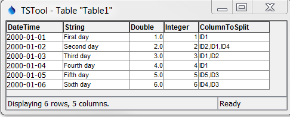

# TSTool / Command / SplitTableColumn #

* [Overview](#overview)
* [Command Editor](#command-editor)
* [Command Syntax](#command-syntax)
* [Examples](#examples)
* [Troubleshooting](#troubleshooting)
* [See Also](#see-also)

-------------------------

## Overview ##

The `SplitTableColumn` command splits a string (text) column in a table into multiple columns.
Currently the only delimited string values can be split.
For example, the `ColumnToSplit` column in the table shown in the following example
can be split to produce the result in the second figure.  Several options for splitting are available.

## Command Editor ##

The following dialog is used to edit the command and illustrates the syntax of the command.


**<p style="text-align: center;">
`SplitTableColumn` Command Editor (<a href="../SplitTableColumn.png">see also the full-size image</a>)
</p>**

## Command Syntax ##

The command syntax is as follows:

```text
SplitTableColumn(Parameter="Value",...)
```
**<p style="text-align: center;">
Command Parameters
</p>**

| **Parameter**&nbsp;&nbsp;&nbsp;&nbsp;&nbsp;&nbsp;&nbsp;&nbsp;&nbsp;&nbsp;&nbsp;&nbsp;&nbsp;&nbsp;&nbsp;&nbsp;&nbsp;&nbsp;&nbsp;&nbsp;&nbsp;&nbsp;&nbsp;&nbsp;&nbsp;&nbsp; | **Description** | **Default**&nbsp;&nbsp;&nbsp;&nbsp;&nbsp;&nbsp;&nbsp;&nbsp;&nbsp;&nbsp; |
| --------------|-----------------|----------------- |
|`TableID`|The identifier for the table.|None – must be specified.|
|`ColumnToSplit`|The name of the table column to split.|None – must be specified.|
|`Delimiter`|The delimiter character for splitting the values in the split column, for example a comma.|None – must be specified.|
|`OutputColumns`|The names of output columns to be inserted, separated by commas.  Specify literal column names or use the notation:<br><ul><li>`[Start:End:Increment]` for example `[1:9:3]`</li><li>`[Start:End]` for example `[1:10]`</li><li>`[Start:]` for example `[1:]`</li></ul><br>For example, to generate output columns with names `Column1`, `Column2`, ... for all necessary output columns, use: `Column[1:]`|None – must be specified.|
|`OutputColumnOrder`|The order of split values in output columns:<br><ul><li>`SequenceOrder` – split and then insert the parts sequentially in output columns</li><li>`UniqueValues` – create output columns for each unique value, in the order they were encountered</li><li>`UniqueValuesSorted` – unique values, sorted</li></li>`SequenceOrder`|
|`InsertBeforeColumn`|The name of the column before which to insert the new output columns.|Append at end|
|`DeleteOriginalColumn`|Indicate whether the original table column should be deleted after processing:  `False` or `True`.|`False`|

## Examples ##

See the [automated tests](https://github.com/OpenCDSS/cdss-app-tstool-test/tree/master/test/regression/commands/general/SplitTableColumn).




## Troubleshooting ##

## See Also ##

* [`FormatTableString`](../FormatTableString/FormatTableString.md) command
* [`ManipulateTableString`](../ManipulateTableString/ManipulateTableString.md) command
* [`SplitTableRow`](../SplitTableRow/SplitTableRow.md) command
