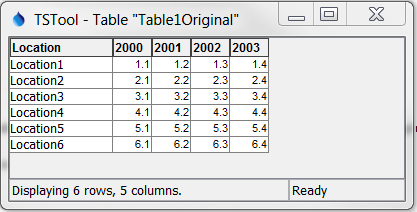
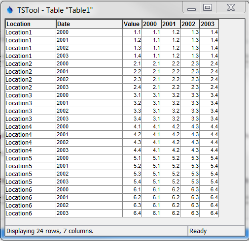
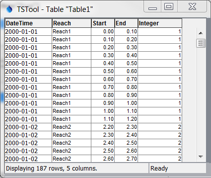
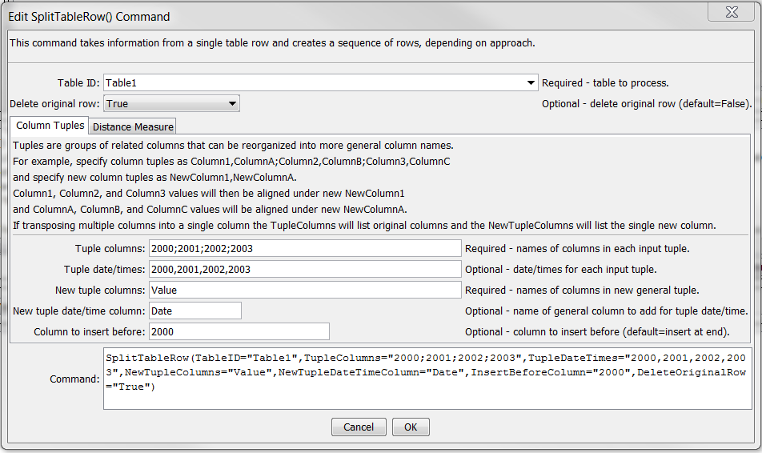

# Learn TSTool / Command / SplitTableRow #

* [Overview](#overview)
* [Command Editor](#command-editor)
* [Command Syntax](#command-syntax)
* [Examples](#examples)
* [Troubleshooting](#troubleshooting)
* [See Also](#see-also)

-------------------------

## Overview ##

The `SplitTableRow` command uses information from a table row to create a sequence of new table rows.
The new rows are inserted after the original row, which optionally can be deleted from the table after processing.
The table rows can be split using either “tuple” or “measure” approach as described below:

### Tuple Split ###

A “tuple” is a sequence of related values and contain 1 or more grouped values.
For example, the following figure illustrates annual time series values listed horizontally in each row.



This command can split the data into the following representation,
which is more conducive to time series processing (for example use the
[`TableToTimeSeries`](../TableToTimeSeries/TableToTimeSeries) command to
convert the results to time series that can be processed in TSTool).



### Measure Split ###
	
A measure split is used to split a longer distance into shorter segments.
Start and end values in the row are used to create segmented row distances.
For example, this can be used to break a streamflow reach into segments of equal length,
for example “stream mile” segments as shown in the following example.
The first table illustrates input and the second the table after modification (original rows are deleted).
The start and end columns can be specified in any order but the output is always with the smaller value as the start.




## Command Editor ##

The following dialog is used to edit the command and illustrates the syntax of the command for tuple split.
<a href="../SplitTableRow_Tuple.png">See also the full-size image.</a>



**<p style="text-align: center;">
`SplitTableRow` Command Editor for Tuple Split
</p>**

The following dialog is used to edit the command and illustrates the syntax of the command for measure split.
<a href="../SplitTableRow.png">See also the full-size image.</a>


**<p style="text-align: center;">
`SplitTableRow` Command Editor for Measure Split
</p>**

## Command Syntax ##

The command syntax is as follows:

```text
SplitTableRow(Parameter="Value",...)
```
**<p style="text-align: center;">
Command Parameters
</p>**

|**Method**|**Parameter**&nbsp;&nbsp;&nbsp;&nbsp;&nbsp;&nbsp;&nbsp;&nbsp;&nbsp;&nbsp;&nbsp;&nbsp;&nbsp;&nbsp;&nbsp;&nbsp;&nbsp;&nbsp;&nbsp;&nbsp;&nbsp;&nbsp;&nbsp;&nbsp;&nbsp;&nbsp;&nbsp;&nbsp;&nbsp;&nbsp;&nbsp;&nbsp;&nbsp;&nbsp;&nbsp;&nbsp; | **Description** | **Default**&nbsp;&nbsp;&nbsp;&nbsp;&nbsp;&nbsp;&nbsp;&nbsp;&nbsp;&nbsp; |
| --------------|-----------------|----------------- |---|
|All|`TableID`<br>**required**|The identifier for the table.|None – must be specified.|
|All|`DeleteOriginalRow`|Indicate whether the original table row should be deleted as `False` or `True`.  Specify True if the generated sequence of rows should replace the original row.|`False`|
|Tuple|`TupleColumns`|The names of columns in each tuple, where the tuple groups are separated by semi-colons and the columns within the tuple are separated by commas.<br>For a 1-tuple:  `Column1;Column;Column3`<br>For a 2-tuple:  `Column1a,Column1b;Column2a,Column2b`|None – must be specified for tuple approach.|
|Tuple|`TupleDateTimes`|The date/times corresponding to each tuple, which will be matched with values inserted into the `NewTupleDateTimeColumn`.|No date/time is associated with tuples.|
|Tuple|`NewTupleColumns`|The output columns to be used when splitting the tuples.<br>For a 1-tuple:  `NewColumn1`<br>For a 2-tuple:  `NewColumn1,NewColumn2`|None – must be specified for tuple approach.|
|Tuple|`NewTupleDateTimeColumn`|If `TupleDateTimes` is specified, this column will be filled with a data/time corresponding to each input tuple.|No date/time output.
|Tuple|`InsertBeforeColumn`|Indicate the name of the column before which to insert new columns.  Currently this is used only with tuples.|Append at end.|
|Measure|`MeasureStartColumn`|The name of the table column for the starting measure.|None – must be specified.|
|Measure|`MeasureEndColumn`|The name of the table column for the ending measure.|None – must be specified.|
|Measure|`MeasureIncrement`|The measure increment used to split the original distance into segments (e.g., .1).|None – must be specified.|
|Measure|`MinimumStartSegmentLength`|The minimum length of the starting segment to include.|Include start segment.|
|Measure|`MinimumEndSegmentLength`|The minimum length of the ending segment to include.|Include end segment.|

## Examples ##

See the [automated tests](https://github.com/OpenWaterFoundation/cdss-app-tstool-test/tree/master/test/regression/commands/general/SplitTableRow).

## Troubleshooting ##

## See Also ##

* [FormatTableString](../FormatTableString/FormatTableString) command
* [ManipulateTableString](../ManipulateTableString/ManipulateTableString) command
* [SplitTableColumn](../SplitTableColumn/SplitTableColumn) command
* [TableToTimeSeries](../TableToTimeSeries/TableToTimeSeries) command
