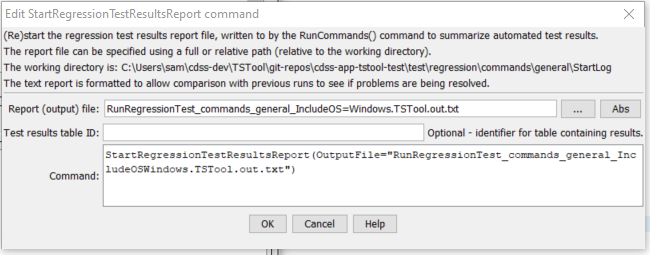

# Learn TSTool / Command / StartRegressionTestResultsReport #

* [Overview](#overview)
* [Command Editor](#command-editor)
* [Command Syntax](#command-syntax)
* [Examples](#examples)
* [Troubleshooting](#troubleshooting)
* [See Also](#see-also)

-------------------------

## Overview ##

The `StartRegressionTestResultsReport` command starts a report file (and optionally results table) to be written to as regression tests are run.
The [CreateRegressionTestCommandFile](../CreateRegressionTestCommandFile/CreateRegressionTestCommandFile) command automatically
inserts this command and is the preferred way to set up automated tests.
The [RunCommands](../RunCommands/RunCommands) commands will write to this file (and optionally results table) if available.

## Command Editor ##

The following dialog is used to edit the command and illustrates the command syntax.
<a href="../StartRegressionTestResultsReport.png">See also the full-size image.</a>



**<p style="text-align: center;">
`StartRegressionTestResultsReport` Command Editor
</p>**


## Command Syntax ##

The command syntax is as follows:

```text
StartRegressionTestResultsReport(Parameter="Value",...)
```
**<p style="text-align: center;">
Command Parameters
</p>**

| **Parameter**&nbsp;&nbsp;&nbsp;&nbsp;&nbsp;&nbsp;&nbsp;&nbsp;&nbsp;&nbsp;&nbsp;&nbsp;&nbsp;&nbsp;&nbsp;&nbsp;&nbsp;&nbsp;&nbsp;&nbsp;&nbsp;&nbsp;&nbsp;&nbsp;&nbsp;&nbsp; | **Description** | **Default**&nbsp;&nbsp;&nbsp;&nbsp;&nbsp;&nbsp;&nbsp;&nbsp;&nbsp;&nbsp; |
| --------------|-----------------|----------------- |
| `OutputFile`<br>**required** | The regression results report file to write, as an absolute path or relative to the command file.  Can use `${Property}`. | None - must be specified. |
| `TestResultsTableID` | The identifier of an output table to be created.  The table will be created. | No table will be output. |

## Examples ##

* See the [command file used to generate tests](https://github.com/OpenWaterFoundation/cdss-app-tstool-test/blob/master/test/regression/TestSuites/commands_general/create/Create_RunTestSuite_commands_general_IncludeOS%3DWindows.TSTool)

See the [Quality Control chapter](../quality-control) for how to set up a regression test.

Each of the command files that are run with
[`RunCommands`](../RunCommands/RunCommands) commands should produce expected time series results, without warnings.
If any command file unexpectedly produces a warning, a warning will also be visible in TSTool.
The issue can then be evaluated to determine whether a software or configuration change is necessary.
An example of the output file is:

```
# File generated by...
# program:      TSTool 10.20.00 (2013-04-10)
# user:         sam
# date:         Sat Apr 20 13:36:05 MDT 2013
# host:         AMAZON
# directory:    C:\Develop\TSTool_SourceBuild\TSTool\test\regression\TestSuites\commands_general\run
# command line: TSTool
#  -home test/operational/CDSS
#
# Command file regression test report from StartRegressionTestResultsReport() and RunCommands()
#
# Explanation of columns:
#
# Num: count of the tests
# Enabled: TRUE if test enabled or FALSE if "#@enabled false" in command file
# Run Time: run time in milliseconds
# Test Pass/Fail:
#    The test status below may be PASS or FAIL (or blank if disabled).
#    A test will pass if the command file actual status matches the expected status.
#    Disabled tests are not run and do not count as PASS or FAIL.
#    Search for *FAIL* to find failed tests.
# Commands Expected Status:
#    Default is assumed to be SUCCESS.
#    "#@expectedStatus Warning|Failure" comment in command file overrides default.
# Commands Actual Status:
#    The most severe status (Success|Warning|Failure) for each command file.
#
#    |       |Test  |Commands  |Commands   |
#    |       |Pass/ |Expected  |Actual     |
# Num|Enabled|Fail  |Status    |Status     |Command File
#----+-------+------+----------+-----------+----------------------------------------------------------------------------------------
    1| TRUE  | PASS |SUCCESS   |SUCCESS    |C:\Develop\TSTool_SourceBuild\TSTool\test\regression\commands\general\ARMA\Test_ARMA_Day.TSTool
    2| TRUE  | PASS |SUCCESS   |SUCCESS    |C:\Develop\TSTool_SourceBuild\TSTool\test\regression\commands\general\ARMA\Test_ARMA_Legacy.TSTool
    3| TRUE  | PASS |SUCCESS   |SUCCESS    |C:\Develop\TSTool_SourceBuild\TSTool\test\regression\commands\general\ARMA\Test_ARMA_Legacy_Ast.TSTool
    4| TRUE  | PASS |SUCCESS   |SUCCESS    |C:\Develop\TSTool_SourceBuild\TSTool\test\regression\commands\general\ARMA\Test_ARMA_Legacy…
...
...
...
...
#----+-------+-------+------+----------+-----------+----------------------------------------------------------------------------------------
FAIL count     = 0, 0.000%
PASS count     = 17, 100.000%
Disabled count = 1
#--------------------------------
Total          = 18
```

## Troubleshooting ##

## See Also ##

* [CreateRegressionTestCommandFile](../CreateRegressionTestCommandFile/CreateRegressionTestCommandFile) command
* [RunCommands](../RunCommands/RunCommands) command
* [WriteCommandSummaryToFile](../WriteCommandSummaryToFile/WriteCommandSummaryToFile) command
