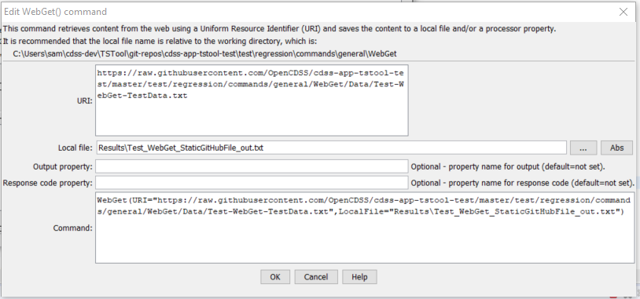

# TSTool / Command / WebGet #

* [Overview](#overview)
* [Command Editor](#command-editor)
* [Command Syntax](#command-syntax)
* [Examples](#examples)
* [Troubleshooting](#troubleshooting)
* [See Also](#see-also)

-------------------------

## Overview ##

The `WebGet` command retrieves content from a website and writes the content to a local file.
The transfer occurs using binary characters and the local copy is the same as that shown by
***View / Source*** (or ***View / Page Source***) in the web browser.
This command is useful for mining time series data and other content from data provider web sites.
The local file can then be processed with additional commands, for example 
[`ReadDelimitedFile`](../ReadDelimitedFile/ReadDelimitedFile.md) if the content is
comma-separated-value.

Extraneous content (such as HTML markup around text) and inconsistencies in newline characters
(`CRLF`=`\r\n` for windows and `LF`=`\n` on other systems) may lead to some issues in processing the content.
Additional command capabilities may be implemented to help handle these issues.

## Command Editor ##

The following dialog is used to edit the command and illustrates the command syntax.

**<p style="text-align: center;">

</p>**

**<p style="text-align: center;">
`WebGet` Command Editor (<a href="../WebGet.png">see also the full-size image</a>)
</p>**

## Command Syntax ##

The command syntax is as follows:

```text
WebGet(Parameter="Value",...)
```
**<p style="text-align: center;">
Command Parameters
</p>**

|**Parameter**&nbsp;&nbsp;&nbsp;&nbsp;&nbsp;&nbsp;&nbsp;&nbsp;&nbsp;&nbsp;&nbsp;&nbsp;&nbsp;&nbsp;&nbsp;&nbsp;&nbsp;&nbsp;&nbsp;&nbsp;&nbsp;&nbsp;&nbsp;&nbsp;&nbsp;&nbsp;&nbsp;&nbsp;&nbsp;&nbsp;&nbsp;&nbsp;&nbsp;&nbsp;&nbsp; | **Description** | **Default**&nbsp;&nbsp;&nbsp;&nbsp;&nbsp;&nbsp;&nbsp;&nbsp;&nbsp;&nbsp;&nbsp;&nbsp;&nbsp;&nbsp;&nbsp;&nbsp; |
| --------------|-----------------|----------------- |
| `URI`<br>**required**| The Uniform Resource Identifier (URI) for the content to be retrieved.  This is often also referred to as the Uniform Resource Locator (URL).  Global properties can be used with the `${Property}` syntax.| None - must be specified.|
| `LocalFile` | The local file in which to save the content.  Global properties can be used with the `${Property}` syntax.| Output file will not be written.|
| `OutputProperty` | Name of the processor property to set the retrieved contents.  For example, a snippet of data can be set as a property for processing by other commands, in which case the content will be accessed using `${Property}` notation.| Content will not be set in a property.|
| `ResponseCodeProperty` | The [HTTP response code](https://en.wikipedia.org/wiki/List_of_HTTP_status_codes) returned by the request.  This can be used to check whether the request was successful. For example, code `200` typically indicates success. | Property value is not set. |


## Examples ##

See the [automated tests](https://github.com/OpenCDSS/cdss-app-tstool-test/tree/master/test/regression/commands/general/WebGet).

## Troubleshooting ##

## See Also ##

* [`FTPGet`](../FTPGet/FTPGet.md) command
* [`ListFiles`](../ListFiles/ListFiles.md) command
* [`ReadDelimitedFile`](../ReadDelimitedFile/ReadDelimitedFile.md) command
* [`UnzipFile`](../UnzipFile/UnzipFile.md) command
