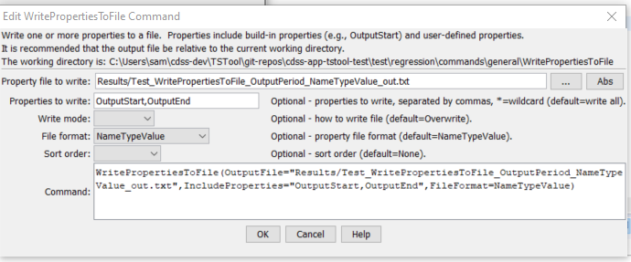

# TSTool / Command / WritePropertiesToFile #

* [Overview](#overview)
* [Command Editor](#command-editor)
* [Command Syntax](#command-syntax)
* [Examples](#examples)
* [Troubleshooting](#troubleshooting)
* [See Also](#see-also)

-------------------------

## Overview ##

The `WritePropertiesToFile` command writes the value of one or more processor
properties to a file (this command replaces the older `WriteProperty` command, which is being phased out).
The [`ReadPropertiesFromFile`](../ReadPropertiesFromFile/ReadPropertiesFromFile.md) command can be used to read properties from a file.
Processor properties include built-in properties such as `InputStart`, `InputEnd`, `OutputStart`, `OutputEnd`, `OutputYearType`, `WorkingDir`,
and also user-defined properties set with [`SetProperty`](../SetProperty/SetProperty.md) and other commands.
Internally, properties have a name and a value, which is of a certain type (Boolean, string, integer, date/time, etc.).
Examples of using the command include:

* creating tests to verify that properties are being set
* passing information from TSTool to another program, such as a Python script
* storing persistent information for later use, such as the date/time that data were last downloaded from a web service

A number of property formats are supported as listed in the following table.

**<p style="text-align: center;">
Property File Formats
</p>**

| **Format**&nbsp;&nbsp;&nbsp;&nbsp;&nbsp;&nbsp;&nbsp;&nbsp;&nbsp;&nbsp;&nbsp;&nbsp;&nbsp;&nbsp;&nbsp;&nbsp;&nbsp;&nbsp;&nbsp;&nbsp;&nbsp;&nbsp;&nbsp;&nbsp;&nbsp;&nbsp;&nbsp;&nbsp;&nbsp; | **Description** |
|-----------------------|-----------------|
| `NameValue`           | Simple format, all properties handled as text:<br><br>`PropertyName=PropertyValue`<br>`PropertyName="Property value, quoted if necessary"` |
| `NameTypeValue`       | Same as `NameValue` format, with non-primitive objects treated as simple constructors:<br><br>`PropertyName=PropertyValue`<br>`DateTimeProperty=DateTime("2010-10-01 12:30")`|
| `NameTypeValuePython` | Similar to the `NameTypeValue` format; however, objects are represented using “Pythonic” notation, to allow the file to be used directly by Python scripts:<br><br>`PropertyName="PropertyValue"`<br>`DateTimeProperty=DateTime(2010,10,1,12,30)` |

## Command Editor ##

The following dialog is used to edit the command and illustrates the command syntax.

**<p style="text-align: center;">

</p>**

**<p style="text-align: center;">
`WritePropertiesToFile` Command Editor (<a href="../WritePropertiesToFile.png">see also the full-size image</a>)
</p>**

## Command Syntax ##

The command syntax is as follows:

```text
WritePropertiesToFile(Parameter="Value",...)
```
**<p style="text-align: center;">
Command Parameters
</p>**

| **Parameter**&nbsp;&nbsp;&nbsp;&nbsp;&nbsp;&nbsp;&nbsp;&nbsp;&nbsp;&nbsp;&nbsp;&nbsp;&nbsp;&nbsp;&nbsp;&nbsp;&nbsp;&nbsp;&nbsp;&nbsp;&nbsp;&nbsp;&nbsp;&nbsp;&nbsp;&nbsp; | **Description** | **Default**&nbsp;&nbsp;&nbsp;&nbsp;&nbsp;&nbsp;&nbsp;&nbsp;&nbsp;&nbsp; |
| --------------|-----------------|----------------- |
|`OutputFile`<br>**required**| The property file to write, as an absolute path or relative to the command file, can use `${Property}`. | None - must be specified. |
|`IncludeProperties` | The names of properties to write, separated by commas.  The `*` wildcard can be used to indicate multiple properties. | If not specified, all processor properties will be written.|
|`WriteMode`|Indicates how the file should be written:<br><ul><li>`Append` – append the properties to the file without checking for matches (create the file if it does not exist)</li><li>`Overwrite` – overwrite the properties file</li><li>`Update` – update the properties in the file by first checking for matching property names (which will be updated) and then appending unmatched properties (not yet implemented)</li></ul>|`Overwrite`|
|`FileFormat`|Format of the properties file (see descriptions in the above **Property File Formats** table):<ul><li>`NameValue`</li><li>`NameTypeValue`</li><li>`NameTypeValuePython`|`NameValue`|
|`SortOrder`|The order to sort properties:<br><ul><li>`Ascending`</li><li>`Descending`</li><li>`None`</li></ul>|None – order depends on order in processor.|

## Examples ##

See the [automated tests](https://github.com/OpenCDSS/cdss-app-tstool-test/tree/master/test/regression/commands/general/WritePropertiesToFile).

## Troubleshooting ##

## See Also ##

* [`SetProperty`](../SetProperty/SetProperty.md) command
* [`SetPropertyFromTimeSeries`](../SetPropertyFromTimeSeries/SetPropertyFromTimeSeries.md) command
