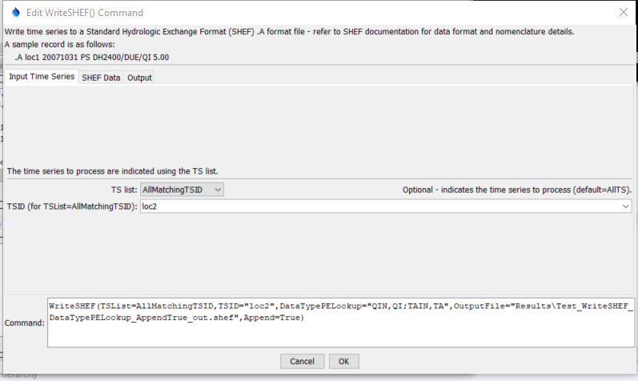

# TSTool / Command / WriteSHEF #

* [Overview](#overview)
* [Command Editor](#command-editor)
* [Command Syntax](#command-syntax)
* [Examples](#examples)
* [Troubleshooting](#troubleshooting)
* [See Also](#see-also)

-------------------------

## Overview ##

The `WriteSHEF` command write time series to a Standard Hydrologic Exchange Format (SHEF) .A record format file.
See the [SHEF Input Type appendix](../../datastore-ref/SHEF/SHEF) for more information about the file format.
The SHEF physical element (PE) codes are similar to time series data type codes.
The PE code is looked up based on data type information that is available for the execution environment.
Currently there is no default PE information.
The PE code can be supplied using the `DataTypePELookup` parameter.
Additional parameters are being added to use a lookup table.
	
This command has primarily been developed to handle hourly data and
additional enhancements may be needed for other intervals and data types.

## Command Editor ##

The following dialog is used to edit the command and illustrates the syntax of the command.
<a href="../WriteSHEF.png">See also the full-size image.</a>



**<p style="text-align: center;">
`WriteSHEF` Command Editor
</p>**

## Command Syntax ##

The command syntax is as follows:

```text
WriteSHEF(Parameter="Value",...)
```
**<p style="text-align: center;">
Command Parameters
</p>**

|**Parameter**&nbsp;&nbsp;&nbsp;&nbsp;&nbsp;&nbsp;&nbsp;&nbsp;&nbsp;&nbsp;&nbsp;&nbsp;&nbsp;&nbsp;&nbsp;&nbsp;&nbsp;|**Description**|**Default**&nbsp;&nbsp;&nbsp;&nbsp;&nbsp;&nbsp;&nbsp;&nbsp;&nbsp;&nbsp;&nbsp;&nbsp;&nbsp;&nbsp;&nbsp;&nbsp;&nbsp;&nbsp;&nbsp;&nbsp;&nbsp;&nbsp;&nbsp;&nbsp;&nbsp;&nbsp;&nbsp;|
|--------------|-----------------|-----------------|
|`TSList`|Indicates the list of time series to be processed, one of:<br><ul><li>`AllMatchingTSID` – all time series that match the TSID (single TSID or TSID with wildcards) will be processed.</li><li>`AllTS` – all time series before the command.</li><li>`EnsembleID` – all time series in the ensemble will be processed (see the EnsembleID parameter).</li><li>`FirstMatchingTSID` – the first time series that matches the TSID (single TSID or TSID with wildcards) will be processed.</li><li>`LastMatchingTSID` – the last time series that matches the TSID (single TSID or TSID with wildcards) will be processed.</li><li>`SelectedTS` – the time series are those selected with the [`SelectTimeSeries`](../SelectTimeSeries/SelectTimeSeries) command.</li></ul> | `AllTS` |
|`TSID`|The time series identifier or alias for the time series to be processed, using the `*` wildcard character to match multiple time series.  Can be specified using `${Property}`.|Required if `TSList=*TSID`|
|`EnsembleID`|The ensemble to be processed, if processing an ensemble. Can be specified using `${Property}`.|Required if `TSList=*EnsembleID`|
|`OutputFile`|The SHEF output file.  The path to the file can be absolute or relative to the working directory (command file location).|None – must be specified.|
|`Append`|Indicate whether the output should be appended to the file.|`False` – create the file.|
|`DataTypePELookup`|Pairs of data type and SHEF physical element (PE) codes.  The pairs should be separated by semicolons and the data type/PE strings by commas.  For example, the data values for instantaneous streamflow and air temperature might be:  `QIN,QI;TAIN,TA`|Use information determined for operational environment, if available.|
|`OutputStart`|The date/time for the start of the output.|Use the global output period.|
|`OutputEnd`|The date/time for the end of the output. |Use the global output period.|
|`TimeZone`|The time zone to be used for all SHEF records.|`Z` (Zulu time).|
|`ObservationTime`|Observation time to use for all SHEF records.  Specify as a full string (e.g., `DH1200`) or an integer (e.g., `1200`), in which case the prefix will be determined based on data.  For example, use this parameter to specify the observation time for daily data.|Time corresponding to time series data values.|
|`CreationDate`|The creation date to use for all SHEF records.  Specify as a full string (e.g., `DC20010131`) or an integer (e.g., `20010131`), in which case the prefix automatically will be added.|Not used in output.|
|`Duration`|The duration code to use for all SHEF records.  Specify as a literal string (e.g., `DVH06`).|Determined automatically from irregular time series, not used for regular interval time series.|
|`Precision`|Number of digits after the decimal to use for output.|Determine from the time series data units, or use 2 by default.|

## Examples ##

See the [automated tests](https://github.com/OpenWaterFoundation/cdss-app-tstool-test/tree/master/test/regression/commands/general/WriteSHEF).

## Troubleshooting ##

## See Also ##

* [`SelectTimeSeries`](../SelectTimeSeries/SelectTimeSeries) command
