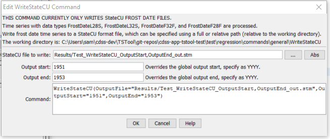

# Learn TSTool / Command / WriteStateCU #

* [Overview](#overview)
* [Command Editor](#command-editor)
* [Command Syntax](#command-syntax)
* [Examples](#examples)
* [Troubleshooting](#troubleshooting)
* [See Also](#see-also)

-------------------------

## Overview ##

The `WriteStateCU` command writes time series to the specified StateCU frost dates format file.
Currently only the frost dates file can be written with this command.
See the [`WriteStateMod`](../WriteStateMod/WriteStateMod) command to write StateMod
format files (e.g., for the precipitation, temperature, and diversion time series files used with the StateCU model).
See the [StateCU Input Type Appendix](../../datastore-ref/StateCU/StateCU) for more information about the file format.
All time series matching the data types `FrostDateL28S`, `FrostDateL32S`,
`FrostDateF32F`, and `FrostDateF28F` will be written (all other time series will be ignored).
Other StateCU files may be supported in the future.
See also the StateDMI software, which processes other StateCU files.

## Command Editor ##

The following dialog is used to edit the command and illustrates the syntax of the command.
<a href="../WriteStateCU.png">See also the full-size image.</a>



**<p style="text-align: center;">
`WriteStateCU` Command Editor
</p>**

## Command Syntax ##

The command syntax is as follows:

```text
WriteStateCU(Parameter="Value",...)
```
**<p style="text-align: center;">
Command Parameters
</p>**

|**Parameter**&nbsp;&nbsp;&nbsp;&nbsp;&nbsp;&nbsp;&nbsp;&nbsp;&nbsp;&nbsp;&nbsp;|**Description**|**Default**&nbsp;&nbsp;&nbsp;&nbsp;&nbsp;&nbsp;&nbsp;&nbsp;&nbsp;&nbsp;&nbsp;&nbsp;&nbsp;&nbsp;&nbsp;&nbsp;&nbsp;&nbsp;&nbsp;&nbsp;&nbsp;&nbsp;&nbsp;&nbsp;&nbsp;&nbsp;&nbsp;|
|--------------|-----------------|-----------------|
|`OutputFile`<br>**required**|The StateCU frost dates output file.  The path to the file can be absolute or relative to the working directory.|None – must be specified.|
|`OutputStart`|The date/time for the start of the output.|Use the global output period.|
|`OutputEnd`|The date/time for the end of the output.|Use the global output period.|

## Examples ##

See the [automated tests](https://github.com/OpenWaterFoundation/cdss-app-tstool-test/tree/master/test/regression/commands/general/WriteStateCU).

A sample command file to process frost date time series from the [State of Colorado’s HydroBase database](../../datastore-ref/CO-HydroBase/CO-HydroBase)
is as follows:

```text
# 0109 - AKRON 4 E
0109.NOAA.FrostDateL28S.Year~HydroBase
0109.NOAA.FrostDateL32S.Year~HydroBase
0109.NOAA.FrostDateF32F.Year~HydroBase
0109.NOAA.FrostDateF28F.Year~HydroBase
WriteStateCU(OutputFile="test.stm")
```

## Troubleshooting ##

## See Also ##

* [`ReadStateCU`](../ReadStateCU/ReadStateCU) command
* [`SelectTimeSeries`](../SelectTimeSeries/SelectTimeSeries) command
