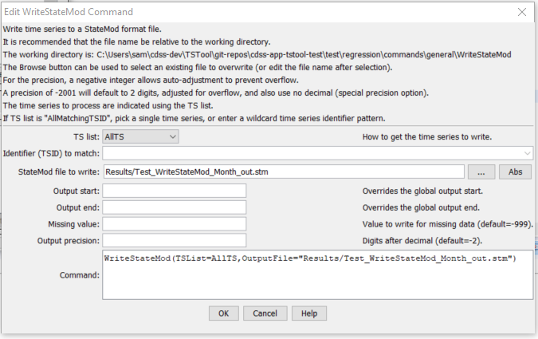

# TSTool / Command / WriteStateMod #

* [Overview](#overview)
* [Command Editor](#command-editor)
* [Command Syntax](#command-syntax)
* [Examples](#examples)
* [Troubleshooting](#troubleshooting)
* [See Also](#see-also)

-------------------------

## Overview ##

The `WriteStateMod` command writes the time series in memory to the specified StateMod format file.
See the [StateMod Input Type Appendix](../../datastore-ref/StateMod/StateMod.md) for more information about the file format.
It is expected that the time series have the same interval.
The time series identifier location part is written as the identifier,
even if an alias is assigned to a time series.

## Command Editor ##

The following dialog is used to edit the command and illustrates the syntax of the command.



**<p style="text-align: center;">
`WriteStateMod` Command Editor (<a href="../WriteStateMod.png">see also the full-size image</a>)
</p>**

## Command Syntax ##

The command syntax is as follows:

```text
WriteStateMod(Parameter="Value",...)
```
**<p style="text-align: center;">
Command Parameters
</p>**

|**Parameter**&nbsp;&nbsp;&nbsp;&nbsp;&nbsp;&nbsp;&nbsp;&nbsp;&nbsp;&nbsp;&nbsp;|**Description**|**Default**&nbsp;&nbsp;&nbsp;&nbsp;&nbsp;&nbsp;&nbsp;&nbsp;&nbsp;&nbsp;&nbsp;&nbsp;&nbsp;&nbsp;&nbsp;&nbsp;&nbsp;&nbsp;&nbsp;&nbsp;&nbsp;&nbsp;&nbsp;&nbsp;&nbsp;&nbsp;&nbsp;|
|--------------|-----------------|-----------------|
|`TSList`|Indicates the list of time series to be processed, one of:<br><ul><li>`AllMatchingTSID` – all time series that match the TSID (single TSID or TSID with wildcards) will be processed.</li><li>`AllTS` – all time series before the command.</li><li>`SelectedTS` – the time series are those selected with the [`SelectTimeSeries`](../SelectTimeSeries/SelectTimeSeries.md) command.</li></ul> | `AllTS` |
|`TSID`|The time series identifier or alias for the time series to be processed, using the `*` wildcard character to match multiple time series.  Can be specified using `${Property}`.|Required if `TSList=*TSID`|
|`OutputFile`<br>**required**|The StateMod file to write.  The path to the file can be absolute or relative to the working directory (command file location).|None – must be specified.|
|`OutputStart`|The date/time for the start of the output.|Use the global output period.|
|`OutputEnd`|The date/time for the end of the output.|Use the global output period.|
|`MissingValue`|The value to write for missing data.|`-999`|
|`Precision`|The number of digits to use after the decimal point, for data values.  A negative number indicates that if the formatted number is larger than the allowed output width, adjust the format accordingly by truncating fractional digits.  A special value of `–2001` is equivalent to `–2` and additionally NO decimal point will be printed for large values.|The default output precision if not specified is `-2`, which is then reset based on the data units (see the `system/DATAUNIT` file installed with TSTool).|

## Examples ##

See the [automated tests](https://github.com/OpenCDSS/cdss-app-tstool-test/tree/master/test/regression/commands/general/WriteStateMod).

A sample command file to process time series from the [State of Colorado’s HydroBase database](../../datastore-ref/CO-HydroBase/CO-HydroBase.md)
is as follows:

```text
SetOutputPeriod(OutputStart="1950-01",OutputEnd="2002-12")
# 08213500 - RIO GRANDE RIVER AT THIRTY MILE BRIDGE NEAR CREEDE
08213500.DWR.Streamflow.Month~HydroBase
# 08217000 - RIO GRANDE AT WASON, BELOW CREEDE, CO.
08217000.USGS.Streamflow.Month~HydroBase
WriteStateMod(TSList=AllTS,OutputFile="RioGrande.rih")
```

## Troubleshooting ##

## See Also ##

* [`ReadStateMod`](../ReadStateMod/ReadStateMod.md) command
* [`SelectTimeSeries`](../SelectTimeSeries/SelectTimeSeries.md) command
