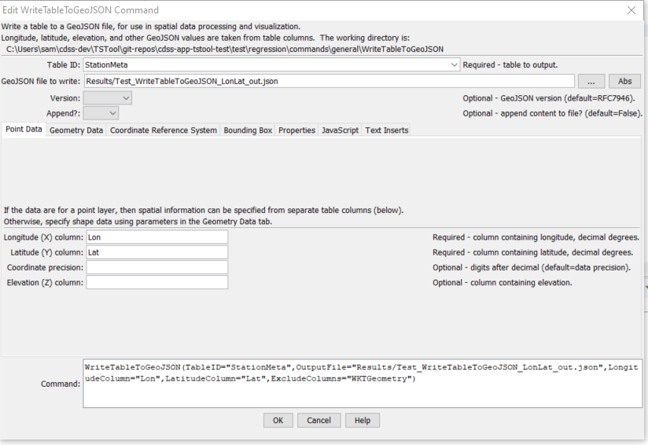
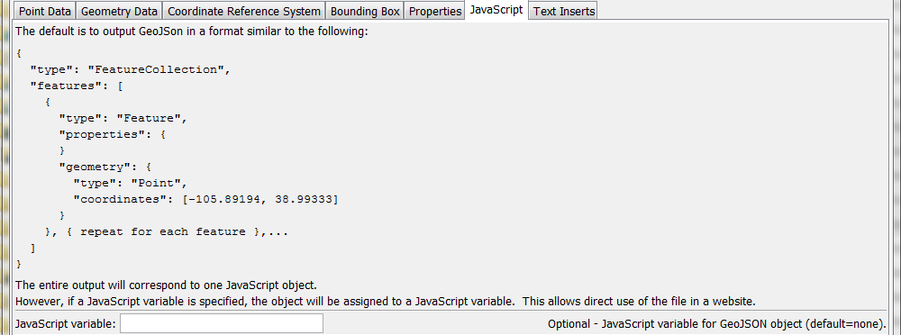

# TSTool / Command / WriteTableToGeoJSON #

* [Overview](#overview)
* [Command Editor](#command-editor)
* [Command Syntax](#command-syntax)
* [Examples](#examples)
* [Troubleshooting](#troubleshooting)
* [See Also](#see-also)

-------------------------

## Overview ##

The `WriteTableToGeoJSON` command writes a table to a GeoJSON file,
which is a spatial data format that can be viewed in geographic information system (GIS) software and other visualization tools.  See:

* [GeoJSON Specification](http://geojson.org/geojson-spec.html)

The table must include columns for longitude and latitude or a column containing Well Known Text (WKT) geometry strings.  See:

* [Well-known Text on WikiPedia](http://en.wikipedia.org/wiki/Well-known_text)

Currently only point and polygon data can be processed but in the future support
for well-known text for other geometry types will be added.
A future enhancement of this command will allow the geometry feature data to be read from other spatial formats.

## Command Editor ##

The following dialog is used to edit the command and illustrates the syntax of the command for
point data in separate columns.



**<p style="text-align: center;">
`WriteTableToGeoJSON` Command Editor for Point Data Parameters (<a href="../WriteTableToGeoJSON.png">see also the full-size image</a>)
</p>**

The following figure illustrates the command syntax for layers specified with a geometry data column.


**<p style="text-align: center;">
`WriteTableToGeoJSON` Command Editor for Geometry Data Parameter (<a href="../WriteTableToGeoJSON_WKTGeometry.png">see also the full-size image</a>)
</p>**

The following figure illustrates the command syntax for coordinate reference system parameter.


**<p style="text-align: center;">
`WriteTableToGeoJSON` Command Editor for Coordinate Reference System Parameter (<a href="../WriteTableToGeoJSON_crs.png">see also the full-size image</a>)
</p>**

The following figure illustrates the command syntax for bounding box parameters.


**<p style="text-align: center;">
`WriteTableToGeoJSON` Command Editor for Bounding Box Parameters (<a href="../WriteTableToGeoJSON_bbox.png">see also the full-size image</a>)
</p>**

The following figure illustrates the command syntax for specifying table columns to include as properties in the GeoJSON output.


**<p style="text-align: center;">
`WriteTableToGeoJSON` Command Editor for Property Parameters (<a href="../WriteTableToGeoJSON_Properties.png">see also the full-size image</a>)
</p>**

The following figure illustrates the command syntax for specifying the JavaScript variable for the output object.



**<p style="text-align: center;">
`WriteTableToGeoJSON` Command Editor for JavaScript Parameters (<a href="../WriteTableToGeoJSON_JavaScript.png">see also the full-size image</a>)
</p>**

The following figure illustrates the command syntax for specifying inserts before and after the GeoJSON content.


**<p style="text-align: center;">
`WriteTableToGeoJSON` Command Editor for Text Insert Parameters (<a href="../WriteTableToGeoJSON_Inserts.png">see also the full-size image</a>)
</p>**

## Command Syntax ##

The command syntax is as follows:

```text
WriteTableToGeoJSON(Parameter="Value",...)
```
**<p style="text-align: center;">
Command Parameters
</p>**

|**Parameter**&nbsp;&nbsp;&nbsp;&nbsp;&nbsp;&nbsp;&nbsp;&nbsp;&nbsp;&nbsp;&nbsp;&nbsp;&nbsp;&nbsp;&nbsp;&nbsp;&nbsp;&nbsp;&nbsp;&nbsp;&nbsp;|**Description**|**Default**&nbsp;&nbsp;&nbsp;&nbsp;&nbsp;&nbsp;&nbsp;&nbsp;&nbsp;&nbsp;&nbsp;&nbsp;&nbsp;&nbsp;&nbsp;&nbsp;&nbsp;&nbsp;&nbsp;&nbsp;&nbsp;&nbsp;&nbsp;&nbsp;&nbsp;&nbsp;&nbsp;&nbsp;&nbsp;&nbsp;&nbsp;&nbsp;&nbsp;&nbsp;&nbsp;|
|--------------|-----------------|-----------------|
|`TableID`|Identifier for the table to write.  Can be specified using `${Property}` notation.|None – must be specified.|
|`OutputFile`|The name of the GeoJSON file to write, as an absolute path or relative to the command file location.  Can be specified using `${Property}` notation.|None – must be specified.|
|`Append`|Indicate whether to append the GeoJSON content to the output file, `True` or `False`.|`False`|
|`LongitudeColumn`|The name of the table column that contains longitude. Can be specified using `${Property}` notation.|None – must be specified.|
|`LatitudeColumn`|The name of the table column that contains latitude.  Can be specified using `${Property}` notation.|None – must be specified.|
|`ElevationColumn`|The name of the table column that contains elevation.  Can be specified using `${Property}` notation.|Elevation is omitted.|
|`WKTGeometryColumn`|The name of the table column that contains Well Known Text (WKT) geometry strings.  Can be specified using `${Property}` notation.||
|`CRSText`|Full text to define the coordinate reference system using the `crs` GeoJSON property.  The text will be inserted at the top level of the GeoJSON.  This should be used when other than geographic coordinates are used.  For more information, see:<br><ul><li>[GeoJSON CRS specification](http://geojson.org/geojson-spec.html#named-crs)</li><li>[Spatial Reference System](https://en.wikipedia.org/wiki/Spatial_reference_system)</li><li>[spatialreference.org](http://spatialreference.org/)|No `crs` property is included which means that GeoJSON defaults to `EPSG:4326` (geographic).|
|`IncludeBBox`|Indicate whether to include bbox GeoJSON property for the full layer.|`True`|
|`IncludeFeatureBBox`|Indicate whether to include `bbox` GeoJSON property for each feature.|`True`|
|`IncludeColumns`|List of comma-separated table column names to include as feature properties.  Can be specified using ${Property} notation.|Include all columns.|
|`ExcludeColumns`|List of comma-separated table column names to exclude as feature properties.  Can be specified using ${Property} notation.|Exclude no columns.|
|`JavaScriptVar`|Name of JavaScript variable to assign object to in output.  This parameter will be ignored if `PrependText` or `AppendText` are specified.  Can be specified using `${Property}` notation.|Output GeoJSON object surrounded by `{ }`.|
|`PrependText`|Provide text to insert before the GeoJSON object, for example to provide custom JavaScript.  Can be specified using `${Property}` notation.|No insert.|
|`AppendText`|Provide text to append after the GeoJSON object, for example to provide custom JavaScript.  Can be specified using `${Property}` notation.|

## Examples ##

See the [automated tests](https://github.com/OpenCDSS/cdss-app-tstool-test/tree/master/test/regression/commands/general/WriteTableToGeoJSON).

The following example illustrates a CSV table that specifies WKT for points (see `WKTGeometry` column):

```
"ID","ID_text","Lon","Lat","Name","WKTGeometry"
50263,050263,-105.891940,38.993330,ANTERO RSVR,"POINT (-105.891940 38.993330)"
50454,050454,-105.476670,39.404720,BAILEY,"POINT (-105.476670 39.404720)"
50848,050848,-105.266670,39.991940,BOULDER,"POINT (-105.266670 39.991940)"
```

The following example illustrates a CSV table that specifies WKT for polygons:

```
"ID","ID_text","Lon","Lat","Name","WKTGeometry"
50263,050263,-105.891940,38.993330,ANTERO RSVR,"POLYGON (-105.891940 38.993330,-106 39,-106 37.5)"
50454,050454,-105.476670,39.404720,BAILEY,"POLYGON (-105.476670 39.404720, -104 39, -103 37.5)"
```

## Troubleshooting ##

## See Also ##

* [`WriteTableToKml`](../WriteTableToKml/WriteTableToKml.md) command
* [`WriteTableToShapefile`](../WriteTableToShapefile/WriteTableToShapefile.md) command
* [`WriteTimeSeriesToGeoJSON`](../WriteTimeSeriesToGeoJSON/WriteTimeSeriesToGeoJSON.md) command
