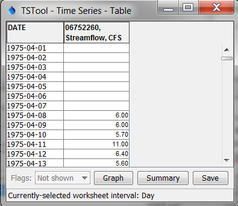
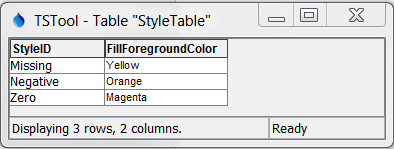
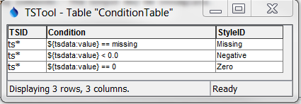
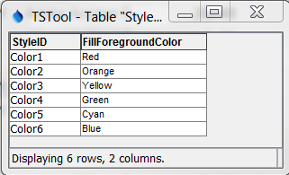
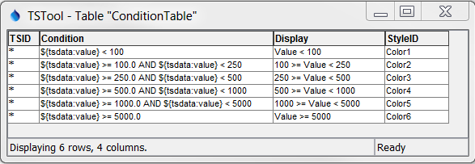

# TSTool / Command / WriteTimeSeriesToExcelBlock #

* [Overview](#overview)
* [Command Editor](#command-editor)
* [Command Syntax](#command-syntax)
* [Examples](#examples)
* [Troubleshooting](#troubleshooting)
* [See Also](#see-also)

-------------------------

## Overview ##

**This command is under development.**
	
The `WriteTimeSeriesToExcelBlock` command writes one or more time series to an Excel
workbook with output being in block layout.  The following functionality is provided:
	
* Time series are written in blocks (see
[`WriteTimeSeriesToExcel`](../WriteTimeSeriesToExcel/WriteTimeSeriesToExcel) for simple column output).
* The worksheet and position in worksheet can be specified.
* The output can be created or appended.
* Options are provided to select how the blocks of data are oriented.  For example, for monthly time series rows may contain years of data and columns may contain months of data.

TSTool uses the [Apache POI software](http://poi.apache.org) to read/write the Excel file and
consequently functionality is constrained by the features of that software package.

## Command Editor ##

The following dialog is used to edit the command and illustrates the syntax of the command for time series parameters.
<a href="../WriteTimeSeriesToExcelBlock_TimeSeries.png">See also the full-size image.</a>


**<p style="text-align: center;">
`WriteTimeSeriesToExcelBlock` Command Editor for Time Series Parameters
</p>**

The following dialog is used to edit the command and illustrates the syntax of the command for Excel output parameters.
<a href="../WriteTimeSeriesToExcelBlock_ExcelOutput.png">See also the full-size image.</a>


**<p style="text-align: center;">
`WriteTimeSeriesToExcelBlock` Command Editor for Excel Output Parameters
</p>**

The following dialog is used to edit the command and illustrates the syntax of the command for Layout parameters.
<a href="../WriteTimeSeriesToExcelBlock_Layout.png">See also the full-size image.</a>


**<p style="text-align: center;">
`WriteTimeSeriesToExcelBlock` Command Editor for Layout Parameters
</p>**

The following dialog is used to edit the command and illustrates the syntax of the command for Statistics parameters.
<a href="../WriteTimeSeriesToExcelBlock_Statistics.png">See also the full-size image.</a>


**<p style="text-align: center;">
`WriteTimeSeriesToExcelBlock` Command Editor for Statistics Parameters
</p>**

The following dialog is used to edit the command and illustrates the syntax of the command for cell comment (data flag) parameters.
<a href="../WriteTimeSeriesToExcelBlock_DataFlags.png">See also the full-size image.</a>


**<p style="text-align: center;">
`WriteTimeSeriesToExcelBlock` Command Editor for Cell Comment (Data Flag) Parameters
</p>**

The following dialog is used to edit the command and illustrates the syntax of the command for style formatting parameters.
<a href="../WriteTimeSeriesToExcelBlock_Style.png">See also the full-size image.</a>


**<p style="text-align: center;">
`WriteTimeSeriesToExcelBlock` Command Editor for Style Parameters
</p>**

## Command Syntax ##

The command syntax is as follows:

```text
WriteTimeSeriesToExcelBlock(Parameter="Value",...)
```
**<p style="text-align: center;">
Command Parameters
</p>**

|**Parameter**&nbsp;&nbsp;&nbsp;&nbsp;&nbsp;&nbsp;&nbsp;&nbsp;&nbsp;&nbsp;&nbsp;&nbsp;&nbsp;&nbsp;&nbsp;&nbsp;&nbsp;&nbsp;|**Description**|**Default**&nbsp;&nbsp;&nbsp;&nbsp;&nbsp;&nbsp;&nbsp;&nbsp;&nbsp;&nbsp;&nbsp;&nbsp;&nbsp;&nbsp;&nbsp;&nbsp;&nbsp;&nbsp;&nbsp;&nbsp;&nbsp;&nbsp;&nbsp;&nbsp;&nbsp;&nbsp;&nbsp;|
|--------------|-----------------|-----------------|
|`TSList`|Indicates the list of time series to be processed, one of:<br><ul><li>`AllMatchingTSID` – all time series that match the TSID (single TSID or TSID with wildcards) will be processed.</li><li>`AllTS` – all time series before the command.</li><li>`EnsembleID` – all time series in the ensemble will be processed (see the EnsembleID parameter).</li><li>`FirstMatchingTSID` – the first time series that matches the TSID (single TSID or TSID with wildcards) will be processed.</li><li>`LastMatchingTSID` – the last time series that matches the TSID (single TSID or TSID with wildcards) will be processed.</li><li>`SelectedTS` – the time series are those selected with the [`SelectTimeSeries`](../SelectTimeSeries/SelectTimeSeries) command.</li></ul> | `AllTS` |
|`TSID`|The time series identifier or alias for the time series to be processed, using the `*` wildcard character to match multiple time series.  Can be specified using `${Property}`.|Required if `TSList=*TSID`|
|`EnsembleID`|The ensemble to be processed, if processing an ensemble. Can be specified using `${Property}`.|Required if `TSList=*EnsembleID`|
|`OutputFile`<br>**required**|The name of the Excel workbook file (`*.xls` or `*.xlsx`) to write, as an absolute path or relative to the command file location.  If the Excel file does not exist it will be created.  Can be specified with processor `${Property}`.|None – must be specified.|
|`Append`|Indicate whether the sheet being written should appended to an existing workbook.|`False` – create a new workbook.|
|`Worksheet`|The name of the worksheet in the workbook to write.  If the worksheet does not exist it will be created.  Can be specified with processor `${Property}`.|Write to the first worksheet.|
|`ExcelAddress`|Indicates the block of cells to write, using Excel address notation (e.g., `A1:D10`).|Must specify address using one of available address parameters.|
|`ExcelNamedRange`|Indicates the block of cells to write, using an Excel named range.|Must specify address using one of available address parameters.|
|`ExcelTableName`|Indicates the block of cells to write, using an Excel named range.|Must specify address using one of available address parameters.|
|`KeepOpen`|Indicate whether to keep the Excel file open (`True`) or close after creating (`False`).  Keeping the file open will increase performance because later commands will not need to reread the workbook.  Make sure to close the file in the last Excel command.|`False`|
|`LayoutBlock`<br>**required**|Indicate data blocks for output:<ul><li>`Period` – time series period of record is output as a block</li><li>`Year` – year of data is output in a block</li></ul>|None – must be specified.|
|`LayoutColumns`<br>**required**|For the output block, indicate what columns contain:<ul><li>`Day` – one day per column</li><li>`Month` – one month per column</li><li>`Year` – one year per column</li></ul>|None – must be specified.|
|`LayoutRows`<br>**required**|For the output block, indicate what rows contain:<ul><li>`YearAscending` – year, with earliest at top</li><li>`YearDescending` – year, with most recent at top</li></ul>|None – must be specified.|
|`OutputYearType`|The output year type, which controls the start and end dates for the output.|`Calendar`|
|`ConditionTableID`|Identifier for condition table (see below).  Can be specified using processor `${Property}`.|Style formatting is not used.|
|`StyleTableID`|Identifier for style table (see below).  Can be specified using processor `${Property}`.|Style formatting is not used.|
|`LegendWorksheet`|Name of worksheet where the legend should be created.  The legend displays conditions and styles. |Time series worksheet.|
|`LegendAddress`|Address `A1`, etc. for upper-left of legend.|No legend created.|

Excel cell formatting consists of number formatting, cell colors, cell width, etc.
The ***Style Formatting*** tab provides general formatting capabilities for data cells.
Consider the following time series data table, where the goal is to write the TSTool
time series to Excel and format cells to indicate specific conditions of interest.
This approach is implemented similarly in the
[`WriteTableToExcel`](../WriteTableToExcel/WriteTableToExcel) command.
<a href="../WriteTimeSeriesToExcelBlock_DataTable.png">See also the full-size image.</a>



**<p style="text-align: center;">
Data Table used with `WriteTimeSeriesToExcelBlock` Command Style Formatting
</p>**

To configure style-based formatting, a style table is defined listing properties for formatting cells.
This table can be defined as a CSV file, Excel worksheet or other format
and read into TSTool using a suitable command.
The following figure illustrates a basic style table, which can be shared among commands.
<a href="../WriteTimeSeriesToExcelBlock_StyleTable.png">See also the full-size image.</a>



**<p style="text-align: center;">
Style Table used with `WriteTimeSeriesToExcelBlock` Command for Specific Checks and Formatting
</p>**

The following style table column names are recognized.
The default values for cell style properties not listed in the table are those provided by Excel.

**<p style="text-align: center;">
Recognized Style Table Column Names
</p>**

|**Column Name**&nbsp;&nbsp;&nbsp;&nbsp;&nbsp;&nbsp;&nbsp;&nbsp;&nbsp;&nbsp;&nbsp;&nbsp;&nbsp;&nbsp;&nbsp;&nbsp;&nbsp;&nbsp;&nbsp;&nbsp;&nbsp;&nbsp;&nbsp;&nbsp;&nbsp;&nbsp;&nbsp;&nbsp;&nbsp;&nbsp;&nbsp;&nbsp;|**Description**|**Default**&nbsp;&nbsp;&nbsp;&nbsp;&nbsp;|
|--|--|--|
|`StyleID`|An identifier for the style, which is used in the format table below.|None – must be specified.|
|`FillForegroundColor`|The foreground fill color as a named color (e.g., `Red`), RGB triplet (`255,255,255`), or hex color `0xFFFFFF`.  The following named colors are recognized:  `black`, `blue`, `cyan`, `darkgray`, `gray`, `green`, `lightgray`, `magenta`, `none`, `orange`, `pink`, `red`, `white`, `yellow`.|No fill color.|
|`FillPattern`|Fill pattern for cells using `FillForegroundColor` and `FillBackgroundColor`.|Currently always defaults to solid - pattern is ignored.|

The condition table indicates how the styles are used for time series data.
The following example indicates that any time series with identifier (or alias)
starting with `ts` should be processed to evaluate for missing, negative, and zero values.
<a href="../WriteTimeSeriesToExcelBlock_ConditionTable.png">See also the full-size image.</a>



**<p style="text-align: center;">
Condition Table used with `WriteTimeSeriesToExcelBlock` Command for Specific Checks and Formatting
</p>**

The column names for the condition table must be specified as shown.
The ***Condition*** column recognizes the following time series data specifiers:

* `${tsdata:value}` – the time series data value, used to evaluate numerical conditions
* `${tsdata:flag}` – the time series flag, used to evaluate string conditions

Values on the left and right of the operator must be separated with spaces to
facilitate parsing the condition.  The ***Condition*** column recognizes the following operators:

**<p style="text-align: center;">
Condition Table Operators
</p>**

|**Operator**|**Description**|
|--|--|
|`<`|Less than.|
|`<=`|Less than or equal to.|
|`==`|Equal to.  Specify the right-side value as missing to check for missing.|
|`!=`|Not equal to.  Specify the right-side value as missing to check for missing.|
|`>`|Greater than.|
|`>=`|Greater than or equal to.|
|`contains`|Specify for string values to check for substring (case-independent).|

Multiple conditions can be specified by using AND (surrounded by a single space) between conditions.
The ***Display*** column in the condition table is optional and provides test to use in the legend.
If the ***Display*** column is not provided, the ***Condition*** column contents will be used for the legend.
<a href="../WriteTimeSeriesToExcelBlock_Output.png">See also the full-size image.</a>


**<p style="text-align: center;">
`WriteTimeSeriesToExcelBlock` Command Example Output for Specific Checks and Formatting
</p>**

The following example illustrates using multiple conditions to implement a color scale.



**<p style="text-align: center;">
Style Table used with `WriteTimeSeriesToExcelBlock` Command for a Color Scale
</p>**


	 
**<p style="text-align: center;">
Condition Table used with `WriteTimeSeriesToExcelBlock` Command for a Color Scale
</p>**

The resulting output is as shown below.
<a href="../WriteTimeSeriesToExcelBlock_Output.png">See also the full-size image.</a>


	 
**<p style="text-align: center;">
`WriteTimeSeriesToExcelBlock` Command Example Output for Style Formatting
</p>**

## Examples ##

See the [automated tests](https://github.com/OpenWaterFoundation/cdss-app-tstool-test/tree/master/test/regression/commands/general/WriteTimeSeriesToExcelBlock).

## Troubleshooting ##

## See Also ##

* [`SelectTimeSeries`](../SelectTimeSeries/SelectTimeSeries) command
* [`WriteTimeSeriesToExcel`](../WriteTimeSeriesToExcel/WriteTimeSeriesToExcel) command
