# TSTool / Commands #

This chapter summarizes features in the ***Commands*** menu.
See also the [Command Reference overview](../command-ref/overview.md).

* [Introduction](#introduction)
* Time Series Commands
	+ [Select/Free Time Series](#selectfree-time-series)
	+ [Create Time Series](#create-time-series)
	+ [Read Time Series](#read-time-series)
	+ [Fill Time Series Missing Data](#fill-time-series-missing-data)
	+ [Set Time Series Data](#set-time-series-data)
	+ [Manipulate Time Series](#manipulate-time-series)
	+ [Analyze Time Series](#analyze-time-series)
	+ [Models - Routing](#models-routing)
	+ [Output Time Series](#output-time-series)
	+ [Check Time Series](#check-time-series)
* Topic Area Commands
	+ [Datastore Processing](#datastore-processing)
	+ [Ensemble Processing](#ensemble-processing)
	+ [Network Processing](#network-processing)
	+ [Spatial Data Processing](#spatial-data-processing)
	+ [Spreadsheet Processing](#spreadsheet-processing)
	+ [Template Processing](#template-processing)
	+ [Visualization Processing](#visualization-processing)
* General Commands
	+ [General Commands - Comments](#general-commands-comments)
	+ [General Commands - File Handling](#general-commands-file-handling)
	+ [General Commands - Logging and Messaging](#general-commands-logging-and-messaging)
	+ [General Commands - Running and Properties](#general-commands-running-and-properties)
	+ [General Commands - Test Processing](#general-commands-test-processing)
* [Deprecated Commands](#deprecated-commands)
* [Table Commands](#table-commands)
* [Plugin Commands](#plugin-commands)

----------

## Introduction ##

The ***Commands*** menu provides choices to insert commands in the ***Commands*** list.

**<p style="text-align: center;">
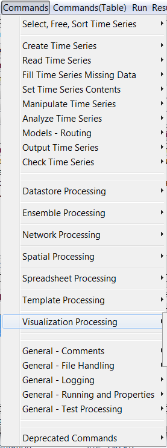
</p>**

**<p style="text-align: center;">
Commands Menu
</p>**

Commands are organized into the following categories:

|**Command Category**|**Description**|
|--|--|
|***Select/Free Time Series***|Select or deselect time series for processing, free time series|
|***Create Time Series***|Create one or more new time series|
|***Read Time Series***|Read time series from a file or database|
|***Fill Time Series Missing Data***|Fill missing data|
|***Set Time Series Contents***|Set time series data or properties|
|***Manipulate Time Series***|Manipulate data (e.g., scale a time series’ data values)|
|***Analyze Time Series***|Perform analysis on time series (e.g., determine wet/dry/average pattern)|
|***Models – Routing***|Lag and attenuate time series|
|***Output Time Series***|Write time series results to a file or produce graphical products|
|***Check Time Series***|Check time series values and statistics against criteria|
|***Datastore Processing***|Commands that are specific to datastore processing|
|***Ensemble Processing***|Commands that are specific to ensemble processing|
|***Network Processing***|Commands that are specific to network processing|
|***Spatial Processing***|Commands that process spatial data|
|***Spreadsheet Processing***|Commands that process spreadsheet files|
|***Template Processing***|Commands that are specific to template processing|
|***Visualization Processing***|Commands that are specific to generating visualizations and output products|
|***General – Comments***|Insert comments|
|***General – File Handling***|Commands to manipulate files and perform FTP and web retrieval|
|***General – Logging and Messaging***|Commands for logging (e.g., open a log file, set message levels)|
|***General – Running and Properties***|Commands to control processing and run external programs|
|***General – Test Processing***|Commands to process tests, to validate software and procedures|
|***Deprecated Commands***|Commands that are planned for removal|

A separate ***Commands(Table)*** menu is provided for table-processing commands.

A separate ***Commands(Plugin)*** menu is provided for plugin commands,
which are third-party commands that are distributed separately from core TSTool and allow custom features.
The plugin feature is under development.

The menus for each category are discussed in the following sections.
Selecting a command menu item will display a command editor.
The editor dialog and command syntax are described in detail in the [Command Reference](../command-ref/overview.md).
Menus are enabled/disabled depending on the state of the application (e.g., whether time series are available).
When ***OK*** is pressed in the command editor, the command will be inserted before the first selected command.
If no commands are selected, the command will be added to the end of the command list.
If necessary, right click on the command list and use ***Deselect All Commands*** –
this will ensure that commands are added at the end of the list.

The `TSList` command parameter is available for many commands to specify the list of time series to process.
Criteria can be specified to match the alias and TSID strings.
The pattern typically can contain wildcards.
For example, specify `TSID=A*` to match aliases starting with `A`, or `TSID=A*.*.*.Month` to match TSIDs with a location starting with `A`.
An identifier string with periods indicates that the string may be a dot-delimited TSID string, and the TSID parts are compared individually.
For example, `Command(TSList=AllTS,...)` will process all available time series and
`Command(TSList=AllMatchingTSID,TSID=”A*”,...)` will process all time series with an alias that starts with `A`.
Refer to the command reference for a description of available parameters for a specific command.
The standard values for the `TSList` parameter are as follows:

|**`TSList` Parameter Value**&nbsp;&nbsp;&nbsp;&nbsp;&nbsp;&nbsp;&nbsp;&nbsp;&nbsp;&nbsp;&nbsp;&nbsp;&nbsp;&nbsp;&nbsp;&nbsp;&nbsp;&nbsp;&nbsp;&nbsp;&nbsp;&nbsp;&nbsp;&nbsp;&nbsp;&nbsp;&nbsp;&nbsp;|**Description**|
|--|--|
|`AllMatchingTSID`|Process all time series that match the TSID parameter value.|
|`AllTS	`|Process all time series.|
|`EnsembleID`|Process all time series for the ensemble identifier specified by the `EnsembleID` parameter.|
|`FirstMatchingTSID`|Process the first time series (from the start of commands to the previous command) that matches the `TSID` parameter.|
|`LastMatchingTSID`|Process the last (previous to the current command) time series that matches the `TSID` parameter.|
|`SelectedTS`|Process all time series that have been selected with [`SelectTimeSeries`](../command-ref/SelectTimeSeries/SelectTimeSeries.md) and [`DeselectTimeSeries`](../command-ref/DeselectTimeSeries/DeselectTimeSeries.md) commands.|
|`SpecifiedTSID`|Process all time series in the specified list of time series identifiers (for example when used with the [`Add`](../command-ref/Add/Add.md) command the` AddTSID` parameter is used to provide the specified identifiers).|

## Select/Free Time Series ##

The ***Commands / Select, Free, Sort Time Series*** menu inserts commands for selecting, deselecting, freeing, and sorting time series.

**<p style="text-align: center;">

</p>**

**<p style="text-align: center;">
Commands / Select, Free, Sort Time Series Menu
</p>**

Time series can be selected for specific actions and are processed by using the
`TSList=SelectedTS` command parameters.
The [`Free`](../command-ref/Free/Free.md) command frees time series resources,
for example when temporary time series are no longer needed or to free up memory for a large command file.

## Create Time Series ##

The ***Commands / Create Time Series*** menu inserts commands for creating new time series.

**<p style="text-align: center;">
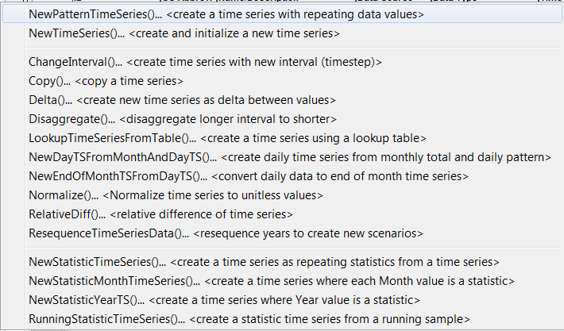
</p>**

**<p style="text-align: center;">
Commands / Create Time Series Menu
</p>**

These commands create new time series from user-supplied data
(see [`NewTimeSeries`](../command-ref/NewTimeSeries/NewTimeSeries.md)) or data from input time series.
A time series created from an existing time series is fundamentally different from the original
and cannot take its place with the same identifier.
For example, the data interval or identifier is different in the new time series.
Consequently, the commands force users to provide new TSID and/or alias information to identify the time series.

Commands may create a single or multiple output time series,
although the trend is to continue enhancing commands to allow multiple time series to be processed.
TSIDs and/or aliases for new time series are used during the discovery
phase of command processing to provide identifiers for later commands.
This allows command editors to provide time series choices even when the commands have not been run.

## Read Time Series ##

The ***Commands / Read Time Series*** menu inserts commands to read time series from a database, file, or web service (internet).

**<p style="text-align: center;">
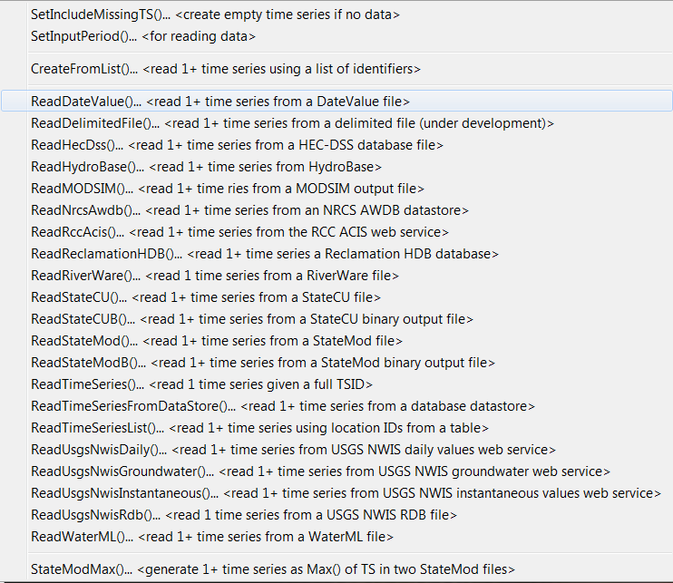
</p>**

**<p style="text-align: center;">
Commands / Read Time Series Menu
</p>**

Read commands are alphabetized and are shown for enabled input types.
The commands that are shown will depend on the input types and datastores that are enabled.
See the [Command Reference read time series commands](../command-ref/overview.md#read-time-series) for a full list of read commands.
Several commands perform supporting functions, such as setting the input period to read.
Some data formats allow only a single time series to be read whereas
other formats allow multiple time series to be read.
Using read commands rather than TSID commands allows more control over the read,
such as assigning an alias and converting data units.

The [`ReadTimeSeriesList`](../command-ref/ReadTimeSeriesList/ReadTimeSeriesList.md)
command uses a delimited input file to provide location information and internally creates a list of TSIDs to read.
 
## Fill Time Series Missing Data ##

The ***Commands / Fill Time Series Missing Data*** menu inserts commands for filling missing data in time series.

**<p style="text-align: center;">
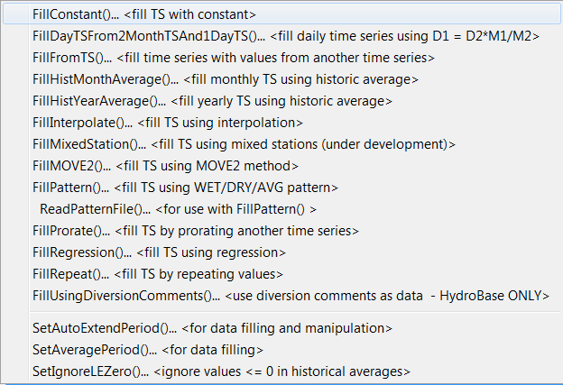
</p>**

**<p style="text-align: center;">
Commands / Fill Time Series Missing Data Menu
</p>**

Fill commands will change only values that are missing, whereas set commands (see next section)
will change values regardless of whether they are missing or non-missing.
These commands can be executed in sequence to apply multiple fill techniques to time series.

Time series may contain missing data due to the following or other reasons:

1. The data collection system is unavailable because of a failure, maintenance cycle,
or hardware that is turned off because of seasonal use
2. In a real-time system the most current data have not yet been received
3. Data collection hardware was not in place during a period (e.g., an early period)
4. Measured values are suspected of being in error and are changed to missing
5. Values in a computed time series cannot be computed (e.g., input data are missing)
6. A data source stores only observed values and non-recorded values are
assumed to be missing rather than a specific value (e.g., zero)

Observations that are available typically are either measured values or values
that have been estimated by the organization that collects and/or maintains the data.
Data flags indicating missing data may or may not be available in the
original source data (e.g., an `m` or `e` character flag often is used to indicate missing and estimated data).

TSTool handles missing data by internally assigning a special numeric value where data are missing.
Different input types may have different missing data values but typically `-999`,
a similar extreme value, or `NaN` (not a number) is used.
If the output period is specified using [`SetOutputPeriod`](../command-ref/SetOutputPeriod/SetOutputPeriod.md) command
or command parameters,
then extensions to the available time series period are filled with the missing data value.
Data flags are supported for some input types.
TSTool displays and output products indicate missing data as blanks,
by showing the missing data value, or a string (e.g., `NC`), depending on the constraints of the product.
For example, an HTML time series highlights missing values and shows flags as a superscript.

Filled time series often are required for use in computer models.
TSTool provides a number of features to fill time series data.
The data filling process consists of analyzing available data and using the results to estimate missing data values.
The estimation process can be simple or complex,
resulting in varying degrees of estimation error and statistical characteristics of the final time series.
The data analysis uses data that are available at the time that the fill command is encountered.
Consequently if values have been changed since the initial read (e.g., because of layered fill commands),
the changed values may impact the analysis.
Basic statistical properties of the original data are saved after the initial read to allow use in later fill commands.
For example, for monthly time series, the historical monthly averages are
computed after the initial read to allow use with a [`FillHistMonthAverage`](../command-ref/FillHistMonthAverage/FillHistMonthAverage.md) command.
Fill commands often provide a `FillFlag` parameter, which allows filled values to be annotated.
The flags can then be displayed in reports and graphs.

The overall period that is being filled is controlled by the time series period
or analysis period that is specified with fill commands.
TSTool will not automatically extend the period of a filled time series
after the time series is initially read.
Use the [`SetInputPeriod`](../command-ref/SetInputPeriod/SetInputPeriod.md) and
[`SetOutputPeriod`](../command-ref/SetOutputPeriod/SetOutputPeriod.md) commands to control the time series period.

The following table lists the fill techniques that are supported by TSTool.

**<p style="text-align: center;">
TSTool Fill Techniques and Associated Commands
</p>**

|**Technique**|**Command**&nbsp;&nbsp;&nbsp;&nbsp;&nbsp;&nbsp;&nbsp;&nbsp;&nbsp;&nbsp;&nbsp;&nbsp;&nbsp;&nbsp;&nbsp;&nbsp;&nbsp;&nbsp;&nbsp;&nbsp;&nbsp;&nbsp;&nbsp;&nbsp;&nbsp;&nbsp;&nbsp;&nbsp;&nbsp;&nbsp;&nbsp;&nbsp;&nbsp;&nbsp;&nbsp;&nbsp;&nbsp;&nbsp;&nbsp;&nbsp;&nbsp;&nbsp;&nbsp;&nbsp;|**Typical Use**|
|--|--|--
|Constant|[`FillConstant`](../command-ref/FillConstant/FillConstant.md)|Use when missing data can be estimated as a constant.  For example, if only the early period of a "regulated" (e.g., reservoir) time series is missing, it may be appropriate to set the values to zero.|
|Monthly total, daily pattern|[`FillDayTSFrom2MonthTSAnd1DayTS`](../command-ref/FillDayTSFrom2MonthTSAnd1DayTS/FillDayTSFrom2MonthTSAnd1DayTS.md)|Use to estimate a daily time series by applying the pattern of a related daily time series to monthly totals from the related and current time series.  For example, use to estimate daily streamflow from monthly total values.|
|Fill from time series|[`FillFromTS`](../command-ref/FillFromTS/FillFromTS.md)|Use non-missing values from a time series to fill missing values in another time series.|
|Historical Monthly Average|[`FillHistMonthAverage`](../command-ref/FillHistMonthAverage/FillHistMonthAverage.md)|Use with monthly time series to estimate missing monthly values as the average of historic monthly values.  For example, if applied to monthly precipitation data, a missing July value would be set to the average of observed July precipitation values (zero is an observation).|
|Historical Year Average|[`FillHistYearAverage`](../command-ref/FillHistYearAverage/FillHistYearAverage.md)|Use with yearly time series to estimate missing data as the average of annual values.|
|HydroBase diversion comments|[`FillUsingDiversionComments`](../command-ref/FillUsingDiversionComments/FillUsingDiversionComments.md)|This command is only available with the [State of Colorado's HydroBase database](../datastore-ref/CO-HydroBase/CO-HydroBase.md) and uses diversion comments and the “not in use” flag to set additional diversion amounts to zero.|
|Interpolation|[`FillInterpolate`](../command-ref/FillInterpolate/FillInterpolate.md)|Use to estimate missing data by interpolating between non-missing values.  For example, use to estimate reservoir level changes.|
|Mixed Station|[`FillMixedStation`](../command-ref/FillMixedStation/FillMixedStation.md)|This command tries various combinations of [`FillRegression`](../command-ref/FillRegression/FillRegression.md) and [`FillMOVE2`](../command-ref/FillMOVE2/FillMOVE2.md) parameters with time series at different locations, to use the best combination.|
|Maintenance of Variance|[`FillMOVE1`](../command-ref/FillMOVE1/FillMOVE1.md)|Use to estimate missing data using the Maintenance of Variance Extension (MOVE.1).  For example, use to estimate unregulated streamflow from a related gage.  **This command is currently not enabled**.|
|Maintenance of Variance|[`FillMOVE2`](../command-ref/FillMOVE2/FillMOVE2.md)|Use to estimate missing data using the Maintenance of Variance Extension (MOVE.2).  For example, use to estimate unregulated streamflow from a related gage.  This approach has been shown to be slightly better than the MOVE.1 approach.|
|Historical Pattern Averages|[`FillPattern`](../command-ref/FillPattern/FillPattern.md)|Similar to filling with historic averages with additional complexity of classifying historic months into categories.  For example, historic averages for wet, dry, and average periods are computed and used as the historic averages.  This command requires that the [`ReadPatternFile`](../command-ref/ReadPatternFile/ReadPatternFile.md) control command also be used.|
|Prorate|[`FillProrate`](../command-ref/FillProrate/FillProrate.md)|Fill a time series by prorating known values with another time series.|
|Regression|[`FillRegression`](../command-ref/FillRegression/FillRegression.md)|Use to estimate missing data by using ordinary least squares regression.  For example, use to estimate streamflow from a related gage.|
|Repeat|[`FillRepeat`](../command-ref/FillRepeat/FillRepeat.md)|Use when it can be assumed that the last observed value before a missing period is a good estimate for missing data.  For example, use with "forecasted" data where no future value is available for interpolation.|

Fill commands can be used in sequence (e.g., use
[`FillRegression`](../command-ref/FillRegression/FillRegression.md),
then [`FillInterpolate`](../command-ref/FillInterpolate/FillInterpolate.md),
then [`FillConstant`](../command-ref/FillConstant/FillConstant.md)).
However, the analysis that occurs for each command may be impacted by earlier fill commands.
If necessary, use the [`SetFromTS`](../command-ref/SetFromTS/SetFromTS.md) command to
piece together the results of independent fill commands into a final time series.
The ***Results /  Graph – XY-Scatter*** output provides options for selecting different fill techniques and viewing analysis details.

## Set Time Series Data ##

The ***Commands / Set Time Series Contents*** menu inserts commands that set time series data and properties.
Unlike fill commands, set commands reset values regardless of whether the values were missing in the time series.

**<p style="text-align: center;">
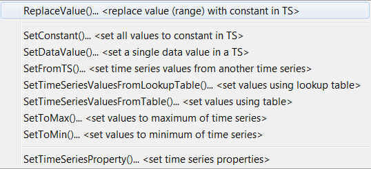
</p>**

**<p style="text-align: center;">
Commands / Set Time Series Contents Menu
</p>**

## Manipulate Time Series ##

The ***Commands / Manipulate Time Series*** menus insert commands for manipulating time series.

**<p style="text-align: center;">
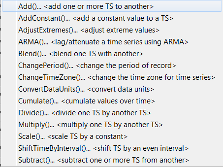
</p>**

**<p style="text-align: center;">
Commands / Manipulate Time Series Menu
</p>**

Because the fundamental nature of the time series (e.g., data type, interval)
is not changed by using these commands,
the commands do not result in the creation of a new time series but change the data values in existing time series.
Manipulation commands typically add comments to the time series history,
which can be viewed with time series properties.
If it is necessary to create a separate time series to contain the result of a manipulation, use a
[`Copy`](../command-ref/Copy/Copy.md), [`NewTimeSeries`](../command-ref/NewTimeSeries/NewTimeSeries.md),
or other command to create a “receiving” time series, and then manipulate this new time series.

## Analyze Time Series ##

The ***Commands / Analyze Time Series*** menu inserts commands for analyzing time series,
which typically produce a report, result time series, or other output product:

**<p style="text-align: center;">

</p>**

**<p style="text-align: center;">
Commands / Analyze Time Series Menu
</p>**

## Models - Routing ##

The ***Commands / Models – Routing*** menu inserts commands that perform tasks
that are more complex than simple data processes.
TSTool does not retrieve or save model states, leaving the handling of states to each model.
Currently, the following routing models are available:

**<p style="text-align: center;">

</p>**

**<p style="text-align: center;">
Commands / Models - Routing Menu
</p>**
 
Minimal model features are currently available.
However, it is envisioned that additional capabilities will be added in the future to facilitate calibration and model evaluation.

## Output Time Series ##

The ***Commands / Output Time Series*** menu inserts commands for outputting time series.

**<p style="text-align: center;">
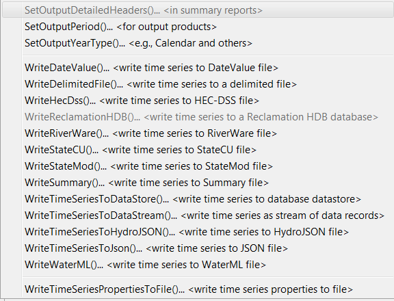
</p>**

**<p style="text-align: center;">
Commands / Output Time Series Menu
</p>**

Commands that set global configuration values (e.g., output period) are listed at the start of the menu.
The commands that are shown will depend on the input types and datastores that are enabled.
See the [Command Reference output time series commands](../command-ref/overview.md#output-time-series) for a full list of read commands.

The [`ProcessTSProduct`](../command-ref/ProcessTSProduct/ProcessTSProduct.md) and other
commands in the ***Commands / Visualization Processing*** menu are used to automate the production of graphs.

Using the output commands allows the results of processing to be saved but does increase processing time.
If commands are processed repeatedly during analysis or debugging,
the following steps may be taken to increase overall efficiency:

1. Output commands that produce output files are not executed if the ***Commands*** list is processed with
***Run / All Commands*** (ignore output commands) or ***Run / Selected Commands*** (ignore output commands).
Therefore, use this menu choice to ignore the output commands.
2. Only selected commands are processed.  Therefore select all but the output commands.
3. Use an [`Exit`](../command-ref/Exit/Exit.md) control command before output commands to skip the output commands.
This command can then be deleted or commented out when not needed.
4. Commands can be converted to comments using the ***Commands*** menu or the popup menu that is
displayed when right-clicking on the Commands list.
Therefore, output commands can be temporarily converted to comments until output needs to be created.

## Check Time Series ##

The ***Commands / Check Time Series*** menu inserts commands for checking time series.

**<p style="text-align: center;">

</p>**

**<p style="text-align: center;">
Commands / Check Time Series Menu
</p>**

These commands can be used for quality control on raw data and processed time series.
A summary of check results can be written to a file to preserve an artifact of data processing.

## Datastore Processing ##

The ***Commands / Datastore Processing*** menu provides commands specific to database datastore processing,

**<p style="text-align: center;">
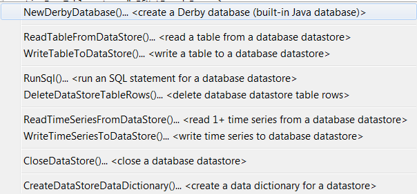
</p>**

**<p style="text-align: center;">
Commands / Datastore Processing Menu
</p>**

## Ensemble Processing ##

The ***Commands / Ensemble Processing*** menu provides commands specific to time series ensembles.
These commands can only be used with ensembles.
However, many commands available in menus described above can be used to process ensembles
by processing all of the time series in the ensemble.
See the `TSList=EnsembleID` parameter in commands.
 
**<p style="text-align: center;">

</p>**

**<p style="text-align: center;">
Commands / Ensemble Processing Menu
</p>**

## Network Processing ##

The ***Commands / Network Processing*** menu provides commands specific to network processing,

**<p style="text-align: center;">

</p>**

**<p style="text-align: center;">
Commands / Network Processing Menu
</p>**

## Spatial Data Processing ##

The ***Commands / Spatial Processing*** menu provides commands specific to spatial data processing.

**<p style="text-align: center;">

</p>**

**<p style="text-align: center;">
Commands / Spatial Processing Menu
</p>**

## Spreadsheet Processing ##

The ***Commands / Spreadsheet Processing*** menu provides commands specific to spreadsheet processing.

**<p style="text-align: center;">
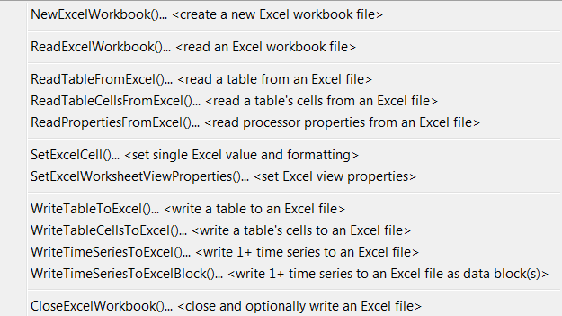
</p>**

**<p style="text-align: center;">
Commands / Spreadsheet Processing Menu
</p>**

## Template Processing ##

The ***Commands / Template Processing*** menu provides commands specific to template processing.

**<p style="text-align: center;">

</p>**

**<p style="text-align: center;">
Commands / Template Processing Menu
</p>**

Templates are text files that can be expanded to reflect dynamic content.
For example, a template command file can be used to repeat a block of commands for many time series.
The documentation for the [`ExpandTemplateFile`](../command-ref/ExpandTemplateFile/ExpandTemplateFile.md)
command provides examples of how templates can be used.

## Visualization Processing ##

The ***Commands / Visualization Processing*** menu provides commands specific to view processing.

**<p style="text-align: center;">

</p>**

**<p style="text-align: center;">
Commands / Visualization Processing Menu
</p>**

TSTool lists time series results in the order that time series are created by commands.
However, this can lead to very long lists of time series that are difficult to review.
The [`NewTreeView`](../command-ref/NewTreeView/NewTreeView.md) command allows time series
results to be organized in a way that is more appropriate.
Other views may be implemented in the future to facilitate viewing results.

## General Commands - Comments ##

The ***Commands / General – Comments*** menu provides choices to insert comments.

**<p style="text-align: center;">

</p>**

**<p style="text-align: center;">
Commands / General – Comments Menu
</p>**

Comments are treated as special commands.
The [`#`](../command-ref/Comment/Comment.md) character indicates a single-line comment.
The [`/*`](../command-ref/CommentBlockStart/CommentBlockStart.md) and
[`*/`](../command-ref/CommentBlockEnd/CommentBlockEnd.md) commands indicate multi-line comments
(for example to disable blocks of commands without removing them from the command file).
The `#@readOnly` comment is used to protect a command file – TSTool will warn if an attempt is made to save the file.
For example, this special comment is useful to protect old command files that are
archived and should not be changed, even if TSTool command syntax changes.

### Inserting # Comments ###

Comments are inserted by selecting a line in the ***Commands*** list and then selecting ***Commands / General – Comments / # Comment(s)***.
 The comments will be inserted before the selected commands.
Unlike most other command editors, multiple command lines can be selected.
The command editor will automatically insert the `#` character.
The following dialog is used to edit comments.

**<p style="text-align: center;">

</p>**

**<p style="text-align: center;">
Comment Editor
</p>**
 
### Start `/*` `*/` Comments ###

Multiple commands can be commented using the following notation:

```
/*
commented commands
commented commands
*/
```

This syntax is consistent with a number of programming languages, including C, C++, and Java,
and can be used to quickly disable multiple commands.
Use the ***Commands / General – Comments / `/*` <start comment>*** menu to start a comment above the selected command.
Matching start and end comments should be inserted.  See also the exit control command.
Currently there is no way to edit a block of commented code.
The notation is meant to be used to comment large blocks of commands, for example during troubleshooting.

### End `/*` `*/` Comments ###

Use the ***Commands / General / `*/` <end comment>*** menu to end a multi-line comment in commands.

## General Commands - File Handling ##

The ***Commands / General – File Handling*** menu provides choices to insert commands that process files.

**<p style="text-align: center;">

</p>**

**<p style="text-align: center;">
Commands / General – File Handling Menu
</p>**
 
The [`RemoveFile`](../command-ref/RemoveFile/RemoveFile.md) command is often used in testing.
The [`FTPGet`](../command-ref/FTPGet/FTPGet.md) and [`WebGet`](../command-ref/WebGet/WebGet.md)
commands are used to retrieve files from the internet.

## General Commands - Logging and Messaging ##

The ***Commands / General – Logging and Messaging*** menu provides choices to insert commands used in logging.
It is recommended that each command file use a
[`StartLog`](../command-ref/StartLog/StartLog.md) command as the first command,
to create a log file that can facilitate troubleshooting and reviewing work at a later time.
Setting the debug and warning level with commands can facilitate troubleshooting specific command logic.

**<p style="text-align: center;">

</p>**

**<p style="text-align: center;">
Commands / General – Logging and Messaging Menu
</p>**

## General Commands - Running and Properties ##

The ***Commands / General - Running and Properties*** menu provides choices to insert commands
related to logic control, running programs, and setting processor properties

**<p style="text-align: center;">
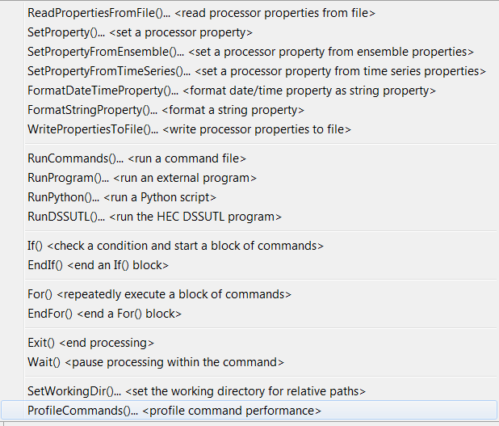
</p>**

**<p style="text-align: center;">
Commands / General – Running and Properties Menu
</p>**

The command processor uses properties to manage controlling information.
These properties can be set with commands to facilitate overall workflow logic,
for example to allow configuration information to be defined at the start of a command file,
and be used by other commands.

The [`RunCommands`](../command-ref/RunCommands/RunCommands.md) command can be used to create
a “master” command file that runs other command files.
This approach is used to create test suites to validate the TSTool software.
Commands also are available to run external programs, Python scripts,
and the Army Corps of Engineers DSSUTL software, which provides time series processing capabilities.

## General Commands - Test Processing ##

The ***Commands / General – Test Processing*** menu provides choices to insert
commands related to software and process testing.
See also the [Quality Control chapter](../quality-control/quality-control.md).
A test case can be a simple test (e.g., test of a single command with a specific
combination of parameters) or a more complex test (e.g., a test of a command file used to process a data set file).
The [`CreateRegressionTestCommandFile`](../command-ref/CreateRegressionTestCommandFile/CreateRegressionTestCommandFile.md)
can be used to search a folder and sub-folders for command files matching a pattern (e.g., `Test_*.TSTool`).
This will create a master command file that includes [`RunCommands`](../command-ref/RunCommands/RunCommands.md) commands.
These commands are used by software developers to create test suites
to verify TSTool software functionality and can also be used by software users to
verify that a process is certified and gives expected results.
Comparing the results from a specific software version with expected results is useful for diagnosing errors.

**<p style="text-align: center;">

</p>**

**<p style="text-align: center;">
Commands / General – Test Processing Menu
</p>**
 
The following is an example command file to run the
[`CreateRegressionTestCommandFile`](../command-ref/CreateRegressionTestCommandFile/CreateRegressionTestCommandFile.md) command:

```text
#
# Create the regression test runner for the
# TSTool/test/regression/TestSuites/commands_general files.
#
# Only command files that match Test_*.TSTool are included in the output.
# Don't append the generated commands, in order to force the old file to be
# overwritten.
#
CreateRegressionTestCommandFile(SearchFolder="..\..\..\commands\general",
OutputFile="..\run\RunRegressionTest_commands_general.TSTool",Append=False)
```

The following command file is generated from the above and can be run to execute the individual tests.
Typically each test uses the
[`CompareTimeSeries`](../command-ref/CompareTimeSeries/CompareTimeSeries.md) or
[`CompareFiles`](../command-ref/CompareFiles/CompareFiles.md)
command to generate a warning if results are not as expected.

```
StartRegressionTestResultsReport(OutputFile="RunRegressionTest_commands_general.TSTool.out.txt")
RunCommands(InputFile="..\..\..\commands\general\add\Test_Add_1.TSTool")
RunCommands(InputFile="..\..\..\commands\general\add\Test_Add_Ensemble_1.TSTool")
RunCommands(InputFile="..\..\..\commands\general\ChangeInterval\Test_ChangeInterval_IrregINST_To_3HourINST.TSTool")
... etc. ...
```

## Deprecated Commands ##

The ***Commands / Deprecated Commands*** menu provides commands that are slated for removal at some point in the future.
These commands should be avoided and newer alternatives should be used.
Refer to the command documentation for information in migrating to other commands.
 
**<p style="text-align: center;">

</p>**

**<p style="text-align: center;">
Commands / Deprecated Commands Menu
</p>**

## Table Commands ##

The ***Commands(Table)*** menu provides commands specific to table processing.
Tables are defined as row/column data (e.g., from delimited files or databases)
where comments can be present in the header and data records,
the header defines labels for columns, and columns contain consistent data types
(i.e., a column has all dates, all integers, all strings, all floating point numbers).
Table rows can be related to a time series by using time series
properties such as the location part of the time series identifier.

**<p style="text-align: center;">
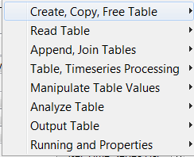
</p>**

**<p style="text-align: center;">
Commands(Table) Menu
</p>**

## Plugin Commands ##

The ***Commands(Plugin)*** menu provides plugin commands.
These commands are distributed separately from the main TSTool software and
allow custom commands to be added.  **These features are under development.**

**<p style="text-align: center;">

</p>**

**<p style="text-align: center;">
Commands(Plugin) Menu
</p>**
